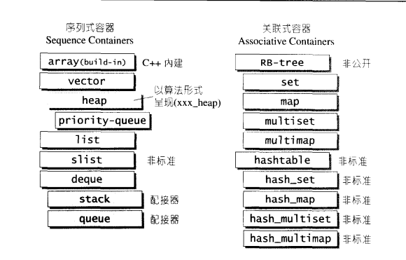
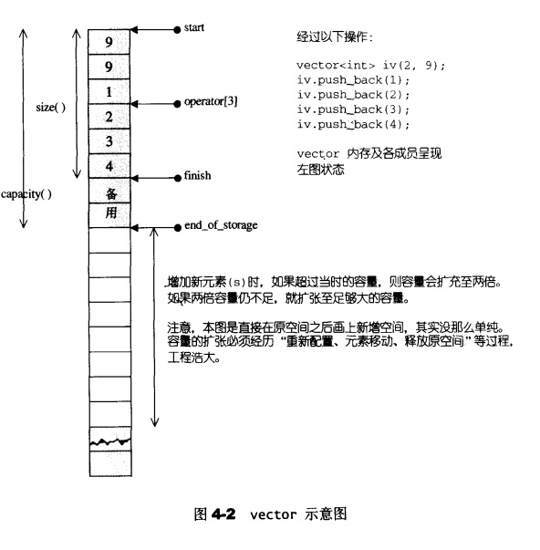
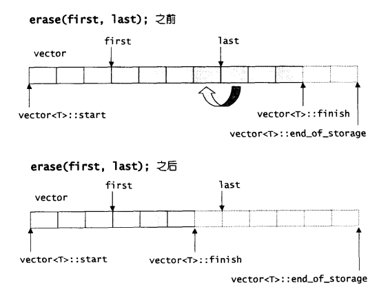
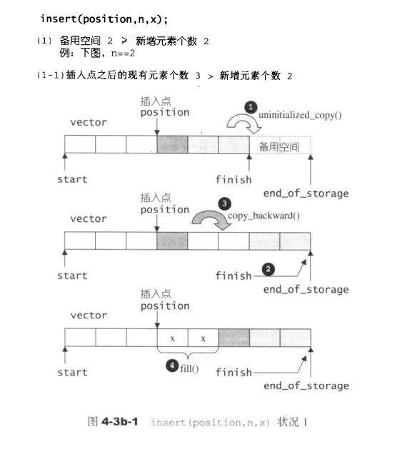
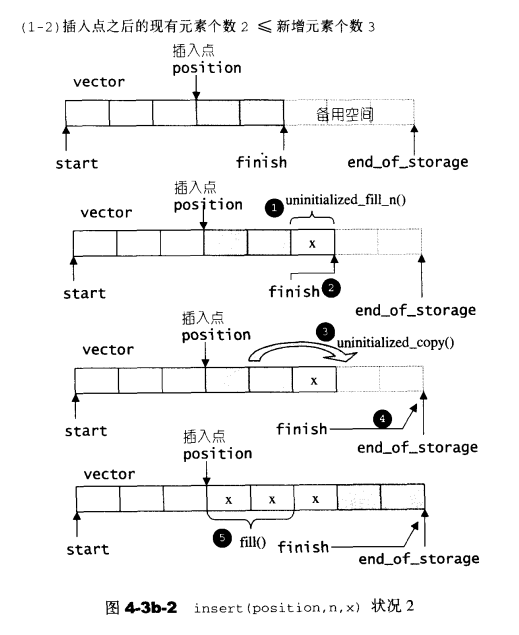
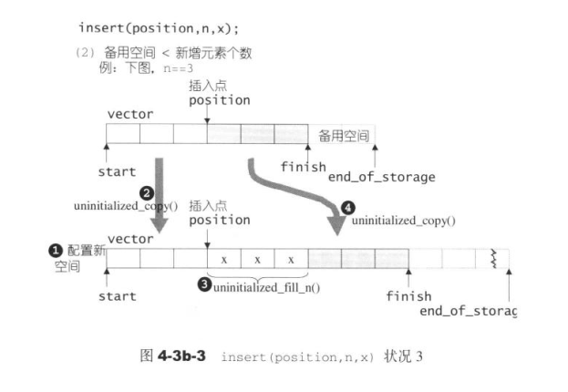
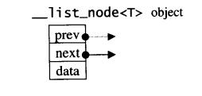
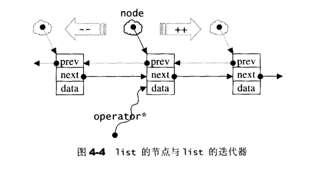
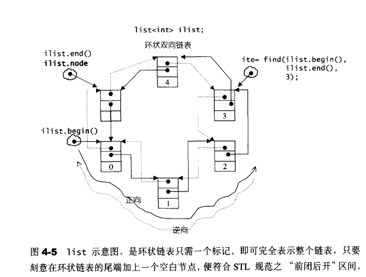
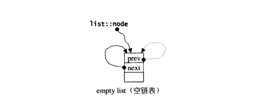

[toc]
# 序列式容器(sequence containers)
## 容器的概观与分类
容器，置物之所也

研究数据的特定排列方式，以利于搜寻或其他特殊目的，这一专门学科称为数据结构(Data Structures)。任何特定的数据结构都是为了实现某种特定的算法。STL容器即是将运用最广的一些数据结构实现出来。

众所周知，常用的数据结构不外乎array(数组)、list(链表)、tree(树)、stack(堆栈)、queue(队列)、hash table(散列表)、set(集合)、map(映射表)...等等。根据"数据在容器中的排列"特性，这些数据结构分为序列式(sequence)和关联式(associative)两种



## 序列式容器(sequential containers)
所谓序列式容器，其中的元素都可序(ordered)，但未必有序(sorted)。C++语言本身提供了一个序列式容器array，STL另外再提供vector，list，deque，stack，queue，priority-queue等等序列式容器。其中stack和queue由于只是将deque改头换面而成，技术上被归类为一种配接器(adapter)

## vector
### vector概述
vector的数据安排以及操作方式，与array非常相似。两者的唯一差别在于空间的运用的灵活性。array是静态空间，一旦配置了就不能改变；要换个大(或小)一点的房子，可以，一切琐细得由客户端自己来：首先配置一块新空间，然后将元素从旧址一一搬往新址，再把原来的空间释还给系统。vector是动态空间，随着元素的加入，它的内部机制会自动扩充空间以容纳新元素，因此，vector的运用对于内存的合理利用与运用的灵活性有很大的帮助，再也不必因为害怕空间不足而一开始就要求一个大块头array了，可以安心使用vector

vector的实现技术，关键在于其对大小的控制以及重新配置时的数据移动效率，一旦vector旧有空间满载，如果客户端每新增一个元素，vector内部只是扩充一个元素的空间，实为不智，因为所谓扩充空间(不论大小)，是"配置新空间/数据移动/释还旧空间"的大工程，时间成本很高，应该加入某种考虑，这也就是SGI vector的空间配置策略
### vector定义摘要
虽然STL规定，欲使用vector者必须先包括`<vector>`，但SGI STL将`<vector>`将vector实现于更底层的`<stl_vector.h>`
```c++
//alloc 是 SGI STL的空间配置器
template <class T, class Alloc = alloc>
class vector{
public:
    typedef T               value_type;
    typedef value_type*     pointer;
    typedef value_type*     iterator;
    typedef value_type&     reference;
    typedef size_t          size_type;
    typedef ptrdiff_t       difference_type;

protected:
    //以下，simple_alloc是SGI STL的空间配置器
    typedef simple_alloc<value_type, Alloc> data_allocator;
    iterator    start;      //表示目前使用空间的头
    iterator    finish;     //表示目前使用空间的尾
    iterator    end_of_storage; //表示目前可用空间的尾

    void insert_aux(iterator position, const T& x);
    void deallocate(){
        if(start){
            data_allocator::deallocate(start, end_of_storage - start);
        }
    }

    void fill_initialize(size_type n, const T& value){
        start = allocate_and_fill(n, value);
        finish = start + n;
        end_of_storage = finish;
    }

public:
    iterator begin() {return start;}
    iterator end() {return finish;}
    size_type size() const {return size_type(end() - begin());}
    size_type capacity() const {return size_type(end_of_storage - begin());}
    bool empty() const {return begin() == end();}
    reference operator[](size_type n){return *(begin() + n);}
    
    vector() : start(0), finish(0), end_of_storage(0){}
    vector(size_type n, const T& value) {fill_initialize(n, value);}
    vector(int n, const T& value) {fill_initialize(n, value);}
    vector(long n, const T& value) {fill_initialize(n, value);}
    explicit vector(size_type n) {fill_initialize(n, T());}

    ~vector(){
        destroy(start, finish);
        deallocate();
    }

    reference front() {return *begin();}
    reference back() {return *(end() - 1);}
    void push_back(const T& x){
        if(finish != end_of_storage){
            construct(finish, x);
            ++finish;
        }else{
            insert_aux(end(), x);
        }
    }

    void pop_back(){
        --finish;
        destroy(finish);
    }

    iterator erase(iterator position){
        if(position + 1 != end()){
            copy(position + 1, finish, position);
        }
        --finish;
        destroy(finish);
        return position;
    }

    void resize(size_type new_size, const T& x){
        if(new_size < size()){
            erase(begin() + new_size, end());
        }else{
            insert(end(), new_size - size(), x);
        }
    }

    void resize(size_type new_size) {resize(new_size, T());}
    void clear() {erase(begin(), end());}

protected:
    //配置空间并填满内容
    iterator allocate_and_fill(size_type n, const T& x){
        iterator result = data_allocator::allocate(n);
        uninitialized_fill_n(result, n, x);
        return result;
    }
};
```

### vector的迭代器
vector维护的是一个连续线性空间，所有无论其元素型别为何，普通指针都可以作为vector的迭代器而满足所有必要条件，因为vector迭代器所需要的操作行为，如`operator*`,`operator->`,`operator++`,`operator--`,`operator+`,`operator-`,`operator+=`,`operator-=`，普通指针天生就具备，vector支持随机存取，而普通指针正有着这样的能力，所以，vector提供的是`Random Access Iterators`
```c++
template <class T, class Alloc = alloc>
class vector{
public:
    typedef T               value_type;
    typedef value_type*     iterator;           //vector的迭代器是普通指针
    //...
};
```
根据上述定义，如果客户端写出这样的代码：
```c++
vector<int>::iterator ivite;
vector<Shape>::iterator svite;
```
`ivite`的型别其实就是`int*`，`svite`的型别其实就是`Shape*`

### vector的数据结构
vector所采用的数据结构非常简单：线性连续空间。它以两个迭代器`start`和`finish`分别指向配置得来的连续空间中目前已被使用的范围，并以迭代器`end_of_storage`指向整块连续空间(含备用空间)的尾端：
```c++
template <class T, class Alloc = alloc>
class vector{
//...
protected:
    iterator    start;              //表示目前使用空间的头
    iterator    finish;             //表示目前使用空间的尾
    iterator    end_of_storage;     //表示目前可用空间的尾
    //...
};
```
为了降低空间配置时的速度成本，vector实际配置的大小可能比客户端需求量更大一些，以备将来可能的扩充。这便是容量(capacity)的观念。一个vector的容量永远大于或等于其大小。一旦容量等于大小，便是满载，下次再有新增元素，整个vector就得另觅居所


运用`start`,`finish`,`end_of_storage`三个迭代器，便可轻易地提供首尾标示、大小、容量、空容器判断、注标([])运算子、最前端元素值、最后端元素值...等机能：
```c++
template <class T, class Alloc = alloc>
class vector{
//...
public:
    iterator begin() {return start;}
    iterator end() {return finish;}
    size_type size() const {return size_type(end() - begin());}
    size_type capacity() const {return size_type(end_of_storage - begin());}
    bool empty() const {return begin() == end();}
    reference operator[](size_type n) {return *(begin() + n);}
    reference front() {return *begin();}
    reference back() {return *(end() - 1);}
    //...
};
```

### vector的构造与内存管理：constructor, push_back
以客户端程序代码为引导，观察其所得结果并实证源代码，是一个良好的学习路径。
```c++
#include <vector>
#include <iostream>
#include <algorithm>

using namespace std;
int main()
{
    int i;
    vector<int> iv(2, 9);
    cout << "size=" << iv.size() << endl;   //size = 2
    cout << "capacity=" << iv.capacity() << endl; //capacity = 2

    iv.push_back(1);
    cout << "size=" << iv.size() << endl;   //size = 3
    cout << "capacity=" << iv.capacity() << endl; //capacity = 4

    iv.push_back(2);
    cout << "size=" << iv.size() << endl;   //size = 4
    cout << "capacity=" << iv.capacity() << endl; //capacity = 4

    iv.push_back(3);
    cout << "size=" << iv.size() << endl;   //size = 5
    cout << "capacity=" << iv.capacity() << endl; //capacity = 8

    iv.push_back(4);
    cout << "size=" << iv.size() << endl;   //size = 6
    cout << "capacity=" << iv.capacity() << endl; //capacity = 8

    for(i = 0; i < iv.size(); ++i){
        cout << iv[i] << ' ';   //9 9 1 2 3 4
    }
    cout << endl;

    iv.push_back(5);
    cout << "size=" << iv.size() << endl;   //size = 7
    cout << "capacity=" << iv.capacity() << endl; //capacity = 8
    for(i = 0; i < iv.size(); ++i){
        cout << iv[i] << ' ';   //9 9 1 2 3 4 5
    }
    cout << endl;

    iv.pop_back();
    iv.pop_back();
    cout << "size=" << iv.size() << endl;   //size = 5
    cout << "capacity=" << iv.capacity() << endl; //capacity = 8

    iv.pop_back();
    cout << "size=" << iv.size() << endl;   //size = 4
    cout << "capacity=" << iv.capacity() << endl; //capacity = 8

    vector<int>::iterator ivite = find(iv.begin(), iv.end(), 1);
    if(ivite){
        iv.erase(ivite);
    }
    cout << "size=" << iv.size() << endl;   //size = 3
    cout << "capacity=" << iv.capacity() << endl; //capacity = 8
    for(i = 0; i < iv.size(); ++i){
        cout << iv[i] << ' ';   //9 9 2
    }
    cout << endl;

    ivite = find(iv.begin(), iv.end(), 2);
    if(ivite){
        iv.insert(ite, 3, 7);
    }
    cout << "size=" << iv.size() << endl;   //size = 6
    cout << "capacity=" << iv.capacity() << endl; //capacity = 8
    for(i = 0; i < iv.size(); ++i){
        cout << iv[i] << ' ';   //9 9 7 7 7 2
    }
    cout << endl;

    iv.clear();
    cout << "size=" << iv.size() << endl;   //size = 0
    cout << "capacity=" << iv.capacity() << endl; //capacity = 8   
}
```
`vector`缺省使用`alloc`作为空间配置器，并据此另外定义了一个`data_allocator`，为的是更方便以元素大小为配置单位：
```c++
template <class T, class Alloc = alloc>
class vector{
protected:
    //simple_alloc<>
    typedef simple_alloc<value_type, Alloc> data_allocator;
    //...
};
```
于是,`data_allocator::allocate(n)`表示配置n个元素空间
vector提供许多constructors，其中一个允许我们指定空间大小及初值
```c++
//构造函数，允许指定vector大小n和初值value
vector(size_type n, const T& value){fill_initialize(n, value);}
//填充并予以初始化
void fill_initialize(size_type n, const T& value)
{
    start = allocate_and_fill(n, value);
    finish = start + n;
    end_of_storage = finish;
}
//配置而后填充
iterator allocate_and_fill(size_type n, const T& x)
{
    iterator result = data_allocator::allocate(n); //配置n个元素空间
    uninitialized_fill_n(result, n, x); //全局变量
    return result;
}
```
`uninitialized_fill_n()`会根据第一参数的型别特性，决定使用算法`fill_n()`或反复调用`construct()`来完成任务
当以`push_back()`将新元素插入于vector尾端时，该函数首先检查是否还有备用空间，如果有就直接在备用空间上构造元素，并调整迭代器`finish`，使vector变大。如果没有备份空间了，就扩充空间(重新配置、移动数据、释放原空间)：
```c++
void push_back(const T& x)
{
    if(finish != end_of_storage){ //还有备份空间
        construct(finish, x);   //全局函数
        ++finish;   //调整水位高度
    }else{  //已无备用空间
        insert_aux(end(), x); 
    }
}

template <class T, class Alloc>
void vector<T, Alloc>::insert_aux(inserator position, const T& x)
{
    if(finish != end_of_storage){   //还有备用空间
        //在备用空间起始处构造一个元素，并以vector最后一个元素为其初值
        construct(finish, *(finish - 1));
        //调整水位
        ++finish;
        T x_copy = x;
        copy_backward(position, finish - 2, finish - 1);
        *position = x_copy;
    }else{//已无备用空间
        const size_type old_size = size();
        const size_type len = old_size != 0 ? 2 * old_size : 1;
        //以上配置原则：如果原大小为0，则配置1(个元素大小)
        //如果原大小不为0，则配置原大小的两倍
        //前半段用来防止原数据，后半段准备用来放置新数据
        iterator new_start = data_allocator::allocate(len); //实际配置
        iterator new_finish = new_start;
        try{
            //将原vector的内容拷贝到新vector
            new_finish = uninitialized_copy(start, position, new_start);
            //为新元素设定初值
            construct(new_finish, x);
            //调整水位
            ++new_finish;
            //将原vector的备用空间中的内容也忠实拷贝过来
            new_finish = uninitialized_copy(position, finish, new_finish);
        }catch(...){
            destroy(new_start, new_finish);
            data_allocator::deallocate(new_start, len);
            throw;
        }

        //析构并释放原vector
        destroy(begin(), end());
        deallocate();

        //调整迭代器，指向新vector
        start = new_start;
        finish = new_finish;
        end_of_storage = new_start + len;
    }
}
```
注意，所谓动态增加大小，并不是在原空间之后接续新空间(因为无法保证原空间之后尚有可供配置的空间)，而是以原大小的两倍另外配置一块较大空间，然后将原内容拷贝过来，然后才开始在原内容之后构造新元素，并释放原空间。因此，对vector的任何操作，一旦引起空间重新配置，指向原vector的所有迭代器就都失效了

### vector的元素操作：pop_back，erase，clear，insert
vector所提供的元素操作很多，为搭配先前对空间配置的讨论，只挑选相关函数作为解说对象
```c++
//将尾端元素拿掉，并调整大小
void pop_back()
{
    --finish;               //将尾端标记往前移一格，表示将放弃尾端元素
    destroy(finish);        //destroy是全局函数
}

//清除[first, last)中的所有元素
iterator erase(iterator first, iterator last)
{
    iterator i = copy(last, finish, first);     //copy是全局函数
    destroy(i, finish); //destroy是全局函数

    finish = finish - (last - first);
    return first;
}

//清除某个位置上的元素
iterator erase(iterator position)
{
    if(position + 1 != end())
    {
        copy(position + 1, finish, position);   //copy是全局函数
    }
    --finish;
    destroy(finish);    //destroy是全局函数
    return position;
}

void clear()
{
    erase(begin(), end());  //erase() 就定义在上面
}
```

下面是`vector::insert()`实现内容：
```c++
//从position开始，插入n个元素，元素初值为x
template <class T, class Alloc>
void vector<T, Alloc>::insert(iterator position, size_type n, const T& x)
{
    if(n != 0) //当 n != 0 才进行以下所有操作
    {
        if(size_type(end_of_storage - finish) >= n)
        {
            //备用空间大于等于"新增元素个数"
            T x_copy = x;
            //以下计算插入点之后的现有元素个数
            const size_type elems_after = finish - position;
            iterator old_finish = finish;
            if(elems_after > n)
            {
                //"插入点之后的现有元素个数"大于"新增元素个数"
                uninitialized_copy(finish - n, finish, finish);
                finish += n;    //将vector尾端标记后移
                copy_backward(position, old_finish -n, old_finish);
                fill(position, position + n, x_copy); //从插入点开始填入新值
            }else{
                //"插入点之后的现有元素个数"小于等于"新增元素个数"
                uninitialized_fill_n(finish, n - elems_after, x_copy);
                finish += n - elems_after;
                uninitialized_copy(position, old_finish, finish);
                finish += elems_after;
                fill(position, old_finish, x_copy);
            }
        }else{
            //备用空间小于"新增元素个数"(那就必须配置额外的内存)
            //首先决定新长度：旧长度的两倍，或旧长度 + 新增元素个数
            const size_type old_size = size();
            const size_type len = old_size + max(old_size, n);
            //以下配置新的vector空间
            iterator new_start = data_allocator::allocate(len);
            iterator new_finish = new_start;
            __STL_TRY{
                //以下首先将旧vector的插入点之前的元素复制到新空间
                new_finish = uninitialized_copy(start, position, new_start);
                //以下再将新增元素(初值皆为n)填入新空间
                new_finish = uninitialized_fill_n(new_finish, n, x);
                //以下再将旧vector的插入点之后的元素复制到新空间
                new_finish = uninitialized_copy(position, finish, new_finish);
            }
        #ifdef __STL_USE_EXCEPTIONS
            catch(...){
                //如有异常发生，实现"commit or rollback"semantics
                destroy(new_start, new_finish);
                data_allocator::deallocate(new_start, len);
                throw;
            }
        #endif

            //以下清除并释放旧的vector
            destroy(start, finish);
            deallocate();
            //以下调整水位标记
            start = new_start;
            finish = new_finish;
            end_of_storage = new_start + len;
        }
    }
}
```
注意，插入完成后，新节点将位于哨兵迭代器所指之节点的前方——这是STL对于"插入操作"的标准规范




## list
相较于vector的连续线性空间，list就显得复杂许多，它的好处是每次插入或删除一个元素，就配置或释放一个元素空间。因此，list对于空间的运用有绝对的精准，一点都不浪费。而且，对于任何位置的元素插入或元素移除，list永远是常数时间
list和vector是两种最长被使用的容器。什么时间下最适合使用哪一种容器，必须视元素的多寡、元素的构造复杂度(有无non-trivial copy constructor，no-trivial copy assignment operator)、元素存取行为的特性而定。
### list的节点(node)
每一个设计过list的人都知道，list本身和list的节点是不同的结构，需要分开设计。
以下是STL list的节点(node)结构：
```c++
template <class T>
struct __list_node{
    typedef void* void_pointer;
    void_pointer prev;  //型别为void*，其实可设为__list_node<T>*
    void_pointer next;
    T data;
};
```
显然这是一个双向链表

### list的迭代器
list不再能够像vector一样以普通指针作为迭代器，因为其节点不保证在存储空间中连续存在，list迭代器必须有能力指向list的节点，并有能力进行正确的递增、递减、取值、成员存取等操作。所谓"list迭代器正确的递增、递减、取值、成员取用"操作是指，递增时指向下一个节点，递减时指向上一个节点，取值时取的是节点的数值值，成员取用时取用的是节点的成员

由于STL list是一个双向链表(double linked-list)，迭代器必须具备前移、后移的能力，所以list提供的是Bidirectional Iterators
list有一个重要性质：插入操作(insert)和接合操作(splice)都不会造成原有的list迭代器失效，这在vector是不成立的，因为vector的插入操作可能造成记忆体重新配置，导致原有的迭代器全部失效，甚至list的元素删除(erase)，也只有"指向被删除元素"的那个迭代器失效，其他迭代器不受任何影响
以下是list迭代器的设计
```c++
template <class T, class Ref, class Ptr>
struct __list_iterator{
    typedef __list_iterator<T, T&, T*>  iterator;
    typedef __list_iterator<T, Ref, Ptr> self;

    typedef bidirectional_iterator_tag iterator_category;
    typedef T value_type;
    typedef Ptr pointer;
    typedef Ref reference;
    typedef __list_node<T>* link_type;
    typedef size_t size_type;
    typedef ptrdiff_t difference_type;

    link_type node; //迭代器内部当然要有一个普通指针，指向list的节点

    //constructor
    __list_iterator(link_type x) : node(x){}
    __list_iterator(){}
    __list_iterator(const iterator& x) node(x.node){}

    bool operator==(const self& x) const {return node == x.node;}
    bool operator!=(const self& x) const {return node != x.node;}
    //以下对迭代器取值(dereference)，取的是节点的数据值
    reference operator*() const {return (*node).data;}
    //以下是迭代器的成员存取(member access)运算子的标准做法
    pointer operator->() const {return &(operator*());}

    //对迭代器累加1，就是前进一个节点
    self& operator++(){
        node = (link_type)((*node).next);
        return *this;
    }

    self operator++(int){
        self tmp = *this;
        ++*this;
        return tmp;
    }

    //对迭代器递减1，就是退后一个节点
    self& operator--(){
        node = (link_type)((*node).prev);
        return *this;
    }
    self operator--(int){
        self tmp = *this;
        --*this;
        return tmp;
    }
};
```
### list的数据结构
SGI list不仅是一个双向链表，而且还是一个环状双向链表。所以它只需要一个指针，便可以完整表现整个链表：
```c++
template <class T, class Alloc = alloc> //缺省使用alloc为配置器
class list{
protected:
    typedef __list_node<T> list_node;
public:
    typedef list_node* link_type;

protected:
    link_type node; //只要一个指针，便可表示整个环状双向链表
    //...
};
```
如果让指针node指向刻意置于尾端的一个空白节点，node便能符合STL对于"前闭后开"区间的要求，成为last迭代器，这样一来，以下几个函数便都可以轻易完成：
```c++
iterator begin() {return (link_type)((*node).next);}
iterator end() {return node;}
bool empty() const {return node->next == node;}
size_type size() const {
    size_typ result = 0;
    distance(begin(), end(), result);
    return result;
}

//取头节点的内容
reference front() {return *begin();}
reference back() {return *(--end());}
```


### list的构造与内存管理
测试程序
```c++
#include <list>
#include <iostream>
#include <algorithm>
using namespace std;

int main()
{
    int i;
    list<int> ilist;
    cout << "size=" << ilist.size() << endl;    //size = 0

    ilist.push_back(0);
    ilist.push_back(1);
    ilist.push_back(2);
    ilist.push_back(3);
    ilist.push_back(4);
    cout << "size=" << ilist.size() << endl;    //size = 5

    list<int>::iterator ite;
    for(ite = ilist.begin(); ite != ilist.end(); ++ite){
        cout << *itr << ' '; //0 1 2 3 4
    }
    cout << endl;

    ite = find(ilist.begin(), ilist.end(), 3);
    if(ite != 0){
        ilist.insert(ite, 99);
    }
    cout << "size=" << ilist.size() << endl;    //size = 6
    cout << *ite << endl; //3

    for(ite = ilist.begin(); ite != ilist.end(); ++ite){
        cout << *itr << ' '; //0 1 2 99 3 4
    }
    cout << endl;

    ite = find(ilist.begin(), ilist.end(), 1);
    if(ite != 0){
        cout << *(ilist.erase(ite)) << endl;
    }

    for(ite = ilist.begin(); ite != ilist.end(); ++ite){
        cout << *itr << ' '; //0 2 99 3 4
    }
    cout << endl;
}
```
list缺省使用alloc作为空间配置器，并据此另外定义一个list_node_allocater，为的是更方便地以节点大小为配置单位：
```c++
template <class T, class Alloc = alloc>
class list{
protected:
    typedef __list_node<T> list_node;
    //专属之空间配置器，每次配置一个节点大小
    typedef simple_alloc<list_node, Alloc> list_node_allocator;
    //...
};
```
于是，`list_node_allocator(n)`表示配置n个节点空间。以下四个函数，分别用来配置、释放、构造、销毁一个节点：
```c++
protected:
    //配置一个节点并传回
    link_type get_node() {return list_node_allocator::allocate();}
    //释放一个节点
    void put_node(link_type p) {list_node_allocator::deallocate(p);}

    //产生(配置并构造)一个节点，带有元素值
    link_type create_node(const T& x){
        link_type p = get_node();
        construct(&p->data, x); //全局函数，构造/析构基本工具
        return p;
    }

    //销毁(析构并释放)一个节点
    void destroy_node(link_type p){
        destroy(&p->data);  //全局函数，构造/析构基本工具
        put_node(p);
    }
```
list提供有许多constructors，其中一个是default constructor，允许我们不指定任何参数做出一个空的list出来：
```c++
public:
    list(){empty_initialize();} //产生一个空链表

protected:
    void empty_initialize(){
        node = get_node(); //配置一个节点空间，令node指向它
        node->next = node; //令node头尾都指向自己，不设元素值
        node->prev = node;
    }
```

当我们以`push_back()`将新元素插入于list尾端时，此函数内部调用`insert()`:
```c++
void push_back(const T& x) {insert(end(), x);}
```
`insert()`是一个重载函数，有多种形式，其中最简单的一种如下，符合以上所需，首先配置并构造一个节点，然后在尾端进行适当的指针操作，将新节点插入进行：
```c++
iterator insert(iterator position, const T& x){
    link_type tmp = create_node(x); //产生一个节点(设置内容为x)
    //调整双向指针，使tmp插入进入
    tmp->next = position.node;
    tmp->prev = position.node->prev;
    ((link_type)(position.node->precv))->next = tmp;
    position.node->prev = tmp;
    return tmp;     
}
```