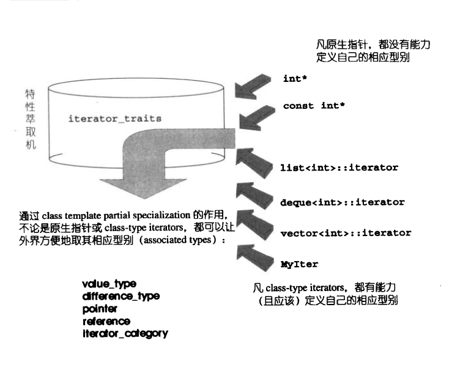
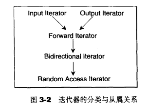
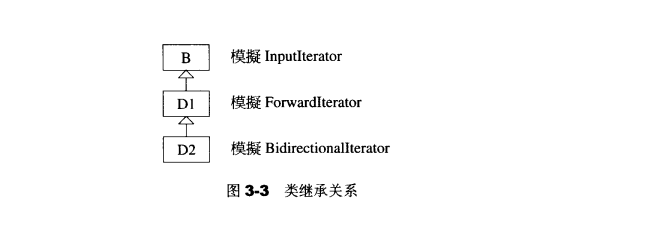

[toc]

# 迭代器(iterators)概念与traits编程技法
迭代器(iterators)是一种抽象的设计改良，现实程序语言中并没有直接对应于这个概念的实物

在设计模式中iterator模式定义如下：提供一种方法，使之能够依序巡访某个聚合物(容器)所含的各个元素，而无需暴露该聚合物的内部表述方式

## 迭代器设计设计思维——STL关键所在
不论是泛型思维或STL的实际运用，迭代器(iterators)都扮演着重要的角色。STL的中心思想在于：将数据容器(containers)和算法(algorithms)分开，彼此独立设计，最后再以一帖胶着剂将它们撮合在一起

容器和算法的泛型化可以通过C++的class templates和funciton templates分别达成目标

```c++
// <stl_algo.h>
template<class InputIterator, class T>
InputerInterator find(InputIterator first, InputIterator last, const T& value)
{
    while(first != last && *first != value){
        ++first;
    }
    return first;
}
```
只要给予不同的迭代器，`find()`便能够对不同的容器进行查找操作
```c++
#include <vector>
#include <list>
#include <deque>
#include <algorithm>
#include <iostream>

using namespace std;

int main()
{
    const int arraySize = 7;
    int ia[arraySize] = {0, 1, 2, 3, 4, 5, 6};

    vector<int> ivect(ia, ia + arraySize);
    list<int> ilist(ia, ia + arraySize);
    deque<int> ideque(ia, ia + arraySize);

    vector<int>::iterator it1 = find(ivect.begin(), ivect.end(), 4);
    if(it1 == ivect.end()){
        cout << "4 not found." << endl;
    }else{
        cout << "4 found." << *it1 << endl;
    }

    list<int>::iterator it2 = find(ilist.begin(), ilist.end(), 6);
    if(it1 == ilist.end()){
        cout << "6 not found." << endl;
    }else{
        cout << "6 found." << *it2 << endl;
    }

    deque<int>::iterator it3 = find(ideque.begin(), ideque.end(), 8);
    if(it3 == ideque.end()){
        cout << "8 not found." << endl;
    }else{
        cout << "8 found." << *it2 << endl;
    }
}
```

## 迭代器(iterator)是一种smart pointer
迭代器是一种行为类似指针的对象，而指针的各种行为中最常见也最重要的便是内容提领(dereference)和成员访问(member access)，因此，迭代器最重要的编程工作就是对`operator*`和`operator->`进行重载工作

`auto_ptr`指针简化版
```c++
template<class T>
class auto_ptr{
public:
    explicit auto_ptr(T *p = 0):pointee(p){}
    template<class U>
    auto_ptr<auto_ptr<U>& rhs>:pointee(rhs.release()){}
    ~auto_ptr(){delete pointee;}

    template<class U>
    auto_ptr<T>& operator=(auto_ptr<U>& rhs){
        if(this != &rhs) reset(rhs.release());
        return *this;
    }

    T& operator*() const {return *pointee;}
    T* operator->() const {return pointee;}
    T* get() const {return pointee;}
private:
    T *pointee;
};
```

为list(链表)设计一个迭代器，假设list及其节点的结构如下：
```c++
template<typename T>
class List
{
    void insert_front(T value);
    void insert_end(T value);
    void display(std::ostream &os = std::cout) const;
    //...
private:
    ListItem<T> *_end;
    ListItem<T> *_front;
    long _size;
};

template<typename T>
class ListItem
{
public:
    T value() const {return _value;}
    ListItem* next() const {return _next;}
    //...
private:
    T _value;
    ListItem* _next;
};
```
我们需要为它设计一个行为类似指针的外衣，也就是一个迭代器，当提领(dereference)这一迭代器时，传回的应该是个ListItem对象；当递增该迭代器时，它应该指向下一个ListItem对象，为了让该迭代器适用于任何形态的节点，而不只限于ListItem，我们将它设计为一个class template:
```c++
#include "3mylist.h"

template<class Item>
struct ListIter
{
    Item* ptr;

    ListIter(Item* p = 0):ptr(p){}

    Item& operator*() const {return *ptr;}
    Item* operator->() const {return ptr;}

    ListIter& operator++(){
        ptr = ptr->next(); 
        return *this;
    }

    ListIter& operator++(int){
        ListIter tmp = *this;
        ++*this;
        return tmp;
    }

    bool operator==(const ListIter& i) const
    {
        return ptr == i.ptr;
    }

    bool operator!=(const ListIter& i) const
    {
        return ptr != i.ptr;
    }
};

void main()
{
    List<int> mylist;

    for(int i = 0; i < 5; ++i){
        mylist.insert_front(i);
        mylist.insert_end(i + 2);
    }

    mylist.display();

    ListIter<ListItem<int>> begin(mylist.front());
    ListIter<ListItem<int>> end;
    ListIter<ListItem<int>> iter;

    iter = find(begin, end, 3);
    if(iter == end){
        cout << "not found" << endl;
    }else{
        cout << "found." << iter->value() << endl;
    }

    if(iter == end){
        cout << "not found" << endl;
    }else{
        cout << "found." << iter->value() << endl;
    }
};
```
由于`find()`函数内以`*iter != value`来检查元素值是否吻合，所以必须写一个全局的`operator!=`重载函数，并以int和ListItem<int> 作为它的两个参数型别：
```c++
template<typename T>
bool operator!=(const ListItem<T>& item, T n)
{
    return item.value() != n;
}
```
## 迭代器相应型别(associated types)
在算法中运用迭代器时，可能会用到其相应型别(associated type)，迭代器所指之物的型别便是其一，假设算法中有必要声明一个变量，以"迭代器所指对象的型别"为型别，利用function template的参数推导(argument deducation)机制来实现
```c++
template<class I, class T>
void func_impl(I iter, T t)
{
    T tmp;
};

template<class I>
inline void func(I iter)
{
    func_imp1(iter, *iter);
}

int main()
{
    int i;
    func(&i);
}
```
以`func()`为对外接口，把实际操作全部置于`func_impl()`之中，由于`func_impl()`是一个function template，一旦被调用，编译器会自动进行template参数推导，于是导出型别T，顺利解决问题

迭代器相应型别(associated types)不只是"迭代器所指对象的型别"一种而已，根据经验，最常用的相应型别有五种，然而并非任何情况下任何一种都可利用上述的template参数推导机制来取得

## Traits编程技法——STL源代码门钥
迭代器所指对象的型别，称为该迭代器的value type,上述的参数型别推导技巧虽然可用于value type，却非全面可用：万一value type必须用于函数的传回值，就束手无策了，毕竟函数的"template参数推导机制"推而导之的只是参数，无法推导函数的返回值型别

声明内嵌型别似乎是个好主意
```c++
tempalte<class T>
struct MyIter{
    typedef T value_type;
    T* ptr;
    MyIter(T* p = 0) : ptr(p) {}
    T& operator*() const {return *ptr;}
};

template<class I>
typename I::value_type func(I iter)
{
    return *iter;
}
//
MyIter<int> iter(new int(8));
cout << func(iter);
```
`func()`的返回类型必须加上关键字`typename`，因为T是一个template参数，在它被编译器具现化之前，编译器对T一无所悉，编译器此时并不知道`MyIter<T>::value_type`代表的是一个型别或是一个`member function`或是一个`data member`，关键字`typename`的用意在于告诉编译器这是一个型别，如此才能顺利通过编译

但是有一个隐晦的陷阱：并不是所有迭代器都是`class type`，原生指针就不是，如果不是`class type`，就无法为它定义内嵌型别，但STL(整个泛型思维)必须接受原生指针作为一种迭代器

**Partial Specialization(偏特化)**
如果`class template`拥有一个以上的`template`参数，可以针对其中某个(或数个，但非全部)`template`参数进行特化工作。换句话说，可以在泛化设计中提供一个特化版本(将泛化版本中的某些`template`参数赋予明确的指定)

假设有一个`class template`如下：
```c++
template<typename U, typename V, typename T>
class C{...};
```
**partial specialization**的定义："针对(任何)`template`参数更进一步的条件限制所设计出来的一个特化版本"

一个`class template`:
```c++
template<typename T>
class C {...};  //这个泛化版本允许(接受)T为任何型别
```
同时很容易接受它有一个形式如下的**partial specialization**:
```c++
template<typename T>
class C<T*> {...}; //这个特化版本仅适用于"T为原生指针的情况"
//"T为原生指针"便是"T为任何型别"的一个更进一步的条件限制
```

有了这个，我们可以解决"内嵌型别"未能解决的问题，先前的问题是，原生指针并非class，因此无法为它们定义内嵌型别，现在，可以针对"迭代器之template参数为指针"者，设计特化版的迭代器

下面这个`class template`专门用来**萃取**迭代器特性，而`value type`正是迭代器的特性之一：
```c++
template <class I>
struct iterator_traits{ //traits 意为 "特性"
    typedef typename I::value_type value_type;
};
```

这个**traits**，其意义是，如果I定义有自己的value type，那么通过这个`traits`的作用，萃取出来的`value type`就是`I:value_type`，也就是说，如果I定义有自己的`value type`，先前`func()`可以改写成这样：
```c++
template <class I>
typename iterator_traits<I>::value_type func(I ite)
{
    return *ite;
}
```
但除了多一层间接性，又有什么好处呢？好处是**traits**可以拥有特化版本，可以令`iterator_traites`拥有一个**partial specializations**：
```c++
template<class T>
struct iterator_traits<T*>{ //偏特化版——迭代器是个原生指针
    typedef T value_type;
};
```
于是，原生指针`int*`虽然不是一种`class type`，亦可通过**traits**取其`value type`，从而解决了先前的问题

但是，针对"指向常数对象的指针(pointer-to-const)"：
```c++
iterator_traits<const int*>::value_type
```
是什么结果？我们获得的是`const int`而非`int`，我们希望利用这种机制来声明一个暂时变量，使其型别与迭代器的`value type`相同，而现在，声明一个无法赋值(因`const`之故)的暂时变量；因此，如果迭代器是个`pointer-to-const`，应该设法令其`value type`为一个`non-const`型别，所以只要另外设计一个特化版本，解决这个问题：
```c++
template<class T>
struct iterator_traits<const T*>{//偏特化版——当迭代器是个pointer-to-const时，萃取出来的型别应该是T而非const T
    typedef T value_type;
};
```
现在无论是迭代器`MyIter`,或是原生指针`int*`或`const int*`，都可以通过`traits`取出正确的`value type`


**traits**所扮演的"特性萃取机"角色，萃取各个迭代器的特性。这里所谓的迭代器特性，指的是迭代器的相应型别(associated type)，若要这个"特性萃取机"**traits**能够运行，每一个迭代器必须遵循约定，自行以内嵌型别定义(nested type)的方式定义出相应型别(associated type)

根据经验，最常用到的迭代器相应型别有五种：`value type`, `difference type`, `pointer`, `reference`, 'iterator category'，如果希望开发的容器能与STL水乳交融，一定要为你的容器的迭代器定义这五种相应型别，"特性萃取机"**traits**会很忠实地将原汁原味榨取出来：
```c++
template <class I>
struct iterator_traits{
    typedef typename I::iterator_category iterator_category;
    typedef typename I::value_type value_type;
    typedef typename I::difference_type difference_type;
    typedef typename I::pointer pointer;
    typedef typename I::reference reference;
};
```
`iterator_traits`必须针对传入之型别为`pointer`及`pointer-to-const`者，设计特化版本

## 迭代器相应型别之一：value type
所谓`value type`，是指迭代器所指对象的型别，任何一个打算与STL算法有完美搭配的class，都应该定义自己的`value type`内嵌型别

## 迭代器相应型别之二：difference type
`difference type`用来表示两个迭代器之间的距离，因此它可以用来表示一个容器的最大容量，因为对于连续空间的容器而言，头尾之间的距离就是其最大容量，如果一个泛型算法提供计数功能，例如STL的`count()`，其传回值就必须使用迭代器的`difference type`:
```c++
template <class I, class T>
typename iterator_traits<I>::difference_type count(I first, I last, const T& value){
    typename iterator_traits<I>::difference_type n = 0;
    for(;first != last; ++first){
        if(*first == value){
            ++n;
        }
    }
    return n;
}
```
针对相应型别`difference type`，**traits**有如下两个(针对原生指针而写的)特化版本，以C++内建的`ptrdiff_t`(定义于`<cstddef>`头文件)作为原生指针的`difference type`:
```c++
template <class I>
struct iterator_traits{
    //...
    typedef typename I::difference_type difference_type;
};

//针对原生指针而设计的"偏特化(partial specialization)"版
template <class T>
struct iterator_traits<T*>{
    //...
    typedef ptrdiff_t difference_type;
};

//针对原生的poniter-to-const而设计的"偏特化(partial specialization)"版
template <class T>
struct iterator_traits<const T*>{
    //...
    typedef ptrdiff_t difference_type;
};
```
现在，任何时候当我们需要任何迭代器I的`difference type`，可以这么写：
```c++
typename iterator_traits<I>::difference_type
```

## 迭代器相应型别之三：reference type
从"迭代器所指之物的内容是否允许改变"的角度观之，迭代器分为两种：不允许改变"所指对象之内容"者，称为`constant iterators`,例如 `const int *pic`；允许改变"所指对象之内容"者，称为`mutable iterators`，例如`int* pi`，当我们对一个`mutable iterators`进行提领操作时，获得的不应该是一个右值(rvalue)，应该是一个左值(lvalue)，因为右值不允许赋值操作(assignment)，左值才允许：
```c++
int *pi = new int(5);
const int *pci = new int(9);
*pi = 7;    //允许
*pci = 1;   //不允许
```
在C++中，函数如果要传回左值，都是以`by reference`的方式进行，所有当p是个`mutable iterators`时，如果其`value type`是T，那么 *p的型别不应该是T，应该是T&，将此道理扩充，如果p是一个`constant iterators`，其`value type`是T，那么 *p的型别不应该是const T, 而应该是const T&

## 迭代器相应型别之四：pointer type
pointers 和 references 在C++中有非常密切的关联，如果"传回一个左值，令它代表p所指之物"是可能的，那么"传回一个左值，令它代表p所指之物的地址"也一定可以。也就是说，能够传回一个pointer，指向迭代器所指之物：

现在把`reference type`和`pointer type`这两个相应型别加入**traits**内：
```c++
template <class T>
struct iterator_traits{
    //...
    typedef typename T::pointer pointer;
    typedef typename T::reference reference;
};

//针对原生指针而设计的"偏特化(partial specialization)"
template <class T>
struct iterator_traits<T*>{
    //...
    typedef T* pointer;
    typedef T& reference;
};

//针对原生的pointer-to-const而设计的"偏特化版(partial specialization)"
template <class T>
struct iterator_traits<const T*>{
    //...
    typedef const T* pointer;
    typedef const T& reference;
};
```

## 迭代器相应型别之五：iterator_category
最后一个(第五个)迭代器的相应型别会引发较大规模的写代码工程，在那之前，必须先讨论迭代器的分类

根据移动特性与施行操作，迭代器被分为五类：
1. `Input Iterator`：这种迭代器所指的对象，不允许外界改变。只读(read only)
2. `Output Iterator`：唯写(write only)
3. `Forward Iterator`：允许"写入型"算法(例如replace())在此种迭代器所形成的区间上进行读写操作
4. `Bidirectional Iterator`：可双向移动，某些算法需要逆向走访某个迭代器区间(例如逆向拷贝某范围内的元素)，可以使用`Bidirectional Iterators`
5. `Random Access Iterator`：前四种迭代器都只供应一部分指针算术能力(前三种支持operator++，第四种再加上operator--)，第五种则涵盖所有指针算术能力，包括p+n, p-n, p[n], p1-p2, p1<p2.


这些迭代器的分类与从属关系

设计算法时，如果可能，尽量针对某种迭代器提供一个明确定义，并针对更强化的某种迭代器提供另一种定义，这样才能在不同情况下提供最大效率

在研究STL的过程中，每一分每一秒都要谨记在心，效率是个重要课题。假设有个算法可接受`Forward Iterator`，但以`Random Access Iterator`喂给它，它当然可以接受，因为一个`Random Access Iiterator`必然是一个`Forward Iterator`，但是可用并不表示最佳

拿`advance()`来说，该函数有两个参数，迭代器p和数值n；函数内部将p累进n次，(前进n距离)，下面有三份定义，一份针对`Input Iterator`，一份针对`Bidirectional Iterator`，另一份针对`Random Access Iterator`，倒是没有针对`Forward Iterator`而设计的版本，因为那和针对`Input Iterator`而设计的版本完全一致
```c++
template <typename InputIterator, typename Distance>
void advance_II(InputIterator& i, Distance n)
{
    while(n--) ++i;
}

template <typename BidirectionalIterator, typename Distance>
void advance_BI(BidirectionalIterator& i, Distance n)
{
    if(n >= 0){
        while(n--) ++i;
    }else{
        while(n++) --i;
    }
}

template <typename RandomAccessIterator, class Distance>
void advance_RAI(RandomAccessIterator& i, Distance n)
{
    i += n;
}
```
当程序调用`advance()`时，应该选用(调用)哪一份函数定义呢？如果选择`advance_II()`，对`Random Access Iterator`而言极度缺乏效率，原本O(1)的操作竟成为O(N)，如果选择`advance_RAI()`，则它无法接受`Input Interator`，所以需要将三者合一：
```c++
template <typename InputIterator, class Distance>
void advance(InputIterator& i, Distance n)
{
    if(is_random_access_iterator(i)){
        advance_RAI(i, n);
    }else if(is_bidirectional_iterator(i)){
        advance_BI(i, n);
    }else{
        advance_II(i, n);
    }
}
```
但是像这样在执行时期才决定使用哪一个版本，会影响程序效率，最好能够在编译期就选择正确的版本，重载函数机制可以达成这个目标

前面三个`advance_xx()`都有两个函数参数，型别都未定(因为都是`template`参数)，为了令其同名，形成重载函数，必须加上一个型别已确定的函数参数，使函数重载机制得以有效运行起来

设计考虑如下：如果**traits**有能力萃取出迭代器的种类，便可利用这个"迭代器类型"相应型别作为`advanced()`的第三个参数，这个相应型别一定必须是一个`class type`，不能只是数值号码类的东西，因为编译器需仰赖它(一个型别)来进行重载决议(overloaded resolution)，下面定义五个classed，代表五种迭代器类型：
```c++
//五个作为标记用的型别(tag_types)
struct input_iterator_tag{};
struct output_iterator_tag{};
struct forward_interator_tag : public input_iterator_tag{};
struct bidirectional_iterator_tag : public forward_iterator_tag{};
struct random_access_iterator_tag : public bidirectional_iterator_tag{};
```
这些class只作为标记用，所以不需要任何成员，至于为什么运用继承机制，稍后解释，现在重新设计`__advance()`，并加上第三参数，使它们形成重载：
```c++
template <class InputIterator, class Distance>
inline void __advance(InputIterator& i, Distance n, input_iterator_tag)
{
    while(n--) ++i;
}

template <class ForwardIterator, class Distance>
inline void __advance(ForwardIterator& i, Distance n, forward_interator_tag)
{
    advance(i, n, input_iterator_tag());
}

template <class BidirectionalIterator, class Distance>
inline void __advance(BidirectionalIterator& i, Distance n, bidirectional_iterator_tag)
{
    if(n >= 0){
        while(n--) ++i;
    }else{
        while(n++) --i;
    }
}

template <class RandomAccessIterator, class Distance>
inline void __advance(RandomAccessIterator&i Distance n, random_access_iterator_tag)
{
    i += n;
}
```
每个`__advance()`的最后一个参数都只声明型别，并未指定参数名称，因为它纯粹只是用来激活重载机制、函数之中根本不使用该参数

我们还需要提供一个对上开发的上传控制接口，调用上述各个重载的`__advance()`，这个上传接口只需要两个参数，当它准备将工作装给上述的`__advance()`时，才自行加上第三个参数：迭代器类型，因此，这个上层函数必须有能力从它所获得的迭代器中推导出其类型——这个工作交给**traits**机制：
```c++
template <class InputIterator, class Distance>
inline void advance(InputIterator& i, Distance n)
{
    __advance(i, n, iterator_traits<InputIterator>::iterator_category());
}
```
`iterator_traits<Iterator>::iterator_category()`将产生一个暂时对象，其型别应该隶属于前述五个迭代器类型之一，然后，根据这个型别，编译器才决定调用哪一个`__advance()`重载函数

因此，为了满足上述行为，**traits**必须再增加一个相应的型别：
```c++
template <class T>
struct iterator_traits{
    //...
    typedef typename T::iterator_category iterator_category;
};

//针对原生指针而设计的"偏特化版"
template <class T>
struct iterator_traits<T*>{
    //...
    //注意，原生指针是一种Random Access Iterator
    typedef random_access_iterator_tag iterator_category;
};

//针对原生的pointer-to-const而设计的"偏特化版"
template <class T>
struct iterator_traits<const T*>
{
    //...
    //注意，原生的pointer-to-const是一种Random Access Iterator
    typedef random_access_iterator_tag iterator_category;
};
```

任何一个迭代器，其类型永远应该落在"该迭代器所隶属之各种类型中，最强化的那个"，比如，int*即是`Random Access Iterator`，又是`Bidrectional Iterator`，同时也是`Forward Iterator`，而且也是`Input Iterator`，那么，其类型应该归属为`random_access_iterator_tag`

```c++
template <class InputIterator, class Distance>
inline void advance(InputIterator& i, Distance n);
```
按说`advance()`既然可以接受各种类型的迭代器，就不应将其型别参数命名为`InputIterator`，这其实是STL算法的一个命名规则：以算法能接受之最低阶迭代器类型，来为其迭代器型别参数命名

**消除"单纯传递调用的函数"**
以`class`来定义迭代器的各种分类标签，不仅可以促成重载机制的成功运作(使编译器得以正确执行重载决议，overloaded resolution)，另一个好处是，通过继承，可以不必再写"单纯只做传递调用"的函数

```c++
#include <iostream>
using namespace std;

struct B{};
struct D1 : public B{};
struct D2 : public D1{};

template <class T>
void func(T& p, B)
{
    cout << "B version" << endl;
}

template <class T>
void func(T& p, D2)
{
    cout << "D2 version" << endl;
}

int main()
{
    int* p;
    func(p, B());
    func(p, D1());
    func(p, D2());
}
```

**以distance()为例**
`distance()`是常用的一个迭代器操作函数，用来计算两个迭代器之间的距离，针对不同的迭代器类型，它可以有不同的计算方式、带来不同的效率，整个设计模式和前述的`advance()`如出一辙：
```c++
template <class InputIterator>
inline iterator_traits<InputIterator>::difference_type __distance(InputIterator first, InputIterator last, input_interator_tag)
{
    iterator_traits<InputIterator>::difference_type n = 0;
    whiel(first != last){
        ++first;
        ++n;
    }
    return n;
}

template <class RandomAccessIterator>
inline iterator_traits<RandomAccessIterator>::difference_type __distance(RandomAccessIterator first, RandomAccessIterator last, random_access_iterator_tag)
{
    return last - first;
}

template <class InputIterator>
inline iterator_traits<InputIterator>::difference_type distance(InputIterator first, InputIterator last)
{
    typedef typename iterator_traits<InputIterator>::iterator_category category;
    return __distance(first, last, category());
}
```
当客户端调用`distance()`并使用`Output Iterator`或`Forward Iterator`或`Bidirectional Iterator`时，统统都会传递调用`Input Iterator`版的那个`__distance()`函数

## std::iterator的保证
为了复合规范，任何迭代器都应该提供五个内嵌相应型别，以利于`traits`萃取，否则无法与其他STL组件顺利搭配，STL提供了一个`iterators class`，如果每个新设计的迭代器都继承自它，就可保证符合STL所需之规范
```c++
template <class Category,
          class T,
          class Distance = ptrdiff_t,
          class Pointer = T*,
          class Reference = T&>
struct iterator{
    typedef Category    iterator_category;
    typedef T           value_type;
    typedef Distance    difference_type;
    typedef Pointer     pointer;
    typedef Reference   reference;
};

```
`iterator class`不包含任何成员，纯粹只是型别定义，所以继承它并不会招致任何额外负担，由于后三个参数皆有默认值，故新的迭代器只需提供前两个即可
```c++
template <class Item>
struct ListIter : public std::iterator<std::forward_iterator_tag, Item>
{...}
```

**总结**
设计适当的相应型别(associated types)，是迭代器的责任，设计适当的迭代器，则是容器的责任。唯容器本身，才知道该设计怎样的迭代器来遍历自己，并执行迭代器该有的各种行为(前进、后退、取值、取用成员...)，至于算法，完全可以独立于容器和迭代器之外自行发展，只要设计以迭代器为对外接口就行

**traits**编程技法大量运用于STL实现品中，它利用"内嵌型别"的编程技巧与编译器的`template`参数推导功能，增强C++未能提供的关于型别认证方面的能力，弥补C++不为强型别(strong typed)语言的遗憾

## iterator源代码完全重列
```c++
//STL<stl_iterator.h>
//五种迭代器类型
struct input_iterator_tag{};
struct output_iterator_tag{};
struct forward_iterator_tag : public input_iterator_tag{};
struct bidirectional_iterator_tag : public forward_iterator_tag{};
struct random_access_iterator_tag : public bidirectional_iterator_tag{};

//为避免写代码时挂一漏万，自行开发的迭代器最好继承下面这个std::iterator
template <class Category, class T, class Distance = ptrdiff_t, class Pointer = T*, class Reference = T&>
struct interator{
    typedef Category        iterator_category;
    typedef T               value_type;
    typedef Distance        difference_type;
    typedef Pointer         pointer;
    typedef Reference       reference;
};

//"榨汁机"traits
template<class Iterator>
struct iterator_traits{
    typedef typename Iterator::iterator_category iterator_category;
    typedef typename Iterator::value_type value_type;
    typedef typename Iterator::difference_type difference_type;
    typedef typename Iterator::pointer pointer;
    typedef typename Iterator::reference reference;
};

//针对原生指针(native pointer)而设计的traits偏特化版
template <class T>
struct iterator_traits<T*>{
    typedef random_access_iterator_tag  iterator_category;
    typedef T           value;
    typedef ptrdiff_t   difference_type;
    typedef T*          pointer;
    typedef T&          reference;
};

//针对原生之poniter-to-const而设计的traits偏特化版
template <class T>
struct iterator_traits<const T*>{
    typedef random_access_iterator_tag  iterator_category;
    typedef T           value;
    typedef ptrdiff_t   difference_type;
    typedef T*          pointer;
    typedef T&          reference;
};

//这个函数可以很方便地决定某个迭代器的类型(category)
template <class Iterator>
inline typename iterator_traits<Iterator>::iterator_category iterator_category(const Iterator&)
{
    typedef typename iterator_traits<Iterator>::iterator_category category;
    return category();
}

//这个函数可以很方便地决定某个迭代器的distance type
template <class Iterator>
inline typename iterator_traits<Iterator>::difference_type* distance_type(const Iterator&)
{
    return static_cast<typename iterator_traits<Iterator>::difference_type*>(0);
}

//这个函数可以很方便地决定某个迭代器的value type
template <class Iterator>
inline typename iterator_traits<Iterator>::value_type* value_type(const Iterator&)
{
    return static_cast<typename iterator_traits<Iterator>::value_type*>(0);
}

//以下是整理distance函数
template <class InputIterator>
inline iterator_traits<InputIterator>::difference_type __distance(InputIterator first, InputIterator last, input_iterator_tag)
{
    iterator_traits<InputIterator>::difference_type n = 0;
    while(first != last){
        ++first;
        ++n;
    }
    return n;
}

template <class RandomAccessIterator>
inline iterator_traits<RandomAccessIterator>::difference_type __distance(RandomAccessIterator first, RandomAccessIterator last, random_access_iterator_tag)
{
    return last - first;
}

template <class InputIterator>
inline iterator_traits<InputIterator>::difference_type distance(InputIterator first, InputIterator last)
{
    typedef typename iterator_traits<InputIterator>::iterator_category category;
    return __distance(first, last, category());
}

//以下是整组advance函数
template <class InputIterator, class Distance>
inline void __advance(InputIterator& i, Distance n, input_iterator_tag)
{
    while(n--) ++i;
}

template <class BidirectionalIterator, class Distance>
inline void __advance(BidirectionalIterator& i, Distance n, bidirectional_iterator_tag)
{
    if(n >= 0){
        while(n--) ++i;
    }else{
        while(n++) --i;
    }
}

template <class RandomAccessIterator, class Distance>
inline void __advance(RandomAccessIterator& i, Distance n, random_access_iterator_tag)
{
    i += n;
}

template <class InputIterator, class Distance>
inline void advance(InputIterator& i, Distance n)
{
    __advance(i, n, iterator_category(i));
}
```

## SGI STL的私房菜：__type_traits
**traits**编程技法很棒，适度弥补了C++语言本身的不足，STL只对迭代器加以规范，制定出`iterator_traits`这样的东西，SGI把这种技巧进一步扩大到迭代器以外的世界，于是有了所谓的`__type_traits`

`iterator_traits`负责萃取迭代器的特性，`__type_traits`则负责萃取型别(type)的特性。此处所关注的型别特性是指：这个型别是否具备`non-trivial defalt ctor`?是否具备`non-trivial copy ctor`?是否具备`non-trivial assignment operator`?是否具备`non-trivail dtor`?如果答案是否定的，在对这个型别进行构造、析构、拷贝、赋值等操作时，就可以采用最有效率的措施(例如根本不调用身居高位、不谋实事的那些`constructor`, `destructor`), 而采用内存直接处理操作如`malloc()`、`memcpy()`等等，获得最高效率，这对于大规模而操作频繁的容器，有着显著的效率提升

定义于SGI`<type_traits.h>`中的`__type_traits`，提供了一种机制，允许针对不同的型别属性(type attributes)，在编译时期完成函数派送决定(fucntion dispatch)，这对于撰写`template`很有帮助，例如，当准备对一个"元素型别未知"的数组执行`copy`操作时，如果能事先知道其元素型别是否有一个`trivial copy constructor`，便能够帮助我们决定是否可使用快速的`memcpy()`或`memmove()`

根据`iterator_traits`得来的经验，我们希望，程序之中可以这样运用`__type_traits<T>`, T代表任意型别：
```c++
__type_traits<T>::has_trivial_default_constructor
__type_traits<T>::has_trivial_copy_constructor
__type_traits<T>::has_trivial_assignment_operator
__type_traits<T>::has_trivial_destructor
__type_traits<T>::is_POD_type   //POD:plain old data
```
我们希望上述式子响应我们"真"或"假"(以便我们决定采取什么策略)，但其结果不应该只是一个bool值，应该有个有着真/假性质的"对象"，因为我们希望利用其响应来进行参数推导，而编译器只有面对class object形式的参数，才会做参数推导，为了，上述式子应该传回这样的东西：
```c++
struct __true_type{};
struct __false_type{};
```
这两个空白classes没有任何成员，不会带来额外负担，却又能标示真假，满足我们所需

为了达成上述五个式子，`__type_traits`内必须定义一些`typedefs`，其值不是`__true_type`就是`__false_type`，下面是SGI的做法：
```c++
template <class type>
struct __type_traits{
    //不要移除这个成员，它通知"有能力自动将__type_traits特化"的编译器说，现在所看到的这个__type_traits template是特殊的。这是为了确保万一编译器也使用一个名为__type_traits而其实与此处定义并无任何关联的template时，所有事情都仍将顺利运作
    typedef __true_type this_dummy_memmber_must_be_fisrt;
    /*
    以下条件应被遵守，因为编译器有可能自动为各型别产生专属的__type_traits特化版本：
    - 你可以重新排列以下的成员的次序
    - 你可以移除以下任何成员
    - 绝对不可以将以下成员重新命名而却没有改变编译器中对应名称
    - 新加入的成员会被视为一般成员，除非你在编译器中加上适当支持
    */
    typedef __false_type has_trivial_default_constructor;
    typedef __false_type has_trivial_copy_constructor;
    typedef __false_type has_trivial_assignment_operator;
    typedef __false_type has_trivial_destructor;
    typedef __false_type is_POD_type;
};
```
为什么SGI把所有内嵌型别都定义为`__false_type`呢？是的，SGI定义出最保守的值，然后再针对每一个标量型别(scalar types)设计适当的`__type_traits`特化版本，这样就解决了问题

上述`__type_traits`可以接受任何型别的参数，五个`typedefs`将经由以下管道获得实值：
1. 一般具现体(general instantiation)，内含对所有型别都必定有效的保守值。上述各个`has_trivial_xxx`型别都被定义为`__false_type`，就是对所有型别都必定有效的保守值
2. 经过声明的特化版本，例如`<type_traits.h>`内对所有C++标量型别(scalar types)提供了对应的特化声明
3. 某些编译器会自动为所有型别提供适当的特化版本

以下便是`<type_traits.h>`对所有C++标量型别所定义的`__type_traits`特化版本。这些定义对于内建有`__types_traits`支持能力的编译器并无伤害，对于无该等支持能力的编译器而言，则属必要
```c++
/*以下针对C++基本型别char, singned char, unsigned char, short, unsigned short, int, unsigned int, long, unsigned long, float, double, long double提供特化版本，注意，每一个成员的值都是__true_type，表示这些型别都可采用最快速方式(例如memcpy)来进行拷贝(copy)或赋值(assign)操作*/
//注意，SGI STL <stl_config.h>将以下出现的__STL_TEMPLATE_NULL定义为template<>，是所谓的class template explicit specialization

__STL_TEMPLATE_NULL struct __type_traits<char>{
    typedef __true_type has_trivial_default_constructor;
    typedef __true_type has_trivial_copy_constructor;
    typedef __true_type has_trivial_assignment_operator;
    typedef __true_type has_trivial_destructor;
    typedef __true_type is_POD_type;
};

__STL_TEMPLATE_NULL struct __type_traits<signed char>{
    typedef __true_type has_trivial_default_constructor;
    typedef __true_type has_trivial_copy_constructor;
    typedef __true_type has_trivial_assignment_operator;
    typedef __true_type has_trivial_destructor;
    typedef __true_type is_POD_type;
};

__STL_TEMPLATE_NULL struct __type_traits<unsigned char>{
    typedef __true_type has_trivial_default_constructor;
    typedef __true_type has_trivial_copy_constructor;
    typedef __true_type has_trivial_assignment_operator;
    typedef __true_type has_trivial_destructor;
    typedef __true_type is_POD_type;
};

__STL_TEMPLATE_NULL struct __type_traits<short>{
    typedef __true_type has_trivial_default_constructor;
    typedef __true_type has_trivial_copy_constructor;
    typedef __true_type has_trivial_assignment_operator;
    typedef __true_type has_trivial_destructor;
    typedef __true_type is_POD_type;
};

__STL_TEMPLATE_NULL struct __type_traits<unsigned short>{
    typedef __true_type has_trivial_default_constructor;
    typedef __true_type has_trivial_copy_constructor;
    typedef __true_type has_trivial_assignment_operator;
    typedef __true_type has_trivial_destructor;
    typedef __true_type is_POD_type;
};

__STL_TEMPLATE_NULL struct __type_traits<int>{
    typedef __true_type has_trivial_default_constructor;
    typedef __true_type has_trivial_copy_constructor;
    typedef __true_type has_trivial_assignment_operator;
    typedef __true_type has_trivial_destructor;
    typedef __true_type is_POD_type;
};

__STL_TEMPLATE_NULL struct __type_traits<unsigned int>{
    typedef __true_type has_trivial_default_constructor;
    typedef __true_type has_trivial_copy_constructor;
    typedef __true_type has_trivial_assignment_operator;
    typedef __true_type has_trivial_destructor;
    typedef __true_type is_POD_type;
};

__STL_TEMPLATE_NULL struct __type_traits<long>{
    typedef __true_type has_trivial_default_constructor;
    typedef __true_type has_trivial_copy_constructor;
    typedef __true_type has_trivial_assignment_operator;
    typedef __true_type has_trivial_destructor;
    typedef __true_type is_POD_type;
};

__STL_TEMPLATE_NULL struct __type_traits<unsigned long>{
    typedef __true_type has_trivial_default_constructor;
    typedef __true_type has_trivial_copy_constructor;
    typedef __true_type has_trivial_assignment_operator;
    typedef __true_type has_trivial_destructor;
    typedef __true_type is_POD_type;
};

__STL_TEMPLATE_NULL struct __type_traits<float>{
    typedef __true_type has_trivial_default_constructor;
    typedef __true_type has_trivial_copy_constructor;
    typedef __true_type has_trivial_assignment_operator;
    typedef __true_type has_trivial_destructor;
    typedef __true_type is_POD_type;
};

__STL_TEMPLATE_NULL struct __type_traits<double>{
    typedef __true_type has_trivial_default_constructor;
    typedef __true_type has_trivial_copy_constructor;
    typedef __true_type has_trivial_assignment_operator;
    typedef __true_type has_trivial_destructor;
    typedef __true_type is_POD_type;
};

__STL_TEMPLATE_NULL struct __type_traits<long double>{
    typedef __true_type has_trivial_default_constructor;
    typedef __true_type has_trivial_copy_constructor;
    typedef __true_type has_trivial_assignment_operator;
    typedef __true_type has_trivial_destructor;
    typedef __true_type is_POD_type;
};

//注意，以下针对原生指针设计__type_traits偏特化版本
//原生指针亦被视为一种标量型别
template<class T>
struct __type_traits<T*>{
    typedef __true_type has_trivial_default_constructor;
    typedef __true_type has_trivial_copy_constructor;
    typedef __true_type has_trivial_assignment_operator;
    typedef __true_type has_trivial_destructor;
    typedef __true_type is_POD_type;
};
```

`__types_traits`在SGI STL中的应用很广，例如`uninitialized_fill_n()`全局函数：
```c++
template<class ForwardIterator, class Size, class T>
inline ForwardIterator uninitialized_fill_n(ForwardIterator first, Size n, const T& x)
{
    return __uninitialized_fill_n(first, n, x, value_type(first));
}
```
该函数以x为蓝本，自迭代器`first`开始构造n个元素，为求取最大效率，首先以`value_type()`萃取出迭代器`first`的`value_type`，再利用`__type_traits`判断该型别是否为POD型别：
```c++
template <class ForwardIterator, class Size, class T, class T1>
inline ForwardIterator __uninitialized_fill_n(ForwardIterator first, Size n, const T& x, T1*)
{
    typedef typename __type_traits<T1>::is_POD_type is_POD;
    return __uninitialized_fill_n_aux(first, n, X, is_POD());
}
```

以下就"是否为POD型别"采取最适当的措施：
```c++
//如果不是POD型别，就会派送(dispatch)到这里
template <class ForwardIterator, class Size, class T>
ForwardIterator __uninitialized_fill_n_aux(ForwardIterator first, Size n, const T& x, __false_type)
{
    ForwardIterator cur = first;
    //为求阅读顺畅简化，以下将原本有的异常处理(exception handling)去除
    for(; n > 0; --n, ++cur){
        construct(&*cur, x);
    }
    return cur;
}

//如果是POD型别，就会派送(dispatch)到这里，下两行是原文件所附注解
//如果copy construction等同于assignment，而且有trival destructor,以下有效
template <class ForwardIterator, class Size, class T>
inline ForwardIterator __uninitialized_fill_n_aux(ForwardIterator first, Size n, const T& x, __true_type)
{
    return fill_n(first, n, x);
}

//以下是定于与<stl_algobase.h>中的fill_n()
template<class OutputIterator, class Size, class T>
OutputIterator fill_n(OutputIterator first, Size n, const T& value)
{
    for(; n > 0; --n, ++first){
        *first = value;
    }
    return first;
}
```

第二个例子是负责对象析构的`destroy()`全局函数
第三个例子是`copy()`全局函数(泛型算法之一)，这个函数有非常多的特化(specialization)与强化(refinement)版本，全都是为了效率考虑，希望在适当的情况下采用最快的手段。最基本的想法是这样：
```c++
//拷贝一个数组，其元素为任意型别，视情况采用最有效的拷贝手段
template <class T>
inline void copy(T* source, T* destination, int n)
{
    copy(source, destination, n, typename __type_traits<T>::has_trivial_copy_constructor());
}

//拷贝一个数组，其元素型别拥有non-trivial copy constructors
template <class T>
void copy(T* source, T* destination, int n, __false_type)
{
    //...
}

//拷贝一个数组，其元素型别拥有trivial copy constructors 可借助memcpy()完成工作
template <class T>
void copy(T* source, T* destination, int n, __true_type)
{
    //...
}
```
以上只是针对"函数参数为原生指针"的情况而做的设计

在`<type_traits.h>`有如下声明：
```c++
/*NOTE: This is an internal header file, included by other STL headers. You should not attempt to use it directly.*/
```
如果你是SGI STL的用户，你可以在自己的程序中充分运用这个`__type_traits`，假设自行定义了一个`Shape class`，`__type_traits`会对它产生什么效应？如果编译器够厉害，你会发现，`__type_traits`针对`Shape`萃取出来的每一个特性，其结果将取决于我的`Shape`是否有`trivial default ctor`，或`trivial copy ctor`，或`trivial assignment operator`，或`trivial dtor`而定，但对大部分缺乏这种特异功能的编译器而言，`__type_traits`针对`Shape`萃取出来的每一个特性都是`__false_type`，即使`Shape`是个POD型别、这样的结果当然过于保守，但是别无选择，除非我针对`Shape`，自行设计一个`__type_traits`特化版本，明白地告诉编译器以下事实：
```c++
template <>
struct __type_traits<Shape>{
    typedef __true_type has_trivial_default_constructor;
    typedef __false_type has_trivial_copy_constructor;
    typedef __false_type has_trivial_assignment_operator;
    typedef __false_type has_trivial_destructor;
    typedef __false_type is_POD_type;
};
```
究竟一个class什么时候该有自己的`non-trivial default constructor`，`non-trivial copy constructor`，`non-trivial assignment operator`，`non-trivial destructor`呢？一个简单的判断准则是：如果class内含指针成员，并且对它进行内存动态配置，那么这个class就需要实现出自己的`non-trivial-xxx`

即使你无法全面针对你自己定义的型别，设计`__type_traits`特化版本，无论如何，至少，有了这个`__type_traits`之后，当我们设计新的泛型算法时，面对C++标量型别，便有足够的信息决定采用最有效的拷贝操作或赋值操作——因为每一个标量型别都有对应的`__type_traits`特化版本，其中每一个`typedef`的值都是`__true_type`


