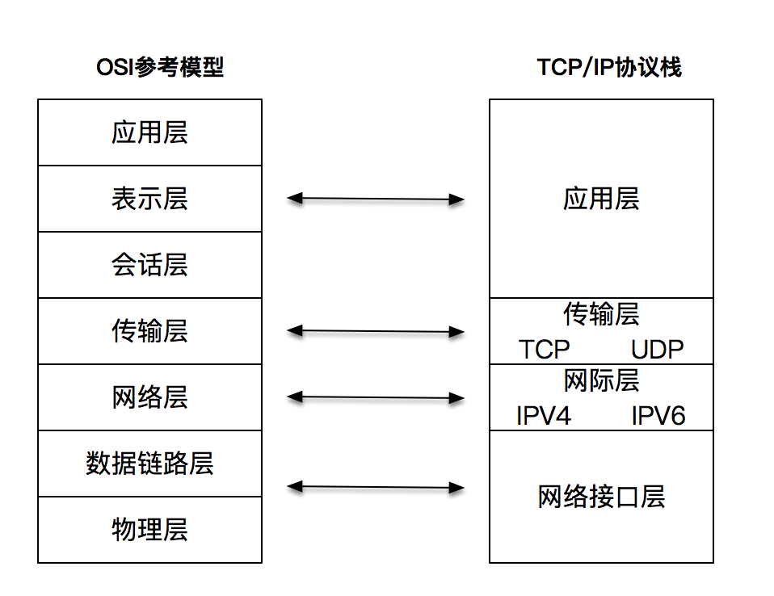
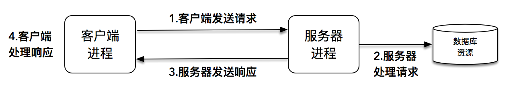
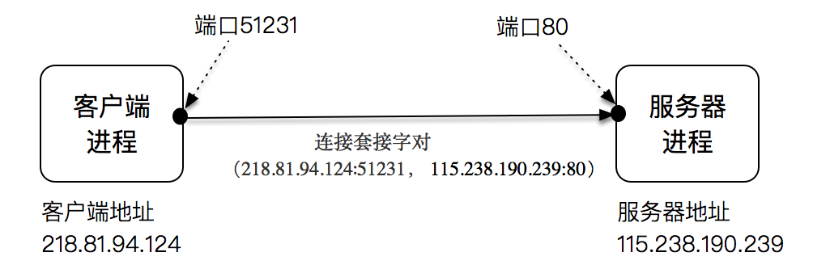

[toc]

# TCP/IP与ISO层次模型


# 客户端-服务器网络编程模型


在网络编程中，具体到客户端 - 服务器模型时，我们经常会考虑是使用 TCP 还是 UDP，其实它们二者的区别也很简单：TCP 中连接是谁发起的，在 UDP 中报文是谁发送的

服务器端需要在一开始就监听在一个众所周知的端口上，等待客户端发送请求，一旦有客户端连接建立，服务器端就会消耗一定的计算机资源为它服务，服务器端是需要同时为成千上万的客户端服务的。如何保证服务器端在数据量巨大的客户端访问时依然能维持效率和稳定，这也是我们讲述高性能网络编程的目的

客户端相对来说更为简单，它向服务器端的监听端口发起连接请求，连接建立之后，通过连接通路和服务器端进行通信

**还有一点需要强调的是，无论是客户端，还是服务器端，它们运行的单位都是进程（process），而不是机器**

# IP和端口
计算机的 IP 地址是唯一的，每个连接的端口号是不同的，端口号是一个 16 位的整数，最多为 65536。当一个客户端发起连接请求时，客户端的端口是由操作系统内核临时分配的，称为临时端口；然而，前面也提到过，服务器端的端口通常是一个众所周知的端口

一个连接可以通过客户端 - 服务器端的 IP 和端口唯一确定，这叫做套接字对
```
（clientaddr:clientport, serveraddr: serverport)
```


# 保留网段
国际标准组织在 IPv4 地址空间里面，专门划出了一些网段，这些网段不会用做公网上的 IP，而是仅仅保留作内部使用，我们把这些地址称作保留网段

下表是三个保留网段，其可以容纳的计算机主机个数分别是 16777216 个、1048576 个和 65536 个


# 子网掩码
第一是网络（network）的概念，直观点说，它表示的是这组 IP 共同的部分
第二是主机（host）的概念，它表示的是这组 IP 不同的部分

# 全球域名系统
域名（DNS）记录网站和 IP 的对应关系
全球域名按照从大到小的结构，形成了一棵树状结构。实际访问一个域名时，是从最底层开始写起


# 数据报和字节流
TCP，又被叫做字节流套接字（Stream Socket），UDP 也有一个类似的叫法, 数据报套接字（Datagram Socket），一般分别以“SOCK_STREAM”与“SOCK_DGRAM”分别来表示 TCP 和 UDP 套接字

Datagram Sockets 有时称为“无连接的 sockets”（connectionless sockets）

Stream sockets 是可靠的、双向连接的通讯串流。这就是由 TCP（Transmission Control Protocol）协议完成的，TCP 通过诸如连接管理，拥塞控制，数据流与窗口管理，超时和重传等一系列精巧而详细的设计，提供了高质量的端到端的通信方式

使用 UDP 的原因，是因为速度


