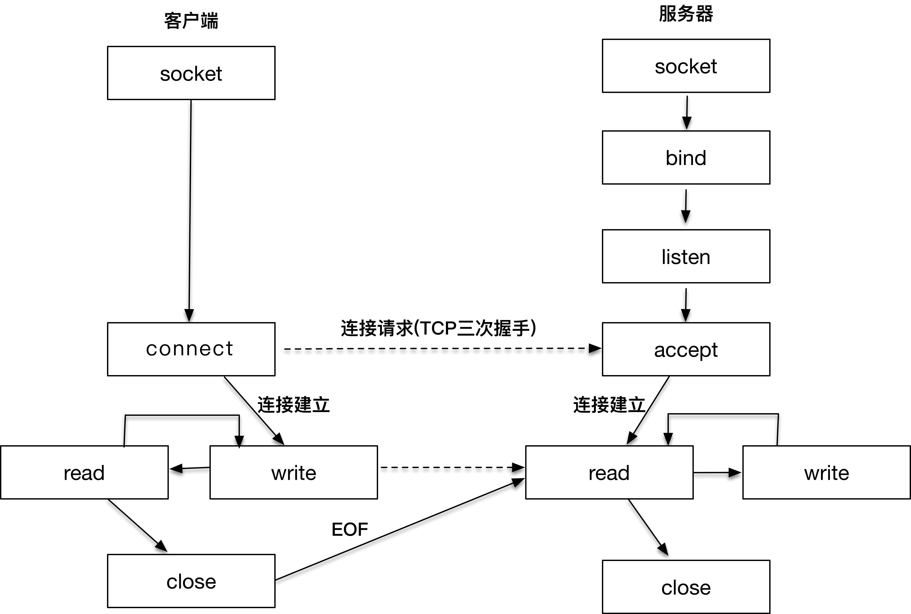
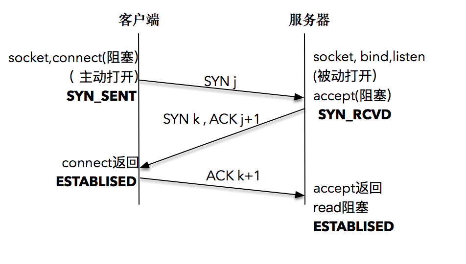

[toc]

# 客户端和服务器工作逻辑

从服务器端开始看，因为在客户端发起连接请求之前，服务器端必须初始化好。服务器端初始化的过程，首先初始化 `socket`，之后服务器端需要执行 `bind` 函数，将自己的服务能力绑定在一个众所周知的地址和端口上，紧接着，服务器端执行 `listen` 操作，将原先的 `socket` 转化为服务端的 `socket`，服务端最后阻塞在 `accept` 上等待客户端请求的到来

客户端需要先初始化 `socket`，再执行 `connect` 向服务器端的地址和端口发起连接请求，这里的地址和端口必须是客户端预先知晓的

这个过程，就是著名的**TCP 三次握手（Three-way Handshake）**

一旦三次握手完成，客户端和服务器端建立连接，就进入了数据传输过程

具体来说，客户端进程向操作系统内核发起`write`字节流写操作，内核协议栈将字节流通过网络设备传输到服务器端，服务器端从内核得到信息，将字节流从内核读入到进程中，并开始业务逻辑的处理，完成之后，服务器端再将得到的结果以同样的方式写给客户端。可以看到，**一旦连接建立，数据的传输就不再是单向的，而是双向的，这也是 TCP 的一个显著特性**

当客户端完成和服务器端的交互后，需要和服务器端断开连接时，就会执行`close`函数，操作系统内核此时会通过原先的连接链路向服务器端发送一个 FIN 包，服务器收到之后执行被动关闭，这时候整个链路处于半关闭状态，此后，服务器端也会执行`close`函数，整个链路才会真正关闭。半关闭的状态下，发起`close`请求的一方在没有收到对方 FIN 包之前都认为连接是正常的；而在全关闭的状态下，双方都感知连接已经关闭

以上所有的操作，都是通过`socket`来完成的。无论是客户端的`connect`，还是服务端的`accept`，或者`read/write`操作等，**socket 是我们用来建立连接，传输数据的唯一途径**

# 套接字地址格式
## 通用套接字地址格式
```c
/*POSIX 规范规定了地址族为2字节的值*/
typedef unsigned short int sa_family_t;
/*描述通用套接字地址*/
struct sockaddr{
    sa_family_t sa_family; //地址族，16bit
    char sa_data[14];  //具体的地址信息 112bit
};
```
在这个结构体里，第一个字段是地址族，它表示使用什么样的方式对地址进行解释和保存,地址族在 glibc 里的定义非常多，常用的有以下几种：
* `AF_LOCAL`：表示的是本地地址，对应的是 Unix 套接字，这种情况一般用于本地 socket 通信，很多情况下也可以写成 `AF_UNIX`、`AF_FILE`；
* `AF_INET`：因特网使用的 IPv4 地址；
* `AF_INET6`：因特网使用的 IPv6 地址。

这里的 `AF_` 表示的含义是 Address Family，但是很多情况下，我们也会看到以 PF_ 表示的宏，比如 `PF_INET`、`PF_INET6` 等，实际上 PF_ 的意思是 Protocol Family，也就是协议族的意思。我们用 `AF_xxx` 这样的值来初始化 socket 地址，用 `PF_xxx` 这样的值来初始化 socket。我们在 头文件中可以清晰地看到，这两个值本身就是一一对应的
```c
/*各种地址族的宏定义*/
#define AF_UNSPEC   PF_UNSPEC
#define AF_LOCAL    PF_LOCAL
#define AF_UNIX     PF_UNIX
#define AF_FILE     PF_FILE
#define AF_INET     PF_INET
#define AF_AX25     PF_AX25
#define AP_IPX      PF_IPX
#define AF_APPLETALK    PF_APPLETALK
#define AF_NETROM   PF_NETROM
#define AF_BRIDGE   PF_BRIDGE
#define AF_ATMPVC   PF_ATMPVC
#define AP_X25      PF_X25
#define AP_INET6    PF_INET6
```
`sockaddr` 是一个通用的地址结构，通用的意思是适用于多种地址族
## IPv4套接字格式地址
```c
/*IPv4套接字地址，32bit值*/
typedef uint32_t in_addr_t;
struct in_addr
{
    in_addr_t s_addr;
};

/*描述IPv4的套接字地址格式*/
struct sockaddr_in{
    sa_family_t sin_family; //16bit
    in_port_t sin_port; //端口号 16-bit
    struct in_addr sin_addr; //Internet address. 32bit

    /*这里仅仅用作占位符,不做实际用处*/
    unsigned char sin_zero[8];
};
```
首先和`sockaddr`一样，都有一个 16-bit 的 sin_family 字段，对于 IPv4 来说这个值就是 `AF_INET`

接下来是端口号，我们可以看到端口号最多是 16-bit，也就是说最大支持 2 的 16 次方，这个数字是 65536，所以我们应该知道支持寻址的端口号最多就是 65535。所谓保留端口就是大家约定俗成的，已经被对应服务广为使用的端口，比如 ftp 的 21 端口，ssh 的 22 端口，http 的 80 端口等。一般而言，大于 5000 的端口可以作为我们自己应用程序的端口使用
```c
/*standard well-known ports*/
enum{
    IPPORT_ECHO = 7,    /*Echo service*/
    IPPORT_DISCARD = 9, /*Discard transmissions service*/
    IPPORT_SYSTAT = 11, /*System status service*/
    IPPORT_DAYTIME = 13,    /*Time of day service*/
    IPPORT_NETSTAT = 15,    /*Network status service*/
    IPPORT_FTP = 21,    /*File Transfer Protocol*/
    IPPORT_TELNET = 23, /*Telnet protocol*/
    IPPORT_SMTP = 25,   /*Simple Mail Transfer Protocol*/
    IPPORT_TIMESERVER = 37, /*Timeserver service*/
    IPPORT_NAMESERVER = 42, /*Domain Name Service*/
    IPPORT_WHOIS = 43,      /*Internet Whois service*/
    IPPORT_MTP = 57,

    IPPORT_TFTP = 69,   /*Trivial File Transfer Protocol*/
    IPPORT_RJE = 77,    
    IPPORT_FINGER = 79, /*Finger service*/
    IPPORT_TTYLINK = 87,
    IPPORT_SUPDUP = 95, /*SUPDUP protocol*/

    IPPORT_EXECSERVER = 512, /*execd service*/
    IPPORT_LOGINSERVER = 513, /*rlogind service*/
    IPPORT_CMDSERVER = 514,
    IPPORT_EFSSERVER = 520,
    
    /*UDP ports*/
    IPPORT_BIFFUDP = 512,
    IPPORT_WHOSERVER = 513,
    IPPORT_ROUTESERVER = 520,

    /*Ports less than this value are reserved for privileged processes*/
    IPPORT_RESERVED = 1024,

    /*Ports greater this value are reserved for (non-privileged) servers*/
    IPPORT_USERRESERVED = 5000
};
```
实际的 IPv4 地址是一个 32-bit 的字段，可以想象最多支持的地址数就是 2 的 32 次方，大约是 42 亿，应该说这个数字在设计之初还是非常巨大的，无奈互联网蓬勃发展，全球接入的设备越来越多，这个数字渐渐显得不太够用了

## IPv6套接字地址格式
```c
struct sockaddr_in6
{
    sa_family_t sin6_family; //16bit
    in_port_t sin6_port; //传输端口号 16bit
    uint32_t sin6_flowinfo; //IPv6流控信息 32bit
    struct in6_addr sin6_addr; //IPv6地址128bit
    uint32_t sin6_scope_id; //IPv6域ID 32bit
};
```
整个结构体长度是 28 个字节，其中流控信息和域 ID 先不用管，这两个字段，一个在 glibc 的官网上根本没出现，另一个是当前未使用的字段。这里的地址族显然应该是 `AF_INET6`，端口同 IPv4 地址一样，关键的地址从 32 位升级到 128 位，这个数字就大到恐怖了，完全解决了寻址数字不够的问题

无论 IPv4 还是 IPv6 的地址格式都是因特网套接字的格式，还有一种本地套接字格式，用来作为本地进程间的通信， 也就是前面提到的 `AF_LOCAL`
```c
struct sockaddr_un{
    unsigned short sun_family;  //固定为AF_LOCAL
    char sun_path[108]; //路径名
};
```

## 几种套接字地址格式比较
IPv4 和 IPv6 套接字地址结构的长度是固定的，而本地地址结构的长度是可变的


# 服务端准备连接过程
## 创建套接字
要创建一个可用的套接字，需要使用下面的函数
```c
int socket(int domain, int type, int protocol)
```
`domain` 就是指 `PF_INET`、`PF_INET6` 以及 `PF_LOCAL` 等，表示什么样的套接字
`type` 可用的值是：
* **SOCK_STREAM：表示的是字节流，对应TCP**
* **SOCK_DGRAM：表示的是数据报，对应TCP**
* **SOCK_RAW：表示的是原始套接字**

参数 `protocol` 原本是用来指定通信协议的，但现在基本废弃。因为协议已经通过前面两个参数指定完成。`protocol` 目前一般写成 0 即可

## `bind`把套接字和套接字地址绑定
```c
int bind(int fd, struct sockaddr* addr, socklen_t len)
```
`bind` 函数后面的第二个参数是通用地址格式`sockaddr * addr`。这里有一个地方值得注意，那就是虽然接收的是通用地址格式，实际上传入的参数可能是 IPv4、IPv6 或者本地套接字格式。`bind` 函数会根据 `len` 字段判断传入的参数 `addr` 该怎么解析，`len` 字段表示的就是传入的地址长度，它是一个可变值

对于使用者来说，每次需要将 IPv4、IPv6 或者本地套接字格式转化为通用套接字格式
```c
struct sockaddr_in name;
bind(sock, (struct sockaddr*)&name, sizeof(name));
```
对于实现者来说，可根据该地址结构的前两个字节判断出是哪种地址。为了处理长度可变的结构，需要读取函数里的第三个参数，也就是 len 字段，这样就可以对地址进行解析和判断

对于 IPv4 的地址来说，使用 `INADDR_ANY` 来完成通配地址的设置；对于 IPv6 的地址来说，使用 `IN6ADDR_ANY` 来完成通配地址的设置
```c
struct sockaddr_in name;
name.sin_addr.s_addr = htonl(INADDR_ANY); //IPv4通配地址
```
除了地址，还有端口。如果把端口设置成 0，就相当于把端口的选择权交给操作系统内核来处理，操作系统内核会根据一定的算法选择一个空闲的端口，完成套接字的绑定。这在服务器端不常使用

例子
```c
#include <stdio.h>
#include <stdlib.h>
#include <sys/socket.h>
#include <netinet/in.h>
int make_socket(uint16_t port)
{
    int sock;
    struct sockaddr_in name;
    sock = socket(PF_INET, SOCK_STREAM, 0);
    if(sock < 0){
        perror("socket");
        exit(EXIT_FAILURE);
    }

    name.sin_family = AF_INET;
    name.sin_port = htons(port);
    name.sin_addr.s_addr = htonl(INADDR_ANY);
    if(bind(sock, (struct sockaddr*)&name, sizeof(name)) < 0){
        perror("bind");
        exit(EXIT_FAILURE);
    }
    return sock;
}
```
## `listen`监听
初始化创建的套接字，可以认为是一个"主动"套接字，其目的是之后主动发起请求。通过 `listen` 函数，可以将原来的"主动"套接字转换为"被动"套接字，告诉操作系统内核：“我这个套接字是用来等待用户请求的。”当然，操作系统内核会为此做好接收用户请求的一切准备，比如完成连接队列
```c
int listen(int socketfd, int backlog)
```
第一个参数 `socketdf` 为套接字描述符，第二个参数 `backlog`，在 Linux 中表示已完成 (ESTABLISHED) 且未 `accept` 的队列大小，这个参数的大小决定了可以接收的并发数目。这个参数越大，并发数目理论上也会越大。但是参数过大也会占用过多的系统资源，一些系统，比如 Linux 并不允许对这个参数进行改变

## `accept`函数
当客户端的连接请求到达时，服务器端应答成功，连接建立，这个时候操作系统内核需要把这个事件通知到应用程序，并让应用程序感知到这个连接
连接建立之后，你可以把 `accept` 这个函数看成是操作系统内核和应用程序之间的桥梁
```c
int accept(int listensockfd, struct sockaddr* cliaddr, socklen_t* addrlen)
```
函数的第一个参数 `listensockfd` 是套接字，可以叫它为 `listen` 套接字，因为这就是前面通过 `bind`，`listen` 一系列操作而得到的套接字。函数的返回值有两个部分，第一个部分 `cliadd` 是通过指针方式获取的客户端的地址，`addrlen` 告诉地址的大小;另一个部分是函数的返回值，这个返回值是一个全新的描述字，代表了与客户端的连接

这里注意有两个套接字描述字，第一个是监听套接字描述字 `listensockfd`，它是作为输入参数存在的；第二个是返回的已连接套接字描述字

监听套接字一直都存在，它是要为成千上万的客户来服务的，直到这个监听套接字关闭；而一旦一个客户和服务器连接成功，完成了 TCP 三次握手，操作系统内核就为这个客户生成一个已连接套接字，让应用服务器使用这个**已连接套接字**和客户进行通信处理。如果应用服务器完成了对这个客户的服务，比如一次网购下单，一次付款成功，那么关闭的就是**已连接套接字**，这样就完成了 TCP 连接的释放。请注意，这个时候释放的只是这一个客户连接，其它被服务的客户连接可能还存在。最重要的是，监听套接字一直都处于“监听”状态，等待新的客户请求到达并服务

# 客户端发起连接过程
第一步和服务端一样，要建立一个套接字，方法和前面是一样的
不一样的是客户端需要调用 `connect` 向服务端发起请求
## `connect`建立连接
客户端和服务器端的连接建立，是通过 `connect` 函数完成的
```c
int connect(int sockfd, const struct sockaddr* servaddr, socklen_t addrlen)
```
函数的第一个参数 `sockfd` 是连接套接字，第二个、第三个参数 `servaddr` 和 `addrlen` 分别代表指向套接字地址结构的指针和该结构的大小。套接字地址结构必须含有服务器的 IP 地址和端口号

客户在调用函数 `connect` 前不必非得调用 `bind` 函数，因为如果需要的话，内核会确定源 IP 地址，并按照一定的算法选择一个临时端口作为源端口

如果是 TCP 套接字，那么调用 `connect` 函数将激发 TCP 的三次握手过程，而且仅在连接建立成功或出错时才返回。其中出错返回可能有以下几种情况：
1. 三次握手无法建立，客户端发出的 SYN 包没有任何响应，于是返回 TIMEOUT 错误。这种情况比较常见的原因是对应的服务端 IP 写错
2. 客户端收到了 RST（复位）回答，这时候客户端会立即返回 CONNECTION REFUSED 错误。这种情况比较常见于客户端发送连接请求时的请求端口写错，因为 RST 是 TCP 在发生错误时发送的一种 TCP 分节。产生 RST 的三个条件是：目的地为某端口的 SYN 到达，然而该端口上没有正在监听的服务器（如前所述）；TCP 想取消一个已有连接；TCP 接收到一个根本不存在的连接上的分节
3. 客户发出的 SYN 包在网络上引起了"destination unreachable"，即目的不可达的错误。这种情况比较常见的原因是客户端和服务器端路由不通

# TCP三次握手

这里使用的网络编程模型都是阻塞式的。所谓阻塞式，就是调用发起后不会直接返回，由操作系统内核处理之后才会返回
## 解读
服务器端通过 `socket`，`bind` 和 `listen` 完成了被动套接字的准备工作，被动的意思就是等着别人来连接，然后调用 `accept`，就会阻塞在这里，等待客户端的连接来临；客户端通过调用 `socket` 和 `connect` 函数之后，也会阻塞。接下来的事情是由操作系统内核完成的，更具体一点的说，是操作系统内核网络协议栈在工作

具体过程：
1. 客户端的协议栈向服务器端发送了 **SYN** 包，并告诉服务器端当前发送序列号 j，客户端进入 **SYNC_SENT** 状态；
2. 服务器端的协议栈收到这个包之后，和客户端进行 **ACK** 应答，应答的值为 j+1，表示对 SYN 包 j 的确认，同时服务器也发送一个 **SYN** 包，告诉客户端当前我的发送序列号为 k，服务器端进入 **SYNC_RCVD** 状态；
3. 客户端协议栈收到 **ACK** 之后，使得应用程序从 `connect` 调用返回，表示客户端到服务器端的单向连接建立成功，客户端的状态为 **ESTABLISHED**，同时客户端协议栈也会对服务器端的 **SYN** 包进行应答，应答数据为 k+1；
4. 应答包到达服务器端后，服务器端协议栈使得 `accept` 阻塞调用返回，这个时候服务器端到客户端的单向连接也建立成功，服务器端也进入 **ESTABLISHED** 状态

# 发送数据
```c
ssize_t write(int socketfd, const void* buffer, size_t size);
ssize_t send(int socketfd, const void* buffer, size_t size, int flags)
ssize_t sendmsg(int socketfd, const struct msghdr *msg, int flags)
```
每个函数都是单独使用的，使用的场景略有不同：
第一个函数是常见的文件写函数，如果把 socketfd 换成文件描述符，就是普通的文件写入。

如果想指定选项，发送带外数据，就需要使用第二个带 `flag` 的函数。所谓带外数据，是一种基于 TCP 协议的紧急数据，用于客户端 - 服务器在特定场景下的紧急处理

如果想指定多重缓冲区传输数据，就需要使用第三个函数，以结构体 `msghdr` 的方式发送数据

对于普通文件描述符而言，一个文件描述符代表了打开的一个文件句柄，通过调用 `write` 函数，操作系统内核帮我们不断地往文件系统中写入字节流。注意，写入的字节流大小通常和输入参数 `size` 的值是相同的，否则表示出错

对于套接字描述符而言，它代表了一个双向连接，在套接字描述符上调用 `write` 写入的字节数**有可能**比请求的数量少，这在普通文件描述符情况下是不正常的

## 发送缓冲区
当 TCP 三次握手成功，TCP 连接成功建立后，操作系统内核会为每一个连接创建配套的基础设施，比如**发送缓冲区**

发送缓冲区的大小可以通过套接字选项来改变，当我们的应用程序调用 `write` 函数时，实际所做的事情是把数据**从应用程序中拷贝到操作系统内核的发送缓冲区中**，并不一定是把数据通过套接字写出去

这里有几种情况：
第一种情况很简单，操作系统内核的发送缓冲区足够大，可以直接容纳这份数据，那么皆大欢喜，我们的程序从 `write` 调用中退出，返回写入的字节数就是应用程序的数据大小

第二种情况是，操作系统内核的发送缓冲区是够大了，不过还有数据没有发送完，或者数据发送完了，但是操作系统内核的发送缓冲区不足以容纳应用程序数据，在这种情况下，操作系统内核并不会返回，也不会报错，而是应用程序被阻塞，也就是说应用程序在 `write` 函数调用处停留，不直接返回

实际上，每个操作系统内核的处理是不同的。大部分 UNIX 系统的做法是一直等到可以把应用程序数据完全放到操作系统内核的发送缓冲区中，再从系统调用中返回

我们的操作系统内核是很聪明的，当 TCP 连接建立之后，它就开始运作起来。你可以把发送缓冲区想象成一条包裹流水线，有个聪明且忙碌的工人不断地从流水线上取出包裹（数据），这个工人会按照 TCP/IP 的语义，将取出的包裹（数据）封装成 TCP 的 MSS 包，以及 IP 的 MTU 包，最后走数据链路层将数据发送出去。这样我们的发送缓冲区就又空了一部分，于是又可以继续从应用程序搬一部分数据到发送缓冲区里，这样一直进行下去，到某一个时刻，应用程序的数据不可以完全放置到发送缓冲区里。在这个时候，`write` 阻塞调用返回。注意返回的时刻，应用程序数据并没有全部被发送出去，发送缓冲区里还有部分数据，这部分数据会在稍后由操作系统内核通过网络发送出去。

# 读取数据
套接字描述本身和本地文件描述符并无区别，在 **UNIX 的世界里万物都是文件**，这就意味着可以将套接字描述符传递给那些原先为处理本地文件而设计的函数。这些函数包括 read 和 write 交换数据的函数
## `read`函数
```c
ssize_t read(int socketfd, void* buffer, size_t size)
```
read 函数要求操作系统内核从套接字描述字 `socketfd`**读取最多多少个字节（size），并将结果存储到 buffer 中。返回值告诉我们实际读取的字节数目，也有一些特殊情况，如果返回值为 0，表示 EOF（end-of-file），这在网络中表示对端发送了 FIN 包，要处理断连的情况**；如果返回值为 -1，表示出错。当然，如果是非阻塞 I/O，情况会略有不同

如果我们想让应用程序每次都读到 size 个字节，就需要编写下面的函数，不断地循环读取
```c
//从socketfd描述字读取`size`个字节
size_t readn(int fd, void* buffer, size_t size)
{
    char *buffer_pointer = buffer;
    int length = size;
    while(lenght > 0){
        int result = read(fd, buffer_pointer, length);
        if(result < 0){
            if(errno == EINTR){
                continue; //考虑非堵塞的情况，这里需要再次调用read
            }else{
                return -1;
            }
        }else if(result == 0){
            break; //EOF(End of File)表示套接字关闭
        }

        length -= result;
        buffer_pointer += result;
    }
    return (size - length); //返回的是实际读取的字节数
}
```

# 缓冲区实验
客户端不断地发送数据，服务器端每读取一段数据之后进行休眠，以模拟实际业务处理所需要的时间
## 服务器端读取数据程序
```c
#include "lib/common.h"
void read_data(int sockfd)
{
    ssize_t n;
    char buf[1024];

    int time = 0;
    for(;;){
        fprintf(stdout, "block in read\n");
        if((n = readn(sockfd, buf, 1024)) == 0){
            return;
        }

        time++;
        fprintf(stdout, "1K read for %d\n", time);
        usleep(1000);
    }
}

int main(int argc, char **argv)
{
    int listenfd, connfd;
    socklen_t clilen;
    struct sockaddr_in cliaddr, servaddr;
    listenfd = socket(AF_INET, SOCK_STREAM, 0);
    bzero(&servaddr, sizeof(servaddr));
    servaddr.sin_family = AF_INET;
    servaddr.sin_addr.s_addr = htonl(INADDR_ANY);
    servaddr.sin_port = htons(12345);

    //bind到本地地址，端口为12345
    bind(listenfd, (struct sockaddr*)&servaddr, sizeof(servaddr));
    //listen的backlog为1024
    listen(listenfd, 1024);

    //循环处理用户请求
    for(;;){
        clilen = sizeof(cliaddr);
        connfd = accept(listenfd, (struct sockaddr*)&cliaddr, &clilen);
        read_data(connfd); //读取数据
        close(connfd); //关闭连接套接字，注意不是监听套接字
    }
}
```
## 客户端发送数据程序
```c
#include "lib/common.h"
#define MESSAGE_SIZE 102400

void send_data(int sockfd)
{
    char *query;
    query = malloc(MESSAGE_SIZE + 1);
    for(int i = 0; i < MESSAGE_SIZE; i++){
        query[i] = 'a';
    }
    query[MESSAGE_SIZE] = '\0';

    const char *cp;
    cp = query;
    size_t remaining = strlen(query);
    while(remaining){
        int n_written = send(sockfd, cp, remaining, 0);
        fprintf(stdout, "send into buffer %ld\n", n_written);
        if(n_written <= 0){
            error(1, errno, "send failed");
            return;
        }
        remaining -= n_written;
        cp += n_written;
    }
    return;
}

int main(int argc, char **argv){
    int sockfd;
    struct sockaddr_in servaddr;
    if(argc != 2){
        error(1, 0, "usage: tcpclient <IPaddress>");
    }
    sockfd = socket(AF_INET, SOCK_STREAM, 0);
    bzero(&servaddr, sizeof(servaddr));
    servaddr.sin_family = AF_INET;
    servaddr.sin_port = htons(12345);
    inet_pton(AF_INET, argv[1], &servaddr.sin_addr);
    int connect_rt = connect(sockfd, (struct sockaddr*)&servaddr, sizeof(servaddr));
    if(connect_rt < 0){
        error(1, errno, "connect failed");
    }
    send_data(sockfd);
    exit(0);
}
```
## 实验一：观察客户端数据发送行为
客户端程序发送了一个很大的字节流，程序运行起来之后，我们会看到服务端不断地在屏幕上打印出读取字节流的过程：

而客户端直到最后所有的字节流发送完毕才打印出下面的一句话，说明在此之前 `send` 函数一直都是阻塞的，也就是说**阻塞式套接字最终发送返回的实际写入字节数和请求字节数是相等的**。

## 实验二：服务端处理变慢
如果我们把服务端的休眠时间稍微调大，把客户端发送的字节数从 10240000 调整为 1024000，再次运行刚才的例子，我们会发现，客户端很快打印出一句话：

但与此同时，服务端读取程序还在屏幕上不断打印读取数据的进度，显示出服务端读取程序还在辛苦地从缓冲区中读取数据

**发送成功仅仅表示的是数据被拷贝到了发送缓冲区中，并不意味着连接对端已经收到所有的数据。至于什么时候发送到对端的接收缓冲区，或者更进一步说，什么时候被对方应用程序缓冲所接收，对我们而言完全都是透明的**