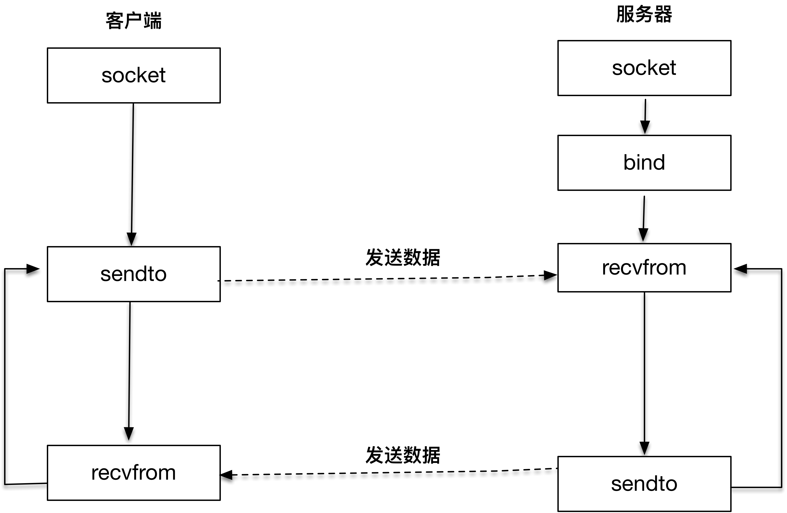

[toc]

# UDP与TCP不同
UDP 是一种“数据报”协议，而 TCP 是一种面向连接的“数据流”协议
UDP 和 TCP 之间最大的区别：TCP 是一个面向连接的协议，TCP 在 IP 报文的基础上，增加了诸如重传、确认、有序传输、拥塞控制等能力，通信的双方是在一个确定的上下文中工作的。而 UDP 则不同，UDP 没有这样一个确定的上下文，它是一个不可靠的通信协议，没有重传和确认，没有有序控制，也没有拥塞控制。我们可以简单地理解为，在 IP 报文的基础上，UDP 增加的能力有限。

UDP 不保证报文的有效传递，不保证报文的有序，也就是说使用 UDP 的时候，我们需要做好丢包、重传、报文组装等工作。

使用 UDP 协议原因：因为 UDP 比较简单，适合的场景还是比较多的，我们常见的 DNS 服务，SNMP 服务都是基于 UDP 协议的，这些场景对时延、丢包都不是特别敏感。另外多人通信的场景，如聊天室、多人游戏等，也都会使用到 UDP 协议

# UDP编程

服务器端创建 UDP 套接字之后，绑定到本地端口，调用 `recvfrom` 函数等待客户端的报文发送；客户端创建套接字之后，调用 `sendto` 函数往目标地址和端口发送 UDP 报文，然后客户端和服务器端进入互相应答过程

`recvfrom` 和 `sendto` 是 UDP 用来接收和发送报文的两个主要函数：
```c
#include <sys/socket.h>
ssize_t recvfrom(int sockfd, void *buff, size_t nbytes, int flags, struct sockaddr* from, socklen_t* addrlen);
ssize_t sendto(int sockfd, const void* buff, size_t nbytes, int flags, const struct sockaddr *to, socklen_t addrlen);
```
`sockfd`、`buff` 和 `nbytes` 是前三个参数。`sockfd` 是本地创建的套接字描述符，`buff` 指向本地的缓存，`nbytes` 表示最大接收数据字节
第四个参数 `flags` 是和 I/O 相关的参数，设置为 0
后面两个参数 `from` 和 `addrlen`，实际上是返回对端发送方的地址和端口等信息，这和 TCP 非常不一样，TCP 是通过 `accept` 函数拿到的描述字信息来决定对端的信息。另外 UDP 报文每次接收都会获取对端的信息，也就是说报文和报文之间是没有上下文的

函数的返回值告诉我们实际接收的字节数

`sendto` 函数中的前三个参数为 `sockfd`、`buff` 和 `nbytes`。`sockfd` 是本地创建的套接字描述符，`buff` 指向发送的缓存，`nbytes` 表示发送字节数。第四个参数 `flags` 依旧设置为 0
后面两个参数 `to` 和 `addrlen`，表示发送的对端地址和端口等信息

函数的返回值告诉我们实际发送的字节数

# UDP服务端
```c
#include "lib/common.h"
static int count;
static void recvfrom_int(int signo){
    printf("\nreceived %d datagrams\n", count);
    exit(0);
}

int main(int argc, char **argv)
{
    int socket_fd;
    socket_fd = socket(AF_INET, SOCK_STREAM, 0);
    struct sockaddr_in server_addr;
    
    bzero(&server_addr, sizeof(server_addr));
    server_addr.sin_family = AF_INET;
    server_addr.sin_addr.s_addr = htonl(INADDR_ANY);
    server_addr.sin_port = htons(SERV_PORT);
    
    bind(socket_fd, (struct sockaddr*)&server_addr, sizeof(server_addr));
    
    socklen_t client_len;
    char message[MAXLINE];
    count = 0;
    
    signal(SIGINT, recvfrom_int);
    
    struct sockaddr_in client_addr;
    client_len = sizeof(client_addr);
    for(;;){
        int n = recvfrom(socket_fd, message, MAXLINE, 0, (struct sockaddr*)&client_addr, &client_len);
        message[n] = 0;
        printf("received %d bytes:%s\n", n, message);

        char send_line[MAXLINE];
        sprintf(send_line, "Hi, %s", message);

        sendto(socket_fd, send_line, strlen(send_line), 0, (struct sockaddr*)&client_addr, client_len);
        
        count++;
    }
}
```
# UDP客户端
```c
#include "lib/common.h"

#define MAXLINE 4096

int main(int argc, char **argv){
    if(argc != 2){
        error(1, 0, "usage:udpclient <IPaddress>");
    }

    int socket_fd;
    socket_fd = socket(AF_INET, SOCK_STREAM, 0);
    
    struct sockaddr_in server_addr;
    bzero(&server_addr, sizeof(server_addr));
    server_addr.sin_family = AF_INET;
    server_addr.sin_port = htons(SERV_PORT);
    inet_pton(AF_INET, argv[1], &server_addr.sin_addr);

    socklen_t server_len = sizeof(server_addr);

    struct sockaddr *replay_addr;
    replay_addr = malloc(server_len);

    char send_line[MAXLINE], recv_line[MAXLINE + 1];
    socklen_t len;
    int n;

    while(fgets(send_line, MAXLINE, stdin) != NULL){
        int i = strlen(send_line);
        if(send_line[i - 1] == '\n'){
            send_line[i - 1] = 0;
        }

        printf("now sending %s\n", send_line);
        size_t rt = sendto(socket_fd, send_line, strlen(send_line), 0, (struct sockaddr*)&server_addr, server_len);
        if(rt < 0){
            error(1, errno, "send failed");
        }
        printf("send bytes:%zu\n", rt);

        len = 0;
        n = recvfrom(socket_fd, recv_line, MAXLINE, 0, reply_addr, &len);
        if(n < 0){
            error(1, errno, "recvfrom failed");
        }
        recv_line[n] = 0;
        fputs(recv_line, stdout);
        fputs("\n", stdout);
    }
    exit(0);
}
```
# 场景一：只运行客户端
如果只运行客户端，程序会一直阻塞在 `recvfrom` 上
```
$ ./udpclient 127.0.0.1
1
now sending g1
send bytes: 2
<阻塞在这里>
```
如果不开启服务端，TCP 客户端的 `connect` 函数会直接返回“Connection refused”报错信息。而在 UDP 程序里，则会一直阻塞在这里

# 场景二：先开启服务端，再开启客户端
```
$./udpserver
received 2 bytes: g1
received 2 bytes: g2
```
```
$./udpclient 127.0.0.1
g1
now sending g1
send bytes: 2
Hi, g1
g2
now sending g2
send bytes: 2
Hi, g2
```
# 场景三：开启服务端，再一次开启两个客户端
```
$./udpserver
received 2 bytes: g1
received 2 bytes: g2
received 2 bytes: g3
received 2 bytes: g4
```
```
$./udpclient 127.0.0.1
now sending g1
send bytes: 2
Hi, g1
g3
now sending g3
send bytes: 2
Hi, g3
```
```
$./udpclient 127.0.0.1
now sending g2
send bytes: 2
Hi, g2
g4
now sending g4
send bytes: 2
Hi, g4
```
两个客户端发送的报文，依次都被服务端收到，并且客户端也可以收到服务端处理之后的报文

如果我们此时把服务器端进程杀死，就可以看到信号函数在进程退出之前，打印出服务器端接收到的报文个数
```
$ ./udpserver
received 2 bytes: g1
received 2 bytes: g2
received 2 bytes: g3
received 2 bytes: g4
^C
received 4 datagrams
```
我们再重启服务器端进程，并使用客户端 1 和客户端 2 继续发送新的报文，我们可以看到和 TCP 非常不同的结果
以下就是服务器端的输出，服务器端重启后可以继续收到客户端的报文，这在 TCP 里是不可以的，TCP 断联之后必须重新连接才可以发送报文信息。但是 UDP 报文的“无连接”的特点，可以在 UDP 服务器重启之后，继续进行报文的发送，这就是 UDP 报文“无上下文”的最好说明
```
$ ./udpserver
received 2 bytes: g1
received 2 bytes: g2
received 2 bytes: g3
received 2 bytes: g4
^C
received 4 datagrams
$ ./udpserver
received 2 bytes: g5
received 2 bytes: g6
```
```
$./udpclient 127.0.0.1
now sending g1
send bytes: 2
Hi, g1
g3
now sending g3
send bytes: 2
Hi, g3
g5
now sending g5
send bytes: 2
Hi, g5
```
```
$./udpclient 127.0.0.1
now sending g2
send bytes: 2
Hi, g2
g4
now sending g4
send bytes: 2
Hi, g4
g6
now sending g6
send bytes: 2
Hi, g6
```

UDP 需要重点关注以下两点：
1. UDP 是无连接的数据报程序，和 TCP 不同，不需要三次握手建立一条连接
2. UDP 程序通过 `recvfrom` 和 `sendto` 函数直接收发数据报报文