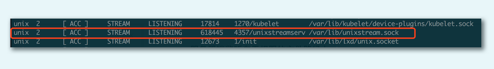

[toc]

本地套接字是 IPC，也就是本地进程间通信的一种实现方式。除了本地套接字以外，其它技术，诸如管道、共享消息队列等也是进程间通信的常用方法，但因为本地套接字开发便捷，接受度高，所以普遍适用于在同一台主机上进程间通信的各种场景

# 概述
本地套接字一般也叫做 UNIX 域套接字，最新的规范已经改叫本地套接字。在前面的 TCP/UDP 例子中，我们经常使用 127.0.0.1 完成客户端进程和服务器端进程同时在本机上的通信

本地套接字是一种特殊类型的套接字，和 TCP/UDP 套接字不同。TCP/UDP 即使在本地地址通信，也要走系统网络协议栈，而本地套接字，严格意义上说提供了一种单主机跨进程间调用的手段，减少了协议栈实现的复杂度，效率比 TCP/UDP 套接字都要高许多。类似的 IPC 机制还有 UNIX 管道、共享内存和 RPC 调用等


# 本地字节流套接字
服务器程序打开本地套接字后，接收客户端发送来的字节流，并往客户端回送了新的字节流
```c
#include "lib/common.h"
int main(int argc, char **argv)
{
    if(argc != 2){
        printf("usage:unixstreamserver <local_path>");
    }

    int listenfd, connfd;
    socklen_t clilen;
    struct sockaddr_un cliaddr, servaddr;

    listenfd = socket(AF_LOCAL, SOCK_STREAM, 0);
    if(listenfd < 0){
        printf("socket create failed");
    }

    char* local_path = argv[1];
    unlink(local_path);
    bzero(&servaddr, sizeof(servaddr));
    servaddr.sum_family = AF_LOCAL;
    strcpy(servaddr.sun_path, local_path);

    if(bind(listenfd, (struct sockaddr*)&servaddr, sizeof(servaddr)) < 0){
        printf("bind failed");
    }

    if(listen(listenfd, LISTENQ) < 0){
        printf("listen failed");
    }

    clilen = sizeof(cliaddr);
    if((connfd = accept(listenfd, (struct sockaddr*)&cliaddr, &clilen)) < 0){
        if(errno == EINTR){
            printf("accept failed");
        }else{
            printf("accept failed");
        }
    }

    char buf[BUFFER_SIZE];

    while(1){
        bzero(buf, sizeof(buf));
        if(read(connfd, buf, BUFFER_SIZE) == 0){
            printf("client quit");
            break;
        }

        printf("Receive: %s", buf);

        char send_line[MAXLINE];
        sprintf(send_line, "Hi, %s", buf);

        int nbytes = sizeof(send_line);

        if(write(connfd, send_line, nbytes) != nbytes){
            printf("write error");
        }
    }

    clse(listenfd);
    close(connfd);
    exit(0);
}
```
本地文件路径，需要明确一点，它必须是“绝对路径”，这样的话，编写好的程序可以在任何目录里被启动和管理。如果是“相对路径”，为了保持同样的目的，这个程序的启动路径就必须固定，这样一来，对程序的管理反而是一个很大的负担
另外还要明确一点，这个本地文件，必须是一个“文件”，不能是一个“目录”。如果文件不存在，后面 `bind` 操作时会自动创建这个文件

```c
#include "lib/common.h"

int main(int argc, char **argv)
{
    if(argc != 2){
        printf("usage: unixstreamclient <local_path>");
    }

    int sockfd;
    struct sockaddr_un servaddr;

    sockfd = socket(AF_LOCAL, SOCK_STREAM, 0);
    if(sockfd < 0){
        printf("create socket failed");
    }

    bzero(&servaddr, sizeof(servaddr));
    servaddr.sum_family = AF_LOCAL;
    strcpy(servaddr.sum_path, argv[1]);

    if(connect(sockfd, (struct sockaddr*)&servaddr, sizeof(servaddr)) < 0){
        printf("connect failed");
    }

    char send_line[MAXLINE];
    bzero(sendline, MAXLINE);
    char recv_line[MAXLINE];

    while(fgets(send_line, MAXLINE, stdin) != NULL){
        int nbytes = sizeof(send_line);
        if(write(sockfd, send_line, nbytes) != nbytes){
            printf("write error");
        }

        if(read(sockfd, recv_line, MAXLINE) == 0){
            printf("server terminated prematurely");
        }

        fputs(recv_line, stdout);
    }

    exit(0);
}
```

# 只启动客户端
```
$ ./unixstreamclient /tmp/unixstream.sock
connect failed: No such file or directory (2)
```
由于没有启动服务器端，没有一个本地套接字在 /tmp/unixstream.sock 这个文件上监听，客户端直接报错，提示我们没有文件存在

# 服务器端监听在无权限的文件路径上
在 Linux 下，执行任何应用程序都有应用属主的概念。在这里，我们让服务器端程序的应用属主没有 /var/lib/ 目录的权限，然后试着启动一下这个服务器程序
```
$ ./unixstreamserver /var/lib/unixstream.sock
bind failed: Permission denied (13)
```
这个结果告诉我们启动服务器端程序的用户，必须对本地监听路径有权限
```
sudo ./unixstreamserver /var/lib/unixstream.sock
(阻塞运行中)
```
打开另外一个 shell，我们看到 /var/lib 下创建了一个本地文件，大小为 0，而且文件的最后结尾有一个（=）号。其实这就是 bind 的时候自动创建出来的文件
```
$ ls -al /var/lib/unixstream.sock
rwxr-xr-x 1 root root 0 Jul 15 12:41 /var/lib/unixstream.sock=
```
如果我们使用 netstat 命令查看 UNIX 域套接字，就会发现 unixstreamserver 这个进程，监听在 /var/lib/unixstream.sock 这个文件路径上


# 服务器-客户端应答
```
$./unixstreamserver /tmp/unixstream.sock
Receive: g1
Receive: g2
Receive: g3
client quit
```
```
$./unixstreamclient /tmp/unixstream.sock
g1
Hi, g1
g2
Hi, g2
g3
Hi, g3
^C
```

# 本地数据报套接字
```c
#include "lib/common.h"
int main(int argc, char **argv)
{
    if(argc != 2){
        printf("usage: unixdataserver <local_path>");
    }

    int socket_fd;
    socket_fd = socket(AF_LOCAL, SOCK_DGRAM, 0);
    if(socket_fd < 0){
        printf("socket create failed");
    }

    struct sockaddr_un servaddr;
    char* local_path = argv[1];
    unlink(local_path);
    bzero(&servaddr, sizeof(servaddr));
    servaddr.sun_family = AF_LOCAL;
    strcpy(servaddr.sun_path, local_path);

    if(bind(socket_fd, (struct sockaddr*)&servaddr, sizeof(servaddr)) < 0){
        printf("bind failed");
    }

    char buf[BUFFER_SIZE];
    struct sockaddr_un client_addr;
    socklen_t client_len = sizeof(client_addr);
    while(1){
        bzero(buf, sizeof(buf));
        if(recvfrom(sock_fd, buf, BUFFER_SIZE, 0, (struct sockaddr*)&client_addr, &client_len) == 0){
            printf("client quit");
            break;
        }
        printf("Receive: %s\n", buf);

        char send_line[MAXLINE];
        bzero(send_line, MAXLINE);
        sprintf(send_line, "Hi, %s", buf);

        size_t nbytes = strlen(send_line);
        printf("now sending:%s \n", send_line);

        if(sendto(socket_fd, send_line, nbytes, 0, (struct sockaddr*)&client_addr, client_len) != nbytes){
            printf("sendto error");
        }
    }
    close(socket_fd);
    exit(0);
}
```
```c
#include "lib/common.h"

int main(int argc, char **argv) {
    if (argc != 2) {
        printf("usage: unixdataclient <local_path>");
    }

    int sockfd;
    struct sockaddr_un client_addr, server_addr;

    sockfd = socket(AF_LOCAL, SOCK_DGRAM, 0);
    if (sockfd < 0) {
        printf("create socket failed");
    }

    bzero(&client_addr, sizeof(client_addr));        /* bind an address for us */
    client_addr.sun_family = AF_LOCAL;
    strcpy(client_addr.sun_path, tmpnam(NULL));

    if (bind(sockfd, (struct sockaddr *) &client_addr, sizeof(client_addr)) < 0) {
        printf("bind failed");
    }

    bzero(&server_addr, sizeof(server_addr));
    server_addr.sun_family = AF_LOCAL;
    strcpy(server_addr.sun_path, argv[1]);

    char send_line[MAXLINE];
    bzero(send_line, MAXLINE);
    char recv_line[MAXLINE];

    while (fgets(send_line, MAXLINE, stdin) != NULL) {
        int i = strlen(send_line);
        if (send_line[i - 1] == '\n') {
            send_line[i - 1] = 0;
        }
        size_t nbytes = strlen(send_line);
        printf("now sending %s \n", send_line);

        if (sendto(sockfd, send_line, nbytes, 0, (struct sockaddr *) &server_addr, sizeof(server_addr)) != nbytes)
            printf("sendto error");

        int n = recvfrom(sockfd, recv_line, MAXLINE, 0, NULL, NULL);
        recv_line[n] = 0;

        fputs(recv_line, stdout);
        fputs("\n", stdout);
    }

    exit(0);
}
```
本地数据报套接字这么做的原因是，它需要指定一个本地路径，以便在服务器端回包时，可以正确地找到地址；而在 UDP 客户端程序里，数据是可以通过 UDP 包的本地地址和端口来匹配的

```
 ./unixdataserver /tmp/unixdata.sock
Receive: g1
now sending: Hi, g1
Receive: g2
now sending: Hi, g2
Receive: g3
now sending: Hi, g3
```
```
$ ./unixdataclient /tmp/unixdata.sock
g1
now sending g1
Hi, g1
g2
now sending g2
Hi, g2
g3
now sending g3
Hi, g3
^C
```
服务器端陆续收到客户端发送的数据报，同时，客户端也收到了服务器端的应答