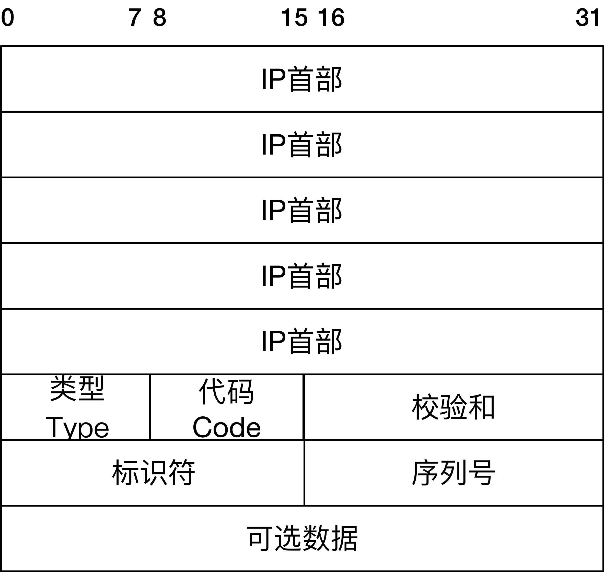
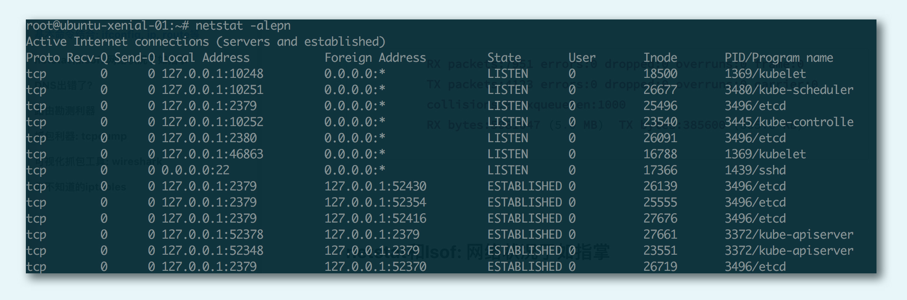
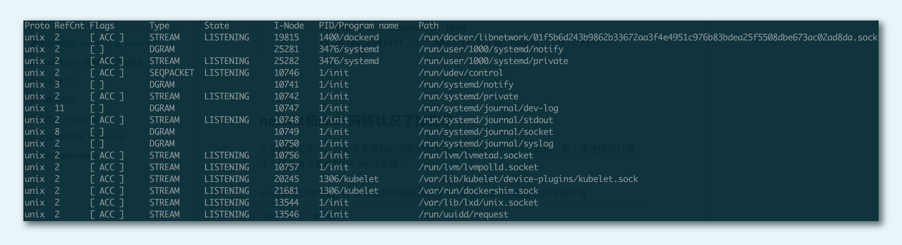
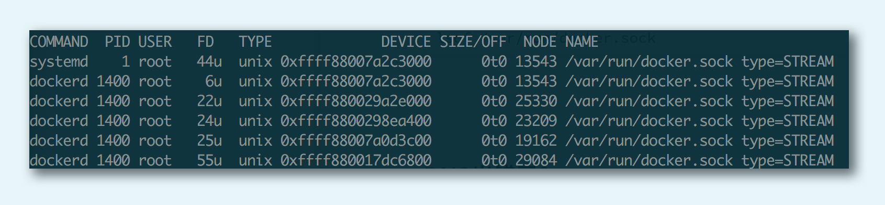
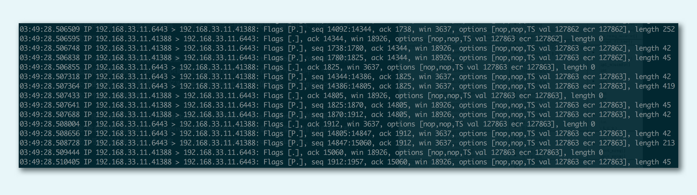
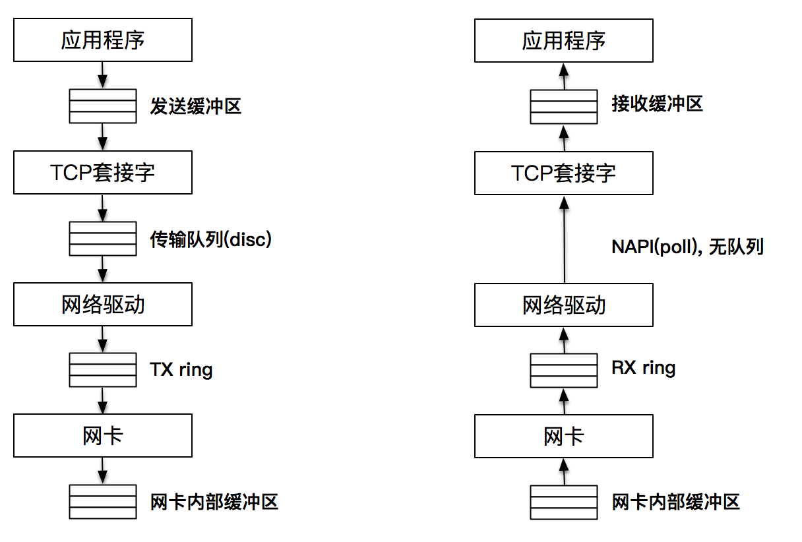

[toc]

# ping工具
“ping”这个命名来自于声呐探测，在网络上用来完成对网络连通性的探测
```
$ ping www.sina.com.cn
PING www.sina.com.cn (202.102.94.124) 56(84) bytes of data.
64 bytes from www.sina.com.cn (202.102.94.124): icmp_seq=1 ttl=63 time=8.64 ms
64 bytes from www.sina.com.cn (202.102.94.124): icmp_seq=2 ttl=63 time=11.3 ms
64 bytes from www.sina.com.cn (202.102.94.124): icmp_seq=3 ttl=63 time=8.66 ms
64 bytes from www.sina.com.cn (202.102.94.124): icmp_seq=4 ttl=63 time=13.7 ms
64 bytes from www.sina.com.cn (202.102.94.124): icmp_seq=5 ttl=63 time=8.22 ms
64 bytes from www.sina.com.cn (202.102.94.124): icmp_seq=6 ttl=63 time=7.99 ms
^C
--- www.sina.com.cn ping statistics ---
6 packets transmitted, 6 received, 0% packet loss, time 5006ms
rtt min/avg/max/mdev = 7.997/9.782/13.795/2.112 ms
```
使用 ping 命令探测了和新浪网的网络连通性。可以看到，每次显示是按照 sequence 序列号排序显示的，一并显示的，也包括 TTL（time to live），反映了两个 IP 地址之间传输的时间。最后还显示了 ping 命令的统计信息，如最小时间、平均时间等

ping 是基于一种叫做 ICMP 的协议开发的，ICMP 又是一种基于 IP 协议的控制协议，翻译为网际控制协议，其报文格式如下图

ICMP 在 IP 报文后加入了新的内容，这些内容包括：
* 类型：即 ICMP 的类型, 其中 ping 的请求类型为 8，应答为 0。
* 代码：进一步划分 ICMP 的类型, 用来查找产生错误的原因。
* 校验和：用于检查错误的数据。
* 标识符：通过标识符来确认是谁发送的控制协议，可以是进程 ID。
* 序列号：唯一确定的一个报文，前面 ping 名字执行后显示的 icmp_seq 就是这个值。

当发起 ping 命令时，ping 程序实际上会组装成如图的一个 IP 报文。报文的目的地址为 ping 的目标地址，源地址就是发送 ping 命令时的主机地址，同时按照 ICMP 报文格式填上数据，在可选数据上可以填上发送时的时间戳

IP 报文通过 ARP 协议，源地址和目的地址被翻译成 MAC 地址，经过数据链路层后，报文被传输出去。当报文到达目的地址之后，目的地址所在的主机也按照 ICMP 协议进行应答。之所以叫做协议，是因为双方都会遵守这个报文格式，并且也会按照格式进行发送 - 应答

应答数据到达源地址之后，ping 命令可以通过再次解析 ICMP 报文，对比序列号，计算时间戳等来完成每个发送 - 应答的显示，最终显示的格式就像前面的例子中展示的一样

ICMP 协议为我们侦测网络问题提供了非常好的支持。另外一种对路由的检测命令 Traceroute 也是通过 ICMP 协议来完成的

# ifconfig基本命令
Linux 有一个对应的命令叫做 ifconfig，也用来显示当前系统中的所有网络设备，通俗一点的说，就是网卡列表
```
vagrant@ubuntu-xenial-01:~$ ifconfig
cni0      Link encap:Ethernet  HWaddr 0a:58:0a:f4:00:01
          inet addr:10.244.0.1  Bcast:0.0.0.0  Mask:255.255.255.0
          inet6 addr: fe80::401:b4ff:fe51:bcf9/64 Scope:Link
          UP BROADCAST RUNNING MULTICAST  MTU:1450  Metric:1
          RX packets:2133 errors:0 dropped:0 overruns:0 frame:0
          TX packets:2216 errors:0 dropped:0 overruns:0 carrier:0
          collisions:0 txqueuelen:1000
          RX bytes:139381 (139.3 KB)  TX bytes:853302 (853.3 KB)


docker0   Link encap:Ethernet  HWaddr 02:42:93:0f:f7:11
          inet addr:172.17.0.1  Bcast:0.0.0.0  Mask:255.255.0.0
          inet6 addr: fe80::42:93ff:fe0f:f711/64 Scope:Link
          UP BROADCAST RUNNING MULTICAST  MTU:1500  Metric:1
          RX packets:653 errors:0 dropped:0 overruns:0 frame:0
          TX packets:685 errors:0 dropped:0 overruns:0 carrier:0
          collisions:0 txqueuelen:0
          RX bytes:49542 (49.5 KB)  TX bytes:430826 (430.8 KB)


enp0s3    Link encap:Ethernet  HWaddr 02:54:ad:ea:60:2e
          inet addr:10.0.2.15  Bcast:10.0.2.255  Mask:255.255.255.0
          inet6 addr: fe80::54:adff:feea:602e/64 Scope:Link
          UP BROADCAST RUNNING MULTICAST  MTU:1500  Metric:1
          RX packets:7951 errors:0 dropped:0 overruns:0 frame:0
          TX packets:4123 errors:0 dropped:0 overruns:0 carrier:0
          collisions:0 txqueuelen:1000
          RX bytes:5081047 (5.0 MB)  TX bytes:385600 (385.6 KB)
```
```
Link encap:Ethernet  HWaddr 02:54:ad:ea:60:2e
```
这段表明这是一个以太网设备，MAC 地址为 `02:54:ad:ea:60:2e`
```
inet addr:10.0.2.15  Bcast:10.0.2.255  Mask:255.255.255.0
inet6 addr: fe80::54:adff:feea:602e/64 Scope:Link
```
显示的是网卡的 IPv4 和 IPv6 地址，其中 IPv4 还显示了该网络的子网掩码以及广播地址

在每个 IPv4 子网中，有一个特殊地址被保留作为子网广播地址，比如这里的 10.0.2.255 就是这个子网的广播地址。当向这个地址发送请求时，就会向以太网网络上的一组主机发送请求
通常来说，这种被称作广播（broadcast）的技术，是用 UDP 来实现的
```
UP BROADCAST RUNNING MULTICAST  MTU:1500  Metric:1
```
显示的是网卡的状态，MTU 是最大传输单元的意思，表示的是链路层包的大小。1500 表示的是字节大小

Linux 在一台主机上可以有多个网卡设备，很可能有这么一种情况，多个网卡可以路由到目的地。在同时有无线网卡和有线网卡的情况下，Metric 就是用来确定多块网卡的优先级的，数值越小，优先级越高，1 为最高级。网络连接是从哪一个网卡设备上出去的
```
RX packets:7951 errors:0 dropped:0 overruns:0 frame:0
TX packets:4123 errors:0 dropped:0 overruns:0 carrier:0
collisions:0 txqueuelen:1000
RX bytes:5081047 (5.0 MB)  TX bytes:385600 (385.6 KB)
```
# netstat 和 lsof：对网络状况了如指掌
netstat 可以帮助我们了解当前的网络连接状况
```
netstat -alepn
```

netstat 会把所有 IPv4 形态的 TCP，IPV6 形态的 TCP、UDP 以及 UNIX 域的套接字都显示出来

对于 TCP 类型来说，最大的好处是可以清楚地看到一条 TCP 连接的四元组（源地址、源端口、目的地地址和目的端口）
```
tcp        0      0 127.0.0.1:2379          127.0.0.1:52464         ESTABLISHED 0          27710       3496/etcd
```
它表达的意思是本地 127.0.0.1 的端口 52464 连上本地 127.0.0.1 的端口 2379，状态为 ESTABLISHED，本地进程为 etcd，进程为 3496

```
netstat Socket -x -alepn
```

UNIX 套接字的结果稍有不同，最关键的信息是 Path，这个信息显示了本地套接字监听的文件路径，比如这条：
```
unix  3      [ ]         STREAM     CONNECTED     23209    1400/dockerd        /var/run/docker.sock
```
这其实就是大名鼎鼎的 Docker 在本地套接字的监听路径。/var/run/docker.sock 是本地套接字监听地址，dockerd 是进程名称，1400 是进程号

lsof 的常见用途之一是帮助我们找出在指定的 IP 地址或者端口上打开套接字的进程，而 netstat 则告诉我们 IP 地址和端口使用的情况，以及各个 TCP 连接的状态
通过 lsof 查看到底是谁打开了这个文件：
```
lsof /var/run/docker.sock
```

lsof 还有一个非常常见的用途。如果我们启动了一个服务器程序，发现这个服务器需要绑定的端口地址已经被占用，内核报出“该地址已在使用”的出错信息，我们可以使用 lsof 找出正在使用该端口的那个进程。比如下面这个代码，就帮我们找到了使用 8080 端口的那个进程，从而帮助我们定位问题
```
lsof -i :8080
```

# 抓包利器：tcpdump
tcpdump 这样的抓包工具对于网络编程而言是非常有用的，特别是在一些“山重水复疑无路”的情形下，通过 tcpdump 这样的抓包工具，往往可以达到“柳暗花明又一村”的效果。tcpdump 具有非常强大的过滤和匹配功能。

指定网卡：
```
tcpdump -i eth0
```

指定来源：
```
tcpdump src host hostname
```

抓包是 TCP，且端口是 80，包来自 IP 地址为 192.168.1.25 的主机地址
```
tcpdump 'tcp and port 80 and src host 192.168.1.25'
```
```
tcpdump 'tcp and port 80 and tcp[13:1]&2 != 0'
```
这里 tcp[13:1]表示的是 TCP 头部开始处偏移为 13 的字节，如果这个值为 2，说明设置了 SYN 分节，当然，我们也可以设置成其他值来获取希望类型的分节。注意，这里的偏移是从 0 开始算起的，tcp[13]其实是报文里的第 14 个字节

tcpdump 在开启抓包的时候，会自动创建一个类型为 AF_PACKET 的网络套接口，并向系统内核注册。当网卡接收到一个网络报文之后，它会遍历系统中所有已经被注册的网络协议，包括其中已经注册了的 AF_PACKET 网络协议。系统内核接下来就会将网卡收到的报文发送给该协议的回调函数进行一次处理，回调函数可以把接收到的报文完完整整地复制一份，假装是自己接收到的报文，然后交给 tcpdump 程序，进行各种条件的过滤和判断，再对报文进行解析输出

首先我们看到的是时间戳，之后类似 192.168.33.11.41388 > 192.168.33.11.6443 这样的，显示的是源地址（192.168.33.11.41388）到目的地址（192.168.33.11.6443）；然后 Flags [ ]是包的标志，[P]表示是数据推送，比较常见的包格式如下：
* [S]：SYN，表示开始连接
* [.]：没有标记，一般是确认
* [P]：PSH，表示数据推送
* [F]：FIN，表示结束连接
* [R] ：RST，表示重启连接

最后有几个数据，它们代表的含义如下：
* seq：包序号，就是 TCP 的确认分组
* cksum：校验码
* win：滑动窗口大小
* length：承载的数据（payload）长度 length，如果没有数据则为 0
此外，tcpdump 还可以对每条 TCP 报文的细节进行显示，让我们可以看到每条报文的详细字节信息

# TCP/IP层次模型

当应用程序将数据发送到发送缓冲区时，调用的是 send 或 write 方法，如果缓存中没有空间，系统调用就会失败或者阻塞。这个动作事实上是一次“显式拷贝”。而在这之后，数据将会按照 TCP/IP 的分层再次进行拷贝，这层的拷贝对我们来说就不是显式的了

接下来轮到 TCP 协议栈工作，创建 Packet 报文，并把报文发送到传输队列中（qdisc），传输队列是一个典型的 FIFO 队列，队列的最大值可以通过 ifconfig 命令输出的 txqueuelen 来查看。通常情况下，这个值有几千报文大小

TX ring 在网络驱动和网卡之间，也是一个传输请求的队列

网卡作为物理设备工作在物理层，主要工作是把要发送的报文保存到内部的缓存中，并发送出去

接收端，报文首先到达网卡，由网卡保存在自己的接收缓存中，接下来报文被发送至网络驱动和网卡之间的 RX ring，网络驱动从 RX ring 获取报文 ，然后把报文发送到上层

网络驱动和上层之间没有缓存，因为网络驱动使用 Napi 进行数据传输。因此，可以认为上层直接从 RX ring 中读取报文

最后，报文的数据保存在套接字接收缓存中，应用程序从套接字接收缓存中读取数据


