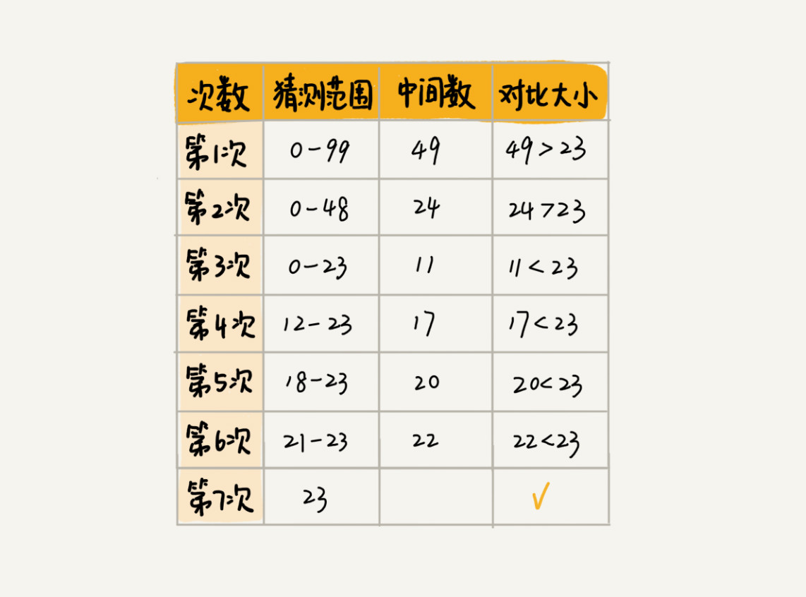

[toc]

有序数据集合的查找算法：二分查找（Binary Search）算法，也叫折半查找算法

# 二分思想
二分查找是一种非常简单易懂的快速查找算法

利用二分思想，每次都与区间的中间数据比对大小，缩小查找区间的范围

**二分查找针对的是一个有序的数据集合，查找思想有点类似分治思想。每次都通过跟区间的中间元素对比，将待查找的区间缩小为之前的一半，直到找到要查找的元素，或者区间被缩小为 0**

# O(logn)惊人的查找速度
二分查找是一种非常高效的查找算法，假设数据大小是 n，每次查找后数据都会缩小为原来的一半，也就是会除以 2。最坏情况下，直到查找区间被缩小为空，才停止

可以看出来，这是一个等比数列。其中 n/2k=1 时，k 的值就是总共缩小的次数。而每一次缩小操作只涉及两个数据的大小比较，所以，经过了 k 次区间缩小操作，时间复杂度就是 O(k)。通过 n/2k=1，我们可以求得 k=log2n，所以时间复杂度就是 O(logn)

二分查找是我们目前为止遇到的第一个时间复杂度为 O(logn) 的算法
堆、二叉树的操作，它们的时间复杂度也是 O(logn)

O(logn) 这种**对数时间复杂度**。这是一种极其高效的时间复杂度，有的时候甚至比时间复杂度是常量级 O(1) 的算法还要高效

因为 logn 是一个非常“恐怖”的数量级，即便 n 非常非常大，对应的 logn 也很小。比如 n 等于 2 的 32 次方，这个数很大了吧？大约是 42 亿。也就是说，如果我们在 42 亿个数据中用二分查找一个数据，最多需要比较 32 次

用大 O 标记法表示时间复杂度的时候，会省略掉常数、系数和低阶。对于常量级时间复杂度的算法来说，O(1) 有可能表示的是一个非常大的常量值，比如 O(1000)、O(10000)。所以，常量级时间复杂度的算法有时候可能还没有 O(logn) 的算法执行效率高

# 二分查找的递归与非递归实现
**最简单的情况**就是**有序数组中不存在重复元素**，我们在其中用二分查找值等于给定值的数据
```java
public int bsearch(int[] a, int n, int value) {
    int low = 0;
    int high = n - 1;

    while (low <= high) {
        int mid = (low + high) / 2;
        if (a[mid] == value) {
            return mid;
        } else if (a[mid] < value) {
            low = mid + 1;
        } else {
            high = mid - 1;
        }
    }
    return -1;
}
```
着重强调一下**容易出错的 3 个地方**
## 循环退出条件
注意是 low<=high，而不是 low
## mid 的取值
实际上，mid=(low+high)/2 这种写法是有问题的。因为如果 low 和 high 比较大的话，两者之和就有可能会溢出。改进的方法是将 mid 的计算方式写成 low+(high-low)/2，更进一步，如果要将性能优化到极致的话，我们可以将这里的除以 2 操作转化成位运算 low+((high-low)>>1)。因为相比除法运算来说，计算机处理位运算要快得多
## low 和 high 的更新
low=mid+1，high=mid-1。注意这里的 +1 和 -1，如果直接写成 low=mid 或者 high=mid，就可能会发生死循环。比如，当 high=3，low=3 时，如果 a[3]不等于 value，就会导致一直循环不退出

**实际上，二分查找除了用循环来实现，还可以用递归来实现，过程也非常简单**
```java
// 二分查找的递归实现
public int bsearch(int[] a, int n, int val) {
    return bsearchInternally(a, 0, n - 1, val);
}

private int bsearchInternally(int[] a, int low, int high, int value) {
    if (low > high) return -1;

    int mid =  low + ((high - low) >> 1);
    if (a[mid] == value) {
        return mid;
    } else if (a[mid] < value) {
        return bsearchInternally(a, mid+1, high, value);
    } else {
        return bsearchInternally(a, low, mid-1, value);
    }
}
```
# 二分查找应用场景局限性
## 二分查找依赖的是顺序表结构(数组)
二分查找算法需要按照下标随机访问元素，数组按照下标随机访问数据的时间复杂度是 O(1)，而链表随机访问的时间复杂度是 O(n)，所以，如果数据使用链表存储，二分查找的时间复杂就会变得很高

二分查找只能用在数据是通过顺序表来存储的数据结构上。如果你的数据是通过其他数据结构存储的，则无法应用二分查找
## 二分查找针对的是有序数据
二分查找对这一点的要求比较苛刻，数据必须是有序的。如果数据没有序，我们需要先排序，排序的时间复杂度最低是 O(nlogn)。所以，如果我们针对的是一组静态的数据，没有频繁地插入、删除，我们可以进行一次排序，多次二分查找。这样排序的成本可被均摊，二分查找的边际成本就会比较低

如果我们的数据集合有频繁的插入和删除操作，要想用二分查找，要么每次插入、删除操作之后保证数据仍然有序，要么在每次二分查找之前都先进行排序。针对这种动态数据集合，无论哪种方法，维护有序的成本都是很高的

二分查找只能用在插入、删除操作不频繁，一次排序多次查找的场景中。针对动态变化的数据集合，二分查找将不再适用

## 数据量太小不适合二分查找
如果要处理的数据量很小，完全没有必要用二分查找，顺序遍历就足够了。比如我们在一个大小为 10 的数组中查找一个元素，不管用二分查找还是顺序遍历，查找速度都差不多。只有数据量比较大的时候，二分查找的优势才会比较明显

如果数据之间的比较操作非常耗时，不管数据量大小，我都推荐使用二分查找，比如，数组中存储的都是长度超过 300 的字符串，如此长的两个字符串之间比对大小，就会非常耗时。我们需要尽可能地减少比较次数，而比较次数的减少会大大提高性能，这个时候二分查找就比顺序遍历更有优势

## 数据量太大不适合二分查找
二分查找的底层需要依赖数组这种数据结构，而数组为了支持随机访问的特性，要求内存空间连续，对内存的要求比较苛刻

注意这里的“连续”二字，也就是说，即便有 2GB 的内存空间剩余，但是如果这剩余的 2GB 内存空间都是零散的，没有连续的 1GB 大小的内存空间，那照样无法申请一个 1GB 大小的数组。而我们的二分查找是作用在数组这种数据结构之上的，所以太大的数据用数组存储就比较吃力了，也就不能用二分查找

# 小结
二分查找的核心思想理解起来非常简单，有点类似分治思想。即每次都通过跟区间中的中间元素对比，将待查找的区间缩小为一半，直到找到要查找的元素，或者区间被缩小为 0。但是二分查找的代码实现比较容易写错。你需要着重掌握它的三个容易出错的地方：循环退出条件、mid 的取值，low 和 high 的更新

二分查找虽然性能比较优秀，但应用场景也比较有限。底层必须依赖数组，并且还要求数据是有序的。对于较小规模的数据查找，我们直接使用顺序遍历就可以了，二分查找的优势并不明显。二分查找更适合处理静态数据，也就是没有频繁的数据插入、删除操作

# 二分查找变形问题

## 变体一：查找第一个值等于给定值的元素
下面这样一个有序数组，其中，a[5]，a[6]，a[7]的值都等于 8，是重复的数据。我们希望查找第一个等于 8 的数据，也就是下标是 5 的元素

如果用普通二分查找的代码实现，首先拿 8 与区间的中间值 a[4]比较，8 比 6 大，于是在下标 5 到 9 之间继续查找。下标 5 和 9 的中间位置是下标 7，a[7]正好等于 8，所以代码就返回了
尽管 a[7]也等于 8，但它并不是我们想要找的第一个等于 8 的元素，因为第一个值等于 8 的元素是数组下标为 5 的元素

烧脑版本
```java
public int bsearch(int[] a, int n, int value) {
    int low = 0;
    int high = n - 1;
    while (low <= high) {
        int mid = low + ((high - low) >> 1);
        if (a[mid] >= value) {
            high = mid - 1;
        } else {
            low = mid + 1;
        }
    }

    if (low < n && a[low]==value) return low;
    else return -1;
}
```
简洁版本
```java
public int bsearch(int[] a, int n, int value) {
    int low = 0;
    int high = n - 1;
    while (low <= high) {
        int mid =  low + ((high - low) >> 1);
        if (a[mid] > value) {
            high = mid - 1;
        } else if (a[mid] < value) {
            low = mid + 1;
        } else {
            if ((mid == 0) || (a[mid - 1] != value)) return mid;
            else high = mid - 1;
        }
    }
    return -1;
}
```
a[mid]跟要查找的 value 的大小关系有三种情况：大于、小于、等于。对于 a[mid]>value 的情况，我们需要更新 high= mid-1

当 a[mid]=value 的时候，a[mid]就是我们要找的元素。但是，如果我们求解的是第一个值等于给定值的元素，当 a[mid]等于要查找的值时，我们就需要确认一下这个 a[mid]是不是第一个值等于给定值的元素

如果 mid 等于 0，那这个元素已经是数组的第一个元素，那它肯定是我们要找的；如果 mid 不等于 0，但 a[mid]的前一个元素 a[mid-1]不等于 value，那也说明 a[mid]就是我们要找的第一个值等于给定值的元素

如果经过检查之后发现 a[mid]前面的一个元素 a[mid-1]也等于 value，那说明此时的 a[mid]肯定不是我们要查找的第一个值等于给定值的元素。那我们就更新 high=mid-1，因为要找的元素肯定出现在[low, mid-1]之间

## 变体二：查找最后一个值等于给定值的元素
```java
public int bsearch(int[] a, int n, int value) {
    int low = 0;
    int high = n - 1;
    while (low <= high) {
        int mid =  low + ((high - low) >> 1);
        if (a[mid] > value) {
            high = mid - 1;
        } else if (a[mid] < value) {
            low = mid + 1;
        } else {
            if ((mid == n - 1) || (a[mid + 1] != value)) return mid;
            else low = mid + 1;
        }
    }
    return -1;
}
```
如果 a[mid]这个元素已经是数组中的最后一个元素了，那它肯定是我们要找的；如果 a[mid]的后一个元素 a[mid+1]不等于 value，那也说明 a[mid]就是我们要找的最后一个值等于给定值的元素

如果我们经过检查之后，发现 a[mid]后面的一个元素 a[mid+1]也等于 value，那说明当前的这个 a[mid]并不是最后一个值等于给定值的元素。我们就更新 low=mid+1，因为要找的元素肯定出现在[mid+1, high]之间

## 变体三：查找第一个大于等于给定值的元素
```java
public int bsearch(int[] a, int n, int value) {
    int low = 0;
    int high = n - 1;
    while (low <= high) {
        int mid =  low + ((high - low) >> 1);
        if (a[mid] >= value) {
            if ((mid == 0) || (a[mid - 1] < value)) return mid;
            else high = mid - 1;
        } else {
            low = mid + 1;
        }
    }
    return -1;
}
```
如果 a[mid]小于要查找的值 value，那要查找的值肯定在[mid+1, high]之间，所以，我们更新 low=mid+1

对于 a[mid]大于等于给定值 value 的情况，我们要先看下这个 a[mid]是不是我们要找的第一个值大于等于给定值的元素。如果 a[mid]前面已经没有元素，或者前面一个元素小于要查找的值 value，那 a[mid]就是我们要找的元素

如果 a[mid-1]也大于等于要查找的值 value，那说明要查找的元素在[low, mid-1]之间，所以，我们将 high 更新为 mid-1

## 变体四：查找最后一个小于等于给定值的元素
```java
public int bsearch7(int[] a, int n, int value) {
    int low = 0;
    int high = n - 1;
    while (low <= high) {
        int mid =  low + ((high - low) >> 1);
        if (a[mid] > value) {
            high = mid - 1;
        } else {
            if ((mid == n - 1) || (a[mid + 1] > value)) return mid;
            else low = mid + 1;
        }
    }
    return -1;
}
```

# 小结
凡是用二分查找能解决的，绝大部分我们更倾向于用散列表或者二叉查找树。即便是二分查找在内存使用上更节省，但是毕竟内存如此紧缺的情况并不多

二分查找更适合用在“近似”查找问题，在这类问题上，二分查找的优势更加明显。这几种变体问题，用其他数据结构，比如散列表、二叉树，就比较难实现

变体的二分查找算法写起来非常烧脑，很容易因为细节处理不好而产生 Bug，这些容易出错的细节有：**终止条件、区间上下界更新方法、返回值选择**
