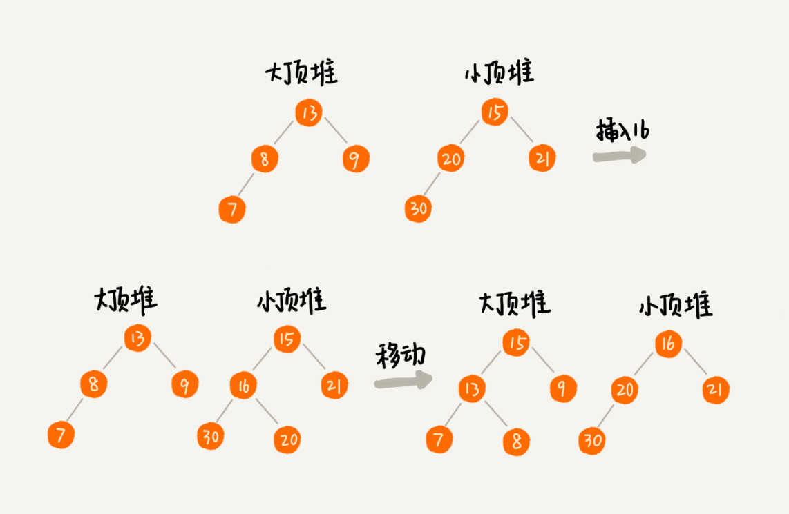

[toc]

# 堆的应用一：优先级队列

优先级队列，顾名思义，它首先应该是一个队列，队列最大的特性就是先进先出。不过，在优先级队列中，数据的出队顺序不是先进先出，而是按照优先级来，优先级最高的，最先出队

如何实现一个优先级队列，用堆来实现是最直接、最高效的，这是因为，堆和优先级队列非常相似。一个堆就可以看作一个优先级队列。很多时候，它们只是概念上的区分而已。往优先级队列中插入一个元素，就相当于往堆中插入一个元素；从优先级队列中取出优先级最高的元素，就相当于取出堆顶元素

## 合并有序小文件
假设我们有 100 个小文件，每个文件的大小是 100MB，每个文件中存储的都是有序的字符串。我们希望将这些 100 个小文件合并成一个有序的大文件。这里就会用到优先级队列

整体思路有点像归并排序中的合并函数。我们从这 100 个文件中，各取第一个字符串，放入数组中，然后比较大小，把最小的那个字符串放入合并后的大文件中，并从数组中删除

假设，这个最小的字符串来自于 13.txt 这个小文件，我们就再从这个小文件取下一个字符串，放到数组中，重新比较大小，并且选择最小的放入合并后的大文件，将它从数组中删除。依次类推，直到所有的文件中的数据都放入到大文件为止

这里我们用数组这种数据结构，来存储从小文件中取出来的字符串。每次从数组中取最小字符串，都需要循环遍历整个数组，显然，这不是很高效

这里就可以用到优先级队列，也可以说是堆。我们将从小文件中取出来的字符串放入到小顶堆中，那堆顶的元素，也就是优先级队列队首的元素，就是最小的字符串。我们将这个字符串放入到大文件中，并将其从堆中删除。然后再从小文件中取出下一个字符串，放入到堆中。循环这个过程，就可以将 100 个小文件中的数据依次放入到大文件中

删除堆顶数据和往堆中插入数据的时间复杂度都是 O(logn)，n 表示堆中的数据个数，这里就是 100

## 高性能定时器
假设我们有一个定时器，定时器中维护了很多定时任务，每个任务都设定了一个要触发执行的时间点。定时器每过一个很小的单位时间（比如 1 秒），就扫描一遍任务，看是否有任务到达设定的执行时间。如果到达了，就拿出来执行

但是，这样每过 1 秒就扫描一遍任务列表的做法比较低效，主要原因有两点：第一，任务的约定执行时间离当前时间可能还有很久，这样前面很多次扫描其实都是徒劳的；第二，每次都要扫描整个任务列表，如果任务列表很大的话，势必会比较耗时

针对这些问题，我们就可以用优先级队列来解决。我们按照任务设定的执行时间，将这些任务存储在优先级队列中，队列首部（也就是小顶堆的堆顶）存储的是最先执行的任务

这样，定时器就不需要每隔 1 秒就扫描一遍任务列表了。它拿队首任务的执行时间点，与当前时间点相减，得到一个时间间隔 T

这个时间间隔 T 就是，从当前时间开始，需要等待多久，才会有第一个任务需要被执行。这样，定时器就可以设定在 T 秒之后，再来执行任务。从当前时间点到（T-1）秒这段时间里，定时器都不需要做任何事情

当 T 秒时间过去之后，定时器取优先级队列中队首的任务执行。然后再计算新的队首任务的执行时间点与当前时间点的差值，把这个值作为定时器执行下一个任务需要等待的时间

这样，定时器既不用间隔 1 秒就轮询一次，也不用遍历整个任务列表，性能也就提高了

# 堆的应用二：利用堆求Top K
我把这种求 Top K 的问题抽象成两类。一类是针对静态数据集合，也就是说数据集合事先确定，不会再变。另一类是针对动态数据集合，也就是说数据集合事先并不确定，有数据动态地加入到集合中

针对静态数据，如何在一个包含 n 个数据的数组中，查找前 K 大数据呢？我们可以维护一个大小为 K 的小顶堆，顺序遍历数组，从数组中取出数据与堆顶元素比较。如果比堆顶元素大，我们就把堆顶元素删除，并且将这个元素插入到堆中；如果比堆顶元素小，则不做处理，继续遍历数组。这样等数组中的数据都遍历完之后，堆中的数据就是前 K 大数据了

遍历数组需要 O(n) 的时间复杂度，一次堆化操作需要 O(logK) 的时间复杂度，所以最坏情况下，n 个元素都入堆一次，时间复杂度就是 O(nlogK)

针对动态数据求得 Top K 就是实时 Top K，一个数据集合中有两个操作，一个是添加数据，另一个询问当前的前 K 大数据

如果每次询问前 K 大数据，我们都基于当前的数据重新计算的话，那时间复杂度就是 O(nlogK)，n 表示当前的数据的大小。实际上，我们可以一直都维护一个 K 大小的小顶堆，当有数据被添加到集合中时，我们就拿它与堆顶的元素对比。如果比堆顶元素大，我们就把堆顶元素删除，并且将这个元素插入到堆中；如果比堆顶元素小，则不做处理。这样，无论任何时候需要查询当前的前 K 大数据，我们都可以立刻返回给他

# 堆的应用三：利用堆求中位数
中位数，顾名思义，就是处在中间位置的那个数。如果数据的个数是奇数，把数据从小到大排列，那第 n/2​+1 个数据就是中位数（注意：假设数据是从 0 开始编号的）；如果数据的个数是偶数的话，那处于中间位置的数据有两个，第 n/2​ 个和第 n/2​+1 个数据，这个时候，我们可以随意取一个作为中位数，比如取两个数中靠前的那个，就是第 n/2​ 个数据

对于一组**静态数据**，中位数是固定的，我们可以先排序，第 2n​ 个数据就是中位数。每次询问中位数的时候，我们直接返回这个固定的值就好了。所以，尽管排序的代价比较大，但是边际成本会很小。但是，如果我们面对的是**动态数据**集合，中位数在不停地变动，如果再用先排序的方法，每次询问中位数的时候，都要先进行排序，那效率就不高了

**借助堆这种数据结构，我们不用排序，就可以非常高效地实现求中位数操作**

我们需要维护两个堆，一个大顶堆，一个小顶堆。大顶堆中存储前半部分数据，小顶堆中存储后半部分数据，且小顶堆中的数据都大于大顶堆中的数据

也就是说，如果有 n 个数据，n 是偶数，我们从小到大排序，那前 n/2​ 个数据存储在大顶堆中，后 n/2​ 个数据存储在小顶堆中。这样，大顶堆中的堆顶元素就是我们要找的中位数。如果 n 是奇数，情况是类似的，大顶堆就存储 n/2​+1 个数据，小顶堆中就存储 n/2​ 个数据

数据是动态变化的，当新添加一个数据的时候，我们如何调整两个堆?如果新加入的数据小于等于大顶堆的堆顶元素，我们就将这个新数据插入到大顶堆；否则，我们就将这个新数据插入到小顶堆

这个时候就有可能出现，两个堆中的数据个数不符合前面约定的情况：如果 n 是偶数，两个堆中的数据个数都是 n/2​；如果 n 是奇数，大顶堆有 n/2​+1 个数据，小顶堆有 n/2​ 个数据。这个时候，我们可以从一个堆中不停地将堆顶元素移动到另一个堆，通过这样的调整，来让两个堆中的数据满足上面的约定

于是，我们就可以利用两个堆，一个大顶堆、一个小顶堆，实现在动态数据集合中求中位数的操作。插入数据因为需要涉及堆化，所以时间复杂度变成了 O(logn)，但是求中位数我们只需要返回大顶堆的堆顶元素就可以了，所以时间复杂度就是 O(1)

## 如何快速求接口的99%响应时间
中位数的概念就是将数据从小到大排列，处于中间位置，就叫中位数，这个数据会大于等于前面 50% 的数据。99 百分位数的概念可以类比中位数，如果将一组数据从小到大排列，这个 99 百分位数就是大于前面 99% 数据的那个数据

假设有 100 个数据，分别是 1，2，3，……，100，那 99 百分位数就是 99，因为小于等于 99 的数占总个数的 99%

再来看 99% 响应时间。如果有 100 个接口访问请求，每个接口请求的响应时间都不同，比如 55 毫秒、100 毫秒、23 毫秒等，我们把这 100 个接口的响应时间按照从小到大排列，排在第 99 的那个数据就是 99% 响应时间，也叫 99 百分位响应时间

如果有 n 个数据，将数据从小到大排列之后，99 百分位数大约就是第 n\*99% 个数据，同类，80 百分位数大约就是第 n\*80% 个数据

维护两个堆，一个大顶堆，一个小顶堆。假设当前总数据的个数是 n，大顶堆中保存 n\*99% 个数据，小顶堆中保存 n\*1% 个数据。大顶堆堆顶的数据就是我们要找的 99% 响应时间

每次插入一个数据的时候，我们要判断这个数据跟大顶堆和小顶堆堆顶数据的大小关系，然后决定插入到哪个堆中。如果这个新插入的数据比大顶堆的堆顶数据小，那就插入大顶堆；如果这个新插入的数据比小顶堆的堆顶数据大，那就插入小顶堆

但是，为了保持大顶堆中的数据占 99%，小顶堆中的数据占 1%，在每次新插入数据之后，我们都要重新计算，这个时候大顶堆和小顶堆中的数据个数，是否还符合 99:1 这个比例。如果不符合，我们就将一个堆中的数据移动到另一个堆，直到满足这个比例

通过这样的方法，每次插入数据，可能会涉及几个数据的堆化操作，所以时间复杂度是 O(logn)。每次求 99% 响应时间的时候，直接返回大顶堆中的堆顶数据即可，时间复杂度是 O(1)

# 小结
优先级队列是一种特殊的队列，优先级高的数据先出队，而不再像普通的队列那样，先进先出。实际上，堆就可以看作优先级队列，只是称谓不一样罢了。求 Top K 问题又可以分为针对静态数据和针对动态数据，只需要利用一个堆，就可以做到非常高效率地查询 Top K 的数据。求中位数实际上还有很多变形，比如求 99 百分位数据、90 百分位数据等，处理的思路都是一样的，即利用两个堆，一个大顶堆，一个小顶堆，随着数据的动态添加，动态调整两个堆中的数据，最后大顶堆的堆顶元素就是要求的数据

