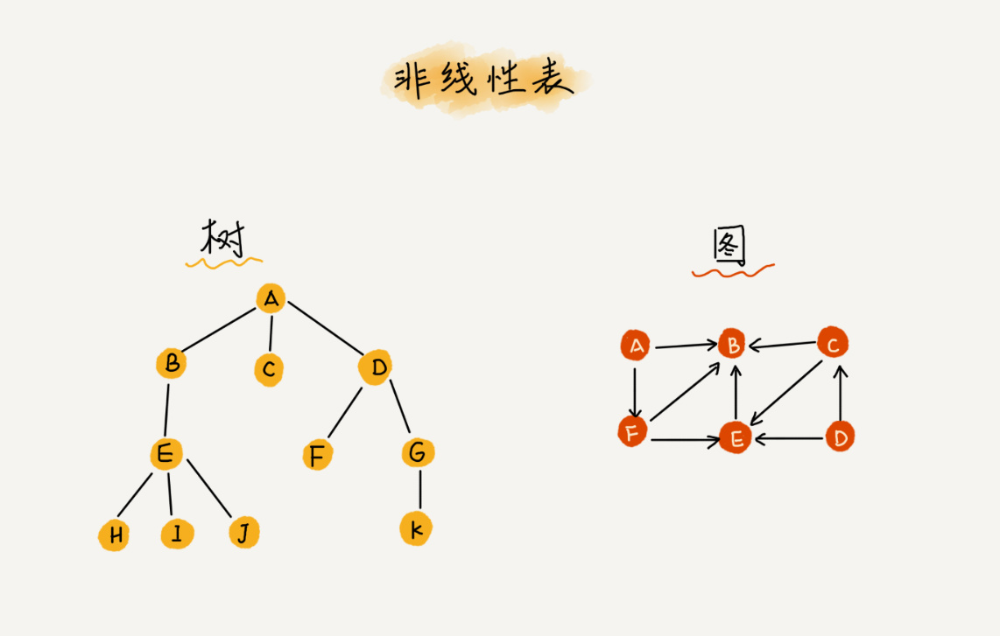

[toc]

# 数组
一种线性表数据结构，它用一组连续的内存空间，来存储一组具有相同类型的数据

# 线性表
线性表是数据排成像一条线一样的结构，每个线性表上的数据最多只有前和后两个方向
数组、链表、队列、栈等都是线性表结构


# 非线性表
在非线性表中，数据之间并不是简单的前后关系
二叉树、堆、图等都是非线性表


# 数组随机访问实现原因
1. 线性表
2. 连续的内存空间和相同类型的数据

但是这两个特性也让数组的很多操作变得非常低效，比如在数组中删除、插入一个数据，为了保证连续性，就需要做大量的数据搬移工作

计算机会给每个内存单元分配一个地址，计算机通过地址来访问内存中的数据
```
a[i]_address = base_address + i * data_type_size
```

## 低效的"插入"和"删除"
### 插入操作
假设数组的长度是n，如果将一个数据插入到数组中的第k个位置，为了把第k个位置腾出来，给新来的数据，需要将第K~n部分的元素都顺序地往后挪一位
如果在数组的末尾插入元素，不需要移动数据，这时时间复杂度是O(1)；如果在数组的开头插入元素，所有数据都需要依次往后移动一位，最坏时间复杂度是O(n)，因为在每个位置插入元素的概率是一样的，所以平均情况时间复杂度为(1+2+...n)/n=O(n)
如果数组的数据是有序的，在某个位置插入一个新的元素，就必须按照上面的方法搬移k之后的数据；但是如果数组中存储的数据并没有任何规律，数组只是被当做一个存储数据的集合，在这种情况下，如果要将某个数据插入到第k个位置，为了避免大规模的数据搬移，可以直接将第k位的数据搬移到数组元素的最后，把新的元素直接放入第k个位置

利用这种技巧，在特定场景下，在第k个位置插入一个元素的时间复杂度就会降为O(1)
### 删除操作
和插入类似，如果删除数组末尾的数据，则最好情况时间复杂度为O(1)；如果删除开头的数据，则最坏情况时间复杂度为O(n)；平均情况时间复杂度为O(n)
实际上，在某些特殊场景下，并不一定非要追求数组中数据的连续，我们可以将多次删除操作集中在一起执行

为了避免d,e,f,g,h这几个数据被搬移三次，可以先记录下已经删除的数据，每次的删除并不是真正地搬移数据，只是记录数据已经被删除，但数组没有更多空间存储数据时，再触发执行一次真正的删除操作，这样就大大减少了删除操作导致的数据搬移

# 警惕数组的访问越界问题
```c
int main(int argc, char* argv[]){
    int i = 0;
    int arr[3] = {0};
    for(; i<=3; i++){
        arr[i] = 0;
        printf("hello world\n");
    }
    return 0;
}
```
结果是无限打印“hello world”，因为arr[3]越界访问，会将访问i，并将i值置为0

# 容器能否完全替代数组
对于业务开发，直接使用容器就可以，完全不会影响到系统整体的性能；如果是做一些非常底层的开发，性能的优化需要做到极致，这个时候数组就会优于容器，成为首选

# 数组为什么从0开始编号
从数组的内存模式来看，"下标"最确切的定义应该是"偏移"，如果用a来表示数组的首地址，a[0]就是偏移为0的位置，也就是首地址，a[k]就表示k个type_size的位置，所以计算a[k]的内存地址如下
```
a[k]_address = base_address + k * type_size
```
如果数组从1开始计数，数组元素a[k]的内存地址计算变为：
```
a[k]_address = base_address + (k-1)*type_size
```
对比两个公式，从1开始编号，每次随机访问数组元素都多了一次减法运算，对于CPU来说，多了一次减法指令
数组作为非常基础的数据结构，通过下标随机访问数组元素又是其非常基础的编程操作，效率的优化就要尽可能做到极致