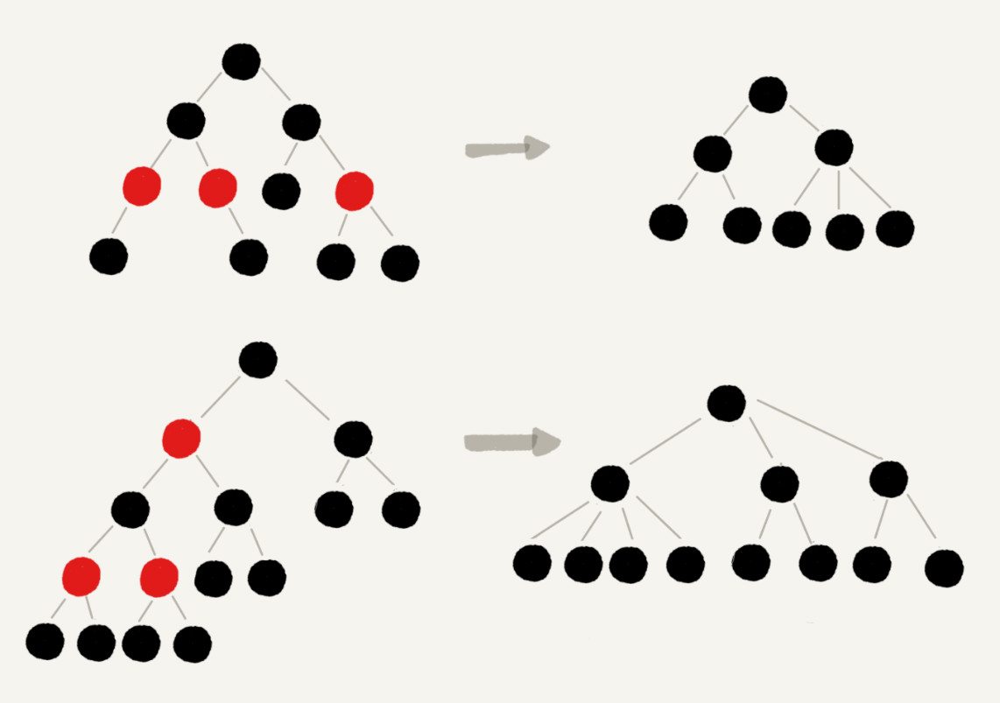
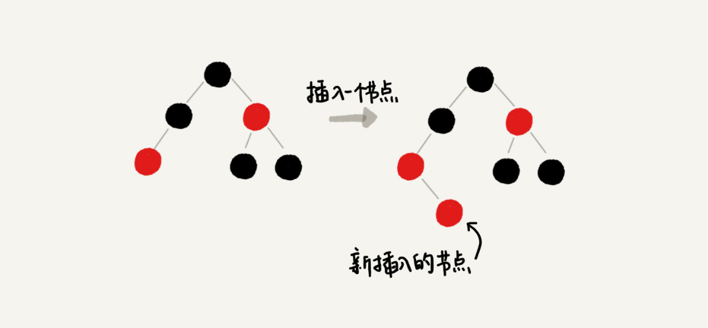

[toc]

二叉查找树是最常用的一种二叉树，它支持快速插入、删除、查找操作，各个操作的时间复杂度跟树的高度成正比，理想情况下，时间复杂度是 O(logn)

不过，二叉查找树在频繁的动态更新过程中，可能会出现树的高度远大于 log2n 的情况，从而导致各个操作的效率下降。极端情况下，二叉树会退化为链表，时间复杂度会退化到 O(n)

# 平衡二叉查找树
平衡二叉树的严格定义是这样的：二叉树中任意一个节点的左右子树的高度相差不能大于 1。从这个定义来看，上一节我们讲的完全二叉树、满二叉树其实都是平衡二叉树，但是非完全二叉树也有可能是平衡二叉树

平衡二叉查找树不仅满足上面平衡二叉树的定义，还满足二叉查找树的特点。最先被发明的平衡二叉查找树是AVL 树，它严格符合我刚讲到的平衡二叉查找树的定义，即任何节点的左右子树高度相差不超过 1，是一种高度平衡的二叉查找树

但是很多平衡二叉查找树其实并没有严格符合上面的定义（树中任意一个节点的左右子树的高度相差不能大于 1），比如我们下面要讲的红黑树，它从根节点到各个叶子节点的最长路径，有可能会比最短路径大一倍

发明平衡二叉查找树这类数据结构的初衷是，解决普通二叉查找树在频繁的插入、删除等动态更新的情况下，出现时间复杂度退化的问题

**平衡二叉查找树中“平衡”的意思，其实就是让整棵树左右看起来比较“对称”、比较“平衡”，不要出现左子树很高、右子树很矮的情况。这样就能让整棵树的高度相对来说低一些，相应的插入、删除、查找等操作的效率高一些**

所以，如果我们现在设计一个新的平衡二叉查找树，只要树的高度不比 log2n 大很多（比如树的高度仍然是对数量级的），尽管它不符合我们前面讲的严格的平衡二叉查找树的定义，但我们仍然可以说，这是一个合格的平衡二叉查找树

# 红黑树
平衡二叉查找树其实有很多，比如，Splay Tree（伸展树）、Treap（树堆）等，但是我们提到平衡二叉查找树，听到的基本都是红黑树。它的出镜率甚至要高于“平衡二叉查找树”这几个字，有时候，我们甚至默认平衡二叉查找树就是红黑树，那我们现在就来看看这个“明星树”

红黑树的英文是“Red-Black Tree”，简称 R-B Tree。它是一种不严格的平衡二叉查找树，我前面说了，它的定义是不严格符合平衡二叉查找树的定义的

顾名思义，红黑树中的节点，一类被标记为黑色，一类被标记为红色。除此之外，一棵红黑树还需要满足这样几个要求：
1. 根节点是黑色的
2. 每个叶子节点都是黑色的空节点（NIL），也就是说，叶子节点不存储数据
3. 任何相邻的节点都不能同时为红色，也就是说，红色节点是被黑色节点隔开的
4. 每个节点，从该节点到达其可达叶子节点的所有路径，都包含相同数目的黑色节点

这里的第二点要求“叶子节点都是黑色的空节点”，稍微有些奇怪，它主要是为了简化红黑树的代码实现而设置的

# 为什么说红黑树是“近似平衡”的
平衡二叉查找树的初衷，是为了解决二叉查找树因为动态更新导致的性能退化问题。所以，**“平衡”的意思可以等价为性能不退化。“近似平衡”就等价为性能不会退化得太严重**

二叉查找树很多操作的性能都跟树的高度成正比。一棵极其平衡的二叉树（满二叉树或完全二叉树）的高度大约是 log2n，所以如果要证明红黑树是近似平衡的，我们只需要分析，红黑树的高度是否比较稳定地趋近 log2n 就好了

**首先，我们来看，如果我们将红色节点从红黑树中去掉，那单纯包含黑色节点的红黑树的高度是多少呢？**
红色节点删除之后，有些节点就没有父节点了，它们会直接拿这些节点的祖父节点（父节点的父节点）作为父节点。所以，之前的二叉树就变成了四叉树

前面红黑树的定义里有这么一条：从任意节点到可达的叶子节点的每个路径包含相同数目的黑色节点。我们从四叉树中取出某些节点，放到叶节点位置，四叉树就变成了完全二叉树。所以，仅包含黑色节点的四叉树的高度，比包含相同节点个数的完全二叉树的高度还要小

完全二叉树的高度近似 log2n，这里的四叉“黑树”的高度要低于完全二叉树，所以去掉红色节点的“黑树”的高度也不会超过 log2n

**我们现在知道只包含黑色节点的“黑树”的高度，那我们现在把红色节点加回去，高度会变成多少呢？**
在红黑树中，红色节点不能相邻，也就是说，有一个红色节点就要至少有一个黑色节点，将它跟其他红色节点隔开。红黑树中包含最多黑色节点的路径不会超过 log2n，所以加入红色节点之后，最长路径不会超过 2log2n，也就是说，红黑树的高度近似 2log2n

所以，红黑树的高度只比高度平衡的 AVL 树的高度（log2n）仅仅大了一倍，在性能上，下降得并不多。这样推导出来的结果不够精确，实际上红黑树的性能更好

# 为什么选择红黑树这种平衡二叉查找树
前面提到 Treap、Splay Tree，绝大部分情况下，它们操作的效率都很高，但是也无法避免极端情况下时间复杂度的退化。尽管这种情况出现的概率不大，但是对于单次操作时间非常敏感的场景来说，它们并不适用

AVL 树是一种高度平衡的二叉树，所以查找的效率非常高，但是，有利就有弊，AVL 树为了维持这种高度的平衡，就要付出更多的代价。每次插入、删除都要做调整，就比较复杂、耗时。所以，对于有频繁的插入、删除操作的数据集合，使用 AVL 树的代价就有点高了

红黑树只是做到了近似平衡，并不是严格的平衡，所以在维护平衡的成本上，要比 AVL 树要低

所以，红黑树的插入、删除、查找各种操作性能都比较稳定。对于工程应用来说，要面对各种异常情况，为了支撑这种工业级的应用，我们更倾向于这种性能稳定的平衡二叉查找树

# 小结
**我们学习数据结构和算法，要学习它的由来、特性、适用的场景以及它能解决的问题。对于红黑树，也不例外。你如果能搞懂这几个问题，其实就已经足够了**

红黑树是一种平衡二叉查找树。它是为了解决普通二叉查找树在数据更新的过程中，复杂度退化的问题而产生的。红黑树的高度近似 log2n，所以它是近似平衡，插入、删除、查找操作的时间复杂度都是 O(logn)

因为红黑树是一种性能非常稳定的二叉查找树，所以，在工程中，但凡是用到动态插入、删除、查找数据的场景，都可以用到它。不过，它实现起来比较复杂，如果自己写代码实现，难度会有些高，这个时候，我们其实更倾向用跳表来替代它

---
红黑树是一个让我又爱又恨的数据结构，“爱”是因为它稳定、高效的性能，“恨”是因为实现起来实在太难了

即便你将左右旋背得滚瓜烂熟，我保证你过不几天就忘光了。因为，学习红黑树的代码实现，对于你平时做项目开发没有太大帮助。对于绝大部分开发工程师来说，这辈子你可能都用不着亲手写一个红黑树。除此之外，它对于算法面试也几乎没什么用，一般情况下，靠谱的面试官也不会让你手写红黑树的

# 实现红黑树的基本思想
**遇到什么样的节点排布，我们就对应怎么去调整**。只要按照这些固定的调整规则来操作，就能将一个非平衡的红黑树调整成平衡的

一棵合格的红黑树需要满足这样几个要求：
1. 根节点是黑色的
2. 每个叶子节点都是黑色的空节点（NIL），也就是说，叶子节点不存储数据
3. 任何相邻的节点都不能同时为红色，也就是说，红色节点是被黑色节点隔开的
4. 每个节点，从该节点到达其可达叶子节点的所有路径，都包含相同数目的黑色节点

在插入、删除节点的过程中，第三、第四点要求可能会被破坏，而我们今天要讲的“平衡调整”，实际上就是要把被破坏的第三、第四点恢复过来

在正式开始之前，我先介绍两个非常重要的操作，**左旋（rotate left）**、**右旋（rotate right）**。左旋全称其实是叫**围绕某个节点的左旋**，那右旋的全称估计你已经猜到了，就叫**围绕某个节点的右旋**

红黑树的插入、删除操作会破坏红黑树的定义，具体来说就是会破坏红黑树的平衡，所以，我们现在就来看下，红黑树在插入、删除数据之后，如何调整平衡，继续当一棵合格的红黑树的

# 插入操作的平衡调整
**红黑树规定，插入的节点必须是红色的。而且，二叉查找树中新插入的节点都是放在叶子节点上**。所以，关于插入操作的平衡调整，有这样两种特殊情况，但是也都非常好处理
1. 如果插入节点的父节点是黑色的，那我们什么都不用做，它仍然满足红黑树的定义
2. 如果插入的节点是根节点，那我们直接改变它的颜色，把它变成黑色就可以了

除此之外，其他情况都会违背红黑树的定义，于是我们就需要进行调整，调整的过程包含两种基础的操作：**左右旋转**和**改变颜色**

红黑树的平衡调整过程是一个迭代的过程。我们把正在处理的节点叫做**关注节点**。关注节点会随着不停地迭代处理，而不断发生变化。最开始的关注节点就是新插入的节点

新节点插入之后，如果红黑树的平衡被打破，那一般会有下面三种情况。我们只需要根据每种情况的特点，不停地调整，就可以让红黑树继续符合定义，也就是继续保持平衡

我们下面依次来看每种情况的调整过程。提醒你注意下，为了简化描述，我把父节点的兄弟节点叫做叔叔节点，父节点的父节点叫做祖父节点
**CASE 1：如果关注节点是 a，它的叔叔节点 d 是红色**，我们就依次执行下面的操作：
1. 将关注节点 a 的父节点 b、叔叔节点 d 的颜色都设置成黑色
2. 将关注节点 a 的祖父节点 c 的颜色设置成红色
3. 关注节点变成 a 的祖父节点 c
4. 跳到 CASE 2 或者 CASE 3

**CASE 2：如果关注节点是 a，它的叔叔节点 d 是黑色，关注节点 a 是其父节点 b 的右子节点**，我们就依次执行下面的操作：
1. 关注节点变成节点 a 的父节点 b
2. 围绕新的关注节点b 左旋
3. 跳到 CASE 3

**CASE 3：如果关注节点是 a，它的叔叔节点 d 是黑色，关注节点 a 是其父节点 b 的左子节点**，我们就依次执行下面的操作：
1. 围绕关注节点 a 的祖父节点 c 右旋
2. 将关注节点 a 的父节点 b、兄弟节点 c 的颜色互换
3. 调整结束

# 删除操作的平衡操作
红黑树插入操作的平衡调整还不是很难，但是它的删除操作的平衡调整相对就要难多了。不过原理都是类似的，我们依旧只需要根据关注节点与周围节点的排布特点，按照一定的规则去调整就行了

删除操作的平衡调整分为两步，第一步是**针对删除节点初步调整**。初步调整只是保证整棵红黑树在一个节点删除之后，仍然满足最后一条定义的要求，也就是说，每个节点，从该节点到达其可达叶子节点的所有路径，都包含相同数目的黑色节点；第二步是**针对关注节点进行二次调整**，让它满足红黑树的第三条定义，即不存在相邻的两个红色节点
## 针对删除节点初步调整
这里需要注意一下，红黑树的定义中“只包含红色节点和黑色节点”，经过初步调整之后，为了保证满足红黑树定义的最后一条要求，有些节点会被标记成两种颜色，“红 - 黑”或者“黑 - 黑”。如果一个节点被标记为了“黑 - 黑”，那在计算黑色节点个数的时候，要算成两个黑色节点

如果一个节点既可以是红色，也可以是黑色，在画图的时候，我会用一半红色一半黑色来表示。如果一个节点是“红 - 黑”或者“黑 - 黑”，我会用左上角的一个小黑点来表示额外的黑色

**CASE 1：如果要删除的节点是 a，它只有一个子节点 b**，那我们就依次进行下面的操作：
1. 删除节点 a，并且把节点 b 替换到节点 a 的位置，这一部分操作跟普通的二叉查找树的删除操作一样
2. 节点 a 只能是黑色，节点 b 也只能是红色，其他情况均不符合红黑树的定义。这种情况下，我们把节点 b 改为黑色
3. 调整结束，不需要进行二次调整

**CASE 2：如果要删除的节点 a 有两个非空子节点，并且它的后继节点就是节点 a 的右子节点 c**。我们就依次进行下面的操作：
1. 如果节点 a 的后继节点就是右子节点 c，那右子节点 c 肯定没有左子树。我们把节点 a 删除，并且将节点 c 替换到节点 a 的位置。这一部分操作跟普通的二叉查找树的删除操作无异
2. 然后把节点 c 的颜色设置为跟节点 a 相同的颜色
3. 如果节点 c 是黑色，为了不违反红黑树的最后一条定义，我们给节点 c 的右子节点 d 多加一个黑色，这个时候节点 d 就成了“红 - 黑”或者“黑 - 黑”
4. 这个时候，关注节点变成了节点 d，第二步的调整操作就会针对关注节点来做

**CASE 3：如果要删除的是节点 a，它有两个非空子节点，并且节点 a 的后继节点不是右子节点**，我们就依次进行下面的操作：
1. 找到后继节点 d，并将它删除，删除后继节点 d 的过程参照 CASE 1
2. 将节点 a 替换成后继节点 d
3. 把节点 d 的颜色设置为跟节点 a 相同的颜色
4. 如果节点 d 是黑色，为了不违反红黑树的最后一条定义，我们给节点 d 的右子节点 c 多加一个黑色，这个时候节点 c 就成了“红 - 黑”或者“黑 - 黑”
5. 这个时候，关注节点变成了节点 c，第二步的调整操作就会针对关注节点来做

## 针对关注节点进行二次调整
经过初步调整之后，关注节点变成了“红 - 黑”或者“黑 - 黑”节点。针对这个关注节点，我们再分四种情况来进行二次调整。二次调整是为了让红黑树中不存在相邻的红色节点
**CASE 1：如果关注节点是 a，它的兄弟节点 c 是红色的**，我们就依次进行下面的操作：
1. 围绕关注节点 a 的父节点 b 左旋
2. 关注节点 a 的父节点 b 和祖父节点 c 交换颜色
3. 关注节点不变
4. 继续从四种情况中选择适合的规则来调整

**CASE 2：如果关注节点是 a，它的兄弟节点 c 是黑色的，并且节点 c 的左右子节点 d、e 都是黑色的**，我们就依次进行下面的操作：
1. 将关注节点 a 的兄弟节点 c 的颜色变成红色
2. 从关注节点 a 中去掉一个黑色，这个时候节点 a 就是单纯的红色或者黑色
3. 给关注节点 a 的父节点 b 添加一个黑色，这个时候节点 b 就变成了“红 - 黑”或者“黑 - 黑”
4. 关注节点从 a 变成其父节点 b
5. 继续从四种情况中选择符合的规则来调整

**CASE 3：如果关注节点是 a，它的兄弟节点 c 是黑色，c 的左子节点 d 是红色，c 的右子节点 e 是黑色**，我们就依次进行下面的操作：
1. 围绕关注节点 a 的兄弟节点 c 右旋
2. 节点 c 和节点 d 交换颜色
3. 关注节点不变
4. 跳转到 CASE 4，继续调整

CASE 4：如果关注节点 a 的兄弟节点 c 是黑色的，并且 c 的右子节点是红色的，我们就依次进行下面的操作：
1. 围绕关注节点 a 的父节点 b 左旋
2. 将关注节点 a 的兄弟节点 c 的颜色，跟关注节点 a 的父节点 b 设置成相同的颜色
3. 将关注节点 a 的父节点 b 的颜色设置为黑色
4. 从关注节点 a 中去掉一个黑色，节点 a 就变成了单纯的红色或者黑色
5. 将关注节点 a 的叔叔节点 e 设置为黑色
6. 调整结束

# 为什么红黑树的定义中，要求叶子节点是黑色的空节点
之所以有这么奇怪的要求，其实就是为了实现起来方便。只要满足这一条要求，那在任何时刻，红黑树的平衡操作都可以归结为我们刚刚讲的那几种情况

假设红黑树的定义中不包含刚刚提到的那一条“叶子节点必须是黑色的空节点”，我们往一棵红黑树中插入一个数据，新插入节点的父节点也是红色的，两个红色的节点相邻，这个时候，红黑树的定义就被破坏了

你会发现，这个时候，我们前面在讲插入时，三种情况下的平衡调整规则，没有一种是适用的。但是，如果我们把黑色的空节点都给它加上，变成下面这样，你会发现，它满足 CASE 2 了

你可能会说，你可以调整一下平衡调整规则啊。比如把 CASE 2 改为“如果关注节点 a 的叔叔节点 b 是黑色或者不存在，a 是父节点的右子节点，就进行某某操作”。当然可以，但是这样的话规则就没有原来简洁了

你可能还会说，这样给红黑树添加黑色的空的叶子节点，会不会比较浪费存储空间呢？答案是不会的。虽然我们在讲解或者画图的时候，每个黑色的、空的叶子节点都是独立画出来的。实际上，在具体实现的时候，我们只需要像下面这样，共用一个黑色的、空的叶子节点就行了

# 小结
“红黑树一向都很难学”，有这种想法的人很多。但是我感觉，其实主要原因是，很多人试图去记忆它的平衡调整策略。实际上，你只需要能看懂我讲的过程，没有知识盲点，就算是掌握了这部分内容了。毕竟实际的软件开发并不是闭卷考试，当你真的需要实现一个红黑树的时候，可以对照着我讲的步骤，一点一点去实现

如何比较轻松地看懂我今天讲的操作过程

第一点，**把红黑树的平衡调整的过程比作魔方复原，不要过于深究这个算法的正确性**。你只需要明白，只要按照固定的操作步骤，保持插入、删除的过程，不破坏平衡树的定义就行了

第二点，**找准关注节点，不要搞丢、搞错关注节点**。因为每种操作规则，都是基于关注节点来做的，只有弄对了关注节点，才能对应到正确的操作规则中。在迭代的调整过程中，关注节点在不停地改变，所以，这个过程一定要注意，不要弄丢了关注节点

第三点，**插入操作的平衡调整比较简单，但是删除操作就比较复杂**。针对删除操作，我们有两次调整，第一次是针对要删除的节点做初步调整，让调整后的红黑树继续满足第四条定义，“每个节点到可达叶子节点的路径都包含相同个数的黑色节点”。但是这个时候，第三条定义就不满足了，有可能会存在两个红色节点相邻的情况。第二次调整就是解决这个问题，让红黑树不存在相邻的红色节点