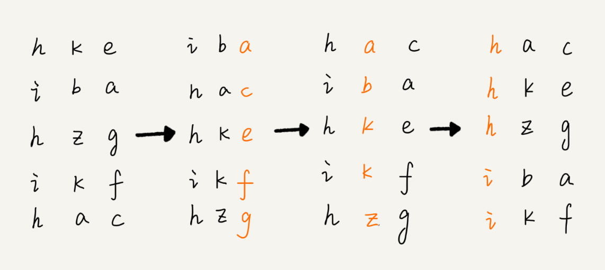

[toc]

三种时间复杂度是 O(n) 的排序算法：桶排序、计数排序、基数排序
因为这些排序算法的时间复杂度是线性的，所以我们把这类排序算法叫作线性排序（Linear sort）,之所以能做到线性的时间复杂度，主要原因是，这三个算法是非基于比较的排序算法，都不涉及元素之间的比较操作
这几种排序算法理解起来都不难，时间、空间复杂度分析起来也很简单，但是对要排序的数据要求很苛刻

# 桶排序(Bucket sort)
核心思想：
将要排序的数据分到几个有序的桶里，每个桶里的数据再单独进行排序。桶内排完序之后，再把每个桶里的数据按照顺序依次取出，组成的序列就是有序的了

如果要排序的数据有 n 个，我们把它们均匀地划分到 m 个桶内，每个桶里就有 k=n/m 个元素,每个桶内部使用快速排序，时间复杂度为 O(k * logk),m 个桶排序的时间复杂度就是 O(m * k * logk)，因为 k=n/m，所以整个桶排序的时间复杂度就是 O(n*log(n/m))。当桶的个数 m 接近数据个数 n 时，log(n/m) 就是一个非常小的常量，这个时候桶排序的时间复杂度接近 O(n)

## 桶排序无法替代之前说的排序算法
首先，要排序的数据需要很容易就能划分成 m 个桶，并且，桶与桶之间有着天然的大小顺序。这样每个桶内的数据都排序完之后，桶与桶之间的数据不需要再进行排序

其次，数据在各个桶之间的分布是比较均匀的。如果数据经过桶的划分之后，有些桶里的数据非常多，有些非常少，很不平均，那桶内数据排序的时间复杂度就不是常量级了。在极端情况下，如果数据都被划分到一个桶里，那就退化为 O(nlogn) 的排序算法了

**桶排序比较适合用在外部排序中**。所谓的外部排序就是数据存储在外部磁盘中，数据量比较大，内存有限，无法将数据全部加载到内存中

# 计数排序(Counting sort)
**计数排序其实是桶排序的一种特殊情况**。当要排序的 n 个数据，所处的范围并不大的时候，比如最大值是 k，我们就可以把数据划分成 k 个桶。每个桶内的数据值都是相同的，省掉了桶内排序的时间

计数排序的算法思想跟桶排序非常类似，只是桶的大小粒度不一样

计数排序算法的实现方法，假设只有 8 个考生，分数在 0 到 5 分之间。这 8 个考生的成绩我们放在一个数组 A[8]中，它们分别是：2，5，3，0，2，3，0，3
考生的成绩从 0 到 5 分，我们使用大小为 6 的数组 C[6]表示桶，其中下标对应分数。不过，C[6]内存储的并不是考生，而是对应的考生个数

从图中可以看出，分数为 3 分的考生有 3 个，小于 3 分的考生有 4 个，所以，成绩为 3 分的考生在排序之后的有序数组 R[8]中，会保存下标 4，5，6 的位置

如何快速计算出，每个分数的考生在有序数组中对应的存储位置,思路是这样的：我们对 C[6]数组顺序求和，C[6]存储的数据就变成了下面这样子。C[k]里存储小于等于分数 k 的考生个数

我们从后到前依次扫描数组 A。比如，当扫描到 3 时，我们可以从数组 C 中取出下标为 3 的值 7，也就是说，到目前为止，包括自己在内，分数小于等于 3 的考生有 7 个，也就是说 3 是数组 R 中的第 7 个元素（也就是数组 R 中下标为 6 的位置）。当 3 放入到数组 R 中后，小于等于 3 的元素就只剩下了 6 个了，所以相应的 C[3]要减 1，变成 6
以此类推，当我们扫描到第 2 个分数为 3 的考生的时候，就会把它放入数组 R 中的第 6 个元素的位置（也就是下标为 5 的位置）。当我们扫描完整个数组 A 后，数组 R 内的数据就是按照分数从小到大有序排列的了

```java
// 计数排序，a是数组，n是数组大小。假设数组中存储的都是非负整数。
public void countingSort(int[] a, int n) {
    if (n <= 1) return;

    // 查找数组中数据的范围
    int max = a[0];
    for (int i = 1; i < n; ++i) {
        if (max < a[i]) {
            max = a[i];
        }
    }

    int[] c = new int[max + 1]; // 申请一个计数数组c，下标大小[0,max]
    for (int i = 0; i <= max; ++i) {
        c[i] = 0;
    }

    // 计算每个元素的个数，放入c中
    for (int i = 0; i < n; ++i) {
        c[a[i]]++;
    }

    // 依次累加
    for (int i = 1; i <= max; ++i) {
        c[i] = c[i-1] + c[i];
    }

    // 临时数组r，存储排序之后的结果
    int[] r = new int[n];
    // 计算排序的关键步骤，有点难理解
    for (int i = n - 1; i >= 0; --i) {
        int index = c[a[i]]-1;
        r[index] = a[i];
        c[a[i]]--;
    }

    // 将结果拷贝给a数组
    for (int i = 0; i < n; ++i) {
        a[i] = r[i];
    }
}
```
**计数排序只能用在数据范围不大的场景中，如果数据范围 k 比要排序的数据 n 大很多，就不适合用计数排序了。而且，计数排序只能给非负整数排序，如果要排序的数据是其他类型的，要将其在不改变相对大小的情况下，转化为非负整数**

# 基数排序(Radix sort)
借助稳定排序算法，先按照最后一位来排序，然后，再按照倒数第二位重新排序，以此类推，最后按照第一位重新排序

注意，这里按照每位来排序的排序算法要是稳定的，否则这个实现思路就是不正确的。因为如果是非稳定排序算法，那最后一次排序只会考虑最高位的大小顺序，完全不管其他位的大小关系，那么低位的排序就完全没有意义了

根据每一位来排序，我们可以用刚讲过的桶排序或者计数排序，它们的时间复杂度可以做到 O(n)。如果要排序的数据有 k 位，那我们就需要 k 次桶排序或者计数排序，总的时间复杂度是 O(k*n)。当 k 不大的时候，比如手机号码排序的例子，k 最大就是 11，所以基数排序的时间复杂度就近似于 O(n)

实际上，有时候要排序的数据并不都是等长的,实际上，我们可以把所有的补齐到相同长度，位数不够的可以在后面补“0”,因为根据ASCII 值，所有字母都大于“0”，所以补“0”不会影响到原有的大小顺序。这样就可以继续用基数排序了

**基数排序对要排序的数据是有要求的，需要可以分割出独立的“位”来比较，而且位之间有递进的关系，如果 a 数据的高位比 b 数据大，那剩下的低位就不用比较了。除此之外，每一位的数据范围不能太大，要可以用线性排序算法来排序，否则，基数排序的时间复杂度就无法做到 O(n) 了**

# 总结
3 种线性时间复杂度的排序算法，有桶排序、计数排序、基数排序。它们对要排序的数据都有比较苛刻的要求，应用不是非常广泛。但是如果数据特征比较符合这些排序算法的要求，应用这些算法，会非常高效，线性时间复杂度可以达到 O(n)

桶排序和计数排序的排序思想是非常相似的，都是针对范围不大的数据，将数据划分成不同的桶来实现排序。基数排序要求数据可以划分成高低位，位之间有递进关系。比较两个数，我们只需要比较高位，高位相同的再比较低位。而且每一位的数据范围不能太大，因为基数排序算法需要借助桶排序或者计数排序来完成每一个位的排序工作

