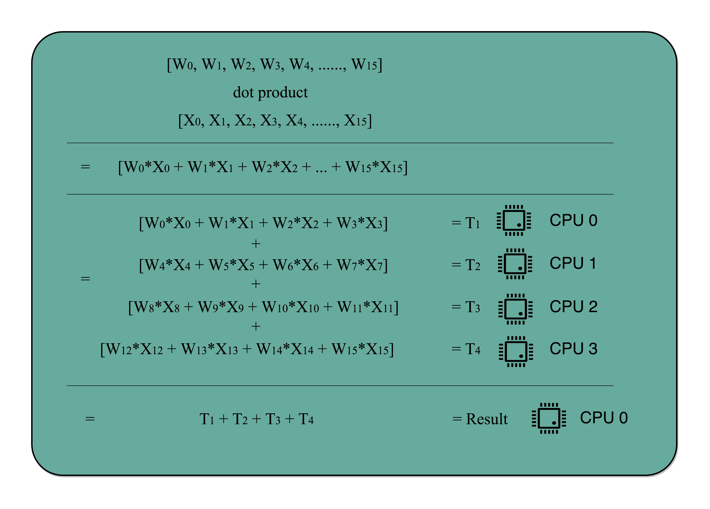

[toc]

# 入门篇

## 计算机体系架构


## 冯.诺依曼体系结构


**任何一台计算机的任何一个部件都可以归到运算器、控制器、存储器、输入设备和输出设备中，而所有的现代计算机也都是基于这个基础架构来设计开发的**

## 计算机组成原理知识地图


## 计算机性能指标

- [x] 响应时间(执行时间)

执行一个程序，到底需要花多少时间

- [x] 吞吐率(带宽)

在一定的时间范围内，到底能处理多少事情

```markdown
性能 = 1 / 响应时间
```

### 性能测试方法(`time`指令)

```markdown
time命令返回三个值
第一个是real time，是wall clock time，运行程序整个过程中流逝的时间
第二个是user time，是CPU在运行你的程序，在用户态运行指令的时间
第三个是sys time，是CPU在运行你的程序，在操作系统内核里运行指令的时间
程序实际花费的CPU执行时间(CPU Time)，就是user time加上sys time
```

### CPU执行时间公式

```
程序的CPU执行时间 = CPU时钟周期数 x 时钟周期时间
```

```
CPU时钟周期数 = 指令数 x 每条指令平均时钟周期数(Cycles Per Instruction，简称CPI)
```

性能优化方法：

- [x] 时钟周期时间，也就是计算机主频，取决于计算机硬件
- [x] 每条指令平均时钟周期数CPI，就是一条指令需要多少CPU Cycle，现在CPU通过流水线技术，让一条指令需要的CPU Cycle尽可能地少
- [x] 指令数，代表执行程序需要多少条指令、用哪些指令。取决于编译器

### 功耗

```
功耗 ~= 1/2 x 负载电容 x 电压的平方 x 开关频率 x 晶体管数量
```

### 并行优化



并行优化满足条件

- [x] 需要进行的计算，本身可以分解成几个可以并行的任务
- [x] 需要能够分解好问题，并确保几个人的结构能够汇总到一起
- [x] 在"汇总"这个阶段，是没有办法并行进行的，还是得顺序执行，一步一步来

### 阿姆达尔定律

```markdown
优化后的执行时间 = 受优化影响的执行时间/加速倍数 + 不受影响的执行时间
```

 ### 原则性性能提升方法

- [x] 加速大概率事件
- [x] 流水线提高性能
- [x] 通过预测提高性能

