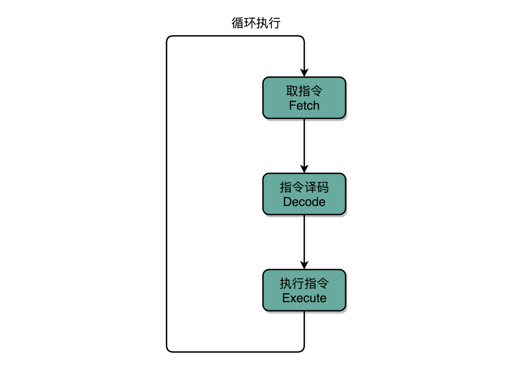

[toc]

# 原理篇：处理器

## 建立数据通路(指令 + 计算)

### 指令周期(Instruction Cycle)

- [x] **Fetch(取得指令)**，从PC寄存器里找到对应的指令地址，根据指令地址从内存里把具体的指令，加载到指令寄存器中，然后把PC寄存器自增，好在未来执行下一条指令
- [x] **Decode(指令译码)**，根据指令寄存器里面的指令，解析成要进行什么样的操作，是R、I、J中的哪一种指令，具体要操作哪些寄存器、数据或者内存地址
- [x] **Execute(执行指令)**，实际运行对应的R、I、J这些特定的指令，进行算数逻辑操作、数据传输或者直接的地址跳转
- [x] 重复进行上面步骤

### 机器周期(CPU周期、Machine Cycle)

CPU内部的操作速度很快，但是访问内存的速度却要慢很多；每一条指令都需要从内存里面加载而来，所以一般把从内存里面读取一条指令的最短时间，称为CPU周期

### 时钟周期(Clock Cycle)

