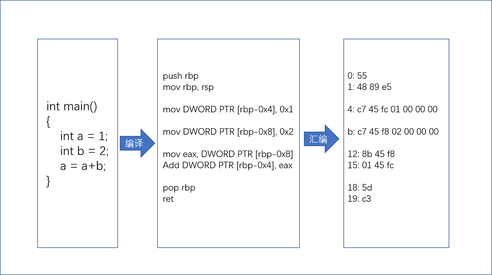
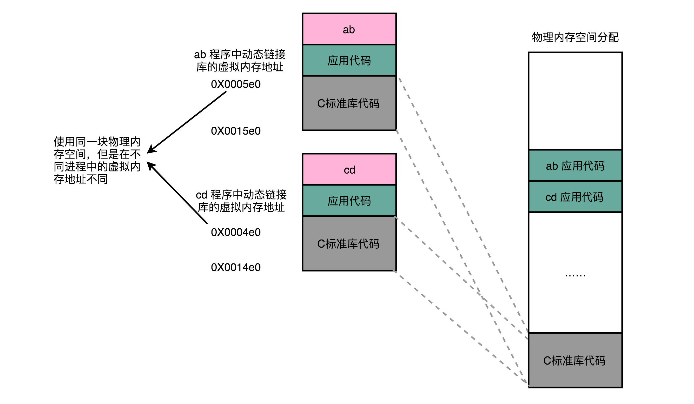

[toc]

# 原理篇：指令和运算

## 计算机指令

### C语言

```c
// test.c
int main()
{
  int a = 1; 
  int b = 2;
  a = a + b;
}
```

### 汇编

```
$ gcc -g -c test.c
$ objdump -d -M intel -S test.o
```

```
test.o:     file format elf64-x86-64
Disassembly of section .text:
0000000000000000 <main>:
int main()
{
   0:   55                      push   rbp
   1:   48 89 e5                mov    rbp,rsp
  int a = 1; 
   4:   c7 45 fc 01 00 00 00    mov    DWORD PTR [rbp-0x4],0x1
  int b = 2;
   b:   c7 45 f8 02 00 00 00    mov    DWORD PTR [rbp-0x8],0x2
  a = a + b;
  12:   8b 45 f8                mov    eax,DWORD PTR [rbp-0x8]
  15:   01 45 fc                add    DWORD PTR [rbp-0x4],eax
}
  18:   5d                      pop    rbp
  19:   c3                      ret    
```

## 编译过程



## 指令类型

- [x] **算术类指令**
- [x] **数据传输类指令**
- [x] **逻辑类指令**
- [x] **条件分支类指令**
- [x] **无条件跳转指令**


### MIPS指令集


- [x] **R指令**一般用来做算术和逻辑操作，里面有读取和写入数据的寄存器的地址。如果是逻辑位移操作，后面还有位移操作的偏移量，而最后的功能码，则是在前面的操作码不够的时候，扩展操作码表示对应的具体指令
- [x] **I指令**通常用在数据传输、条件分支，以及在运算的时候使用的并非变量还是常数的时候。这个时候，没有了位移量和操作码，也没有了第三个寄存器，而是把这三部分直接合并成了一个地址值或者一个常数
- [x] **J指令**就是一个跳转指令，高6位之外的26位都是一个跳转后的地址

#### 示例

```
add $t0,$s2,$s1
```


`add`对应MIPS指令里`opcode`是0，`rs`代表第一个寄存器`s1`的地址是17，`rt`代表第二个寄存器`s2`的地址是18，`rd`代表目标的临时寄存器`t0`的地址，是8。因为不是位移操作，所以位移量都是0

## 指令执行


- [x] **PC寄存器(指令地址寄存器)**，用来存放下一条需要执行的计算机指令的内存地址
- [x] **指令寄存器**，用来存放当前正在指令的指令
- [x] **条件码寄存器**，用里面的一个一个标记位(Flag)，存放CPU进行计算或者逻辑计算的结果
- [x] **通用寄存器**，用来存储数据和内存地址的寄存器，包括整数寄存器、浮点数寄存器、向量寄存器和地址寄存器等


### 示例1

```c
// test.c
#include <time.h>
#include <stdlib.h>
int main()
{
  srand(time(NULL));
  int r = rand() % 2;
  int a = 10;
  if (r == 0)
  {
    a = 1;
  } else {
    a = 2;
  } 
```

```
$ gcc -g -c test.c
$ objdump -d -M intel -S test.o 
```

```
    if (r == 0)
  3b:   83 7d fc 00             cmp    DWORD PTR [rbp-0x4],0x0
  3f:   75 09                   jne    4a <main+0x4a>
    {
        a = 1;
  41:   c7 45 f8 01 00 00 00    mov    DWORD PTR [rbp-0x8],0x1
  48:   eb 07                   jmp    51 <main+0x51>
    }
    else
    {
        a = 2;
  4a:   c7 45 f8 02 00 00 00    mov    DWORD PTR [rbp-0x8],0x2
  51:   b8 00 00 00 00          mov    eax,0x0
    } 
```


### 示例2

```c
int main()
{
    int a = 0;
    for (int i = 0; i < 3; i++)
    {
        a += i;
    }
}
```

```
    for (int i = 0; i <= 2; i++)
   b:   c7 45 f8 00 00 00 00    mov    DWORD PTR [rbp-0x4],0x0
  12:   eb 0a                   jmp    1e 
    {
        a += i;
  14:   8b 45 f8                mov    eax,DWORD PTR [rbp-0x4]
  17:   01 45 fc                add    DWORD PTR [rbp-0x8],eax

  1a:   83 45 f8 01             add    DWORD PTR [rbp-0x4],0x1
  1e:   83 7d f8 02             cmp    DWORD PTR [rbp-0x4],0x2
  22:   7e f0                   jle    14 
  24:   b8 00 00 00 00          mov    eax,0x0
    }
```


## 函数调用

```c
// function_example.c
#include <stdio.h>
int static add(int a, int b)
{
    return a+b;
}

int main()
{
    int x = 5;
    int y = 10;
    int u = add(x, y);
}
```

```
$ gcc -g -c function_example.c
$ objdump -d -M intel -S function_example.o
```

```
int static add(int a, int b)
{
   0:   55                      push   rbp
   1:   48 89 e5                mov    rbp,rsp
   4:   89 7d fc                mov    DWORD PTR [rbp-0x4],edi
   7:   89 75 f8                mov    DWORD PTR [rbp-0x8],esi
    return a+b;
   a:   8b 55 fc                mov    edx,DWORD PTR [rbp-0x4]
   d:   8b 45 f8                mov    eax,DWORD PTR [rbp-0x8]
  10:   01 d0                   add    eax,edx
}
  12:   5d                      pop    rbp
  13:   c3                      ret    
0000000000000014 <main>:
int main()
{
  14:   55                      push   rbp
  15:   48 89 e5                mov    rbp,rsp
  18:   48 83 ec 10             sub    rsp,0x10
    int x = 5;
  1c:   c7 45 fc 05 00 00 00    mov    DWORD PTR [rbp-0x4],0x5
    int y = 10;
  23:   c7 45 f8 0a 00 00 00    mov    DWORD PTR [rbp-0x8],0xa
    int u = add(x, y);
  2a:   8b 55 f8                mov    edx,DWORD PTR [rbp-0x8]
  2d:   8b 45 fc                mov    eax,DWORD PTR [rbp-0x4]
  30:   89 d6                   mov    esi,edx
  32:   89 c7                   mov    edi,eax
  34:   e8 c7 ff ff ff          call   0 <add>
  39:   89 45 f4                mov    DWORD PTR [rbp-0xc],eax
  3c:   b8 00 00 00 00          mov    eax,0x0
}
  41:   c9                      leave  
  42:   c3                      ret    
```

tips:`leave`指令相当于`mov esp,ebp` 加上`pop ebp`指令


### 栈溢出(stack overflow)

```c
int a()
{
  return a();
}

int main()
{
  a();
  return 0;
}
```

### 函数内联

在GCC编译的时候，加上自动优化参数`-O`，编译器就会在可行的情况下，进行指令替换

```c
#include <stdio.h>
#include <time.h>
#include <stdlib.h>

int static add(int a, int b)
{
    return a+b;
}

int main()
{
    srand(time(NULL));
    int x = rand() % 5
    int y = rand() % 10;
    int u = add(x, y)
    printf("u = %d\n", u)
}
```

```
$ gcc -g -c -O function_example_inline.c
$ objdump -d -M intel -S function_example_inline.o
```

```
    return a+b;
  4c:   01 de                   add    esi,ebx
```

**内联**带来的优化是，CPU需要执行的指令数变少了，根据地址跳转的过程不需要了，压栈和出栈的过程也不用了，但是**内联**也意味着，把可以复用的程序指令在调用它的地方完全展开，如果一个函数在很多地方都被调用了，那么就会展开很多次，整个程序占用的空间就会变大


## ELF和静态链接

### 示例

```c
// add_lib.c
int add(int a, int b)
{
    return a+b;
}
```

```c
// link_example.c
#include <stdio.h>
int main()
{
    int a = 10;
    int b = 5;
    int c = add(a, b);
    printf("c = %d\n", c);
}
```

```
$ gcc -g -c add_lib.c link_example.c
$ objdump -d -M intel -S add_lib.o
$ objdump -d -M intel -S link_example.o
```

```
add_lib.o:     file format elf64-x86-64
Disassembly of section .text:
0000000000000000 <add>:
   0:   55                      push   rbp
   1:   48 89 e5                mov    rbp,rsp
   4:   89 7d fc                mov    DWORD PTR [rbp-0x4],edi
   7:   89 75 f8                mov    DWORD PTR [rbp-0x8],esi
   a:   8b 55 fc                mov    edx,DWORD PTR [rbp-0x4]
   d:   8b 45 f8                mov    eax,DWORD PTR [rbp-0x8]
  10:   01 d0                   add    eax,edx
  12:   5d                      pop    rbp
  13:   c3                      ret    
```

```
link_example.o:     file format elf64-x86-64
Disassembly of section .text:
0000000000000000 <main>:
   0:   55                      push   rbp
   1:   48 89 e5                mov    rbp,rsp
   4:   48 83 ec 10             sub    rsp,0x10
   8:   c7 45 fc 0a 00 00 00    mov    DWORD PTR [rbp-0x4],0xa
   f:   c7 45 f8 05 00 00 00    mov    DWORD PTR [rbp-0x8],0x5
  16:   8b 55 f8                mov    edx,DWORD PTR [rbp-0x8]
  19:   8b 45 fc                mov    eax,DWORD PTR [rbp-0x4]
  1c:   89 d6                   mov    esi,edx
  1e:   89 c7                   mov    edi,eax
  20:   b8 00 00 00 00          mov    eax,0x0
  25:   e8 00 00 00 00          call   2a <main+0x2a>
  2a:   89 45 f4                mov    DWORD PTR [rbp-0xc],eax
  2d:   8b 45 f4                mov    eax,DWORD PTR [rbp-0xc]
  30:   89 c6                   mov    esi,eax
  32:   48 8d 3d 00 00 00 00    lea    rdi,[rip+0x0]        # 39 <main+0x39>
  39:   b8 00 00 00 00          mov    eax,0x0
  3e:   e8 00 00 00 00          call   43 <main+0x43>
  43:   b8 00 00 00 00          mov    eax,0x0
  48:   c9                      leave  
  49:   c3                      ret    
```

`add_lib.o`以及`link_example.o`都是**目标文件**，只有通过链接器(Linker)把多个文件以及调用的各种函数库链接起来，才能得到**可执行文件**

```
$ gcc -o link-example add_lib.o link_example.o
$ ./link_example
c = 15
```

### 程序执行步骤

- [x] 第一部分由编译(Compile)、汇编(Assemble)以及链接(Link)三个阶段组成；在完成后生成一个可执行文件
- [x] 第二部分通过装载器(Loader)把可执行文件装载(Load)到内存中，CPU从内存中读取指令和数据，来开始真正执行程序


### ELF格式和链接

```
link_example:     file format elf64-x86-64
Disassembly of section .init:
...
Disassembly of section .plt:
...
Disassembly of section .plt.got:
...
Disassembly of section .text:
...

 6b0:   55                      push   rbp
 6b1:   48 89 e5                mov    rbp,rsp
 6b4:   89 7d fc                mov    DWORD PTR [rbp-0x4],edi
 6b7:   89 75 f8                mov    DWORD PTR [rbp-0x8],esi
 6ba:   8b 55 fc                mov    edx,DWORD PTR [rbp-0x4]
 6bd:   8b 45 f8                mov    eax,DWORD PTR [rbp-0x8]
 6c0:   01 d0                   add    eax,edx
 6c2:   5d                      pop    rbp
 6c3:   c3                      ret    
00000000000006c4 <main>:
 6c4:   55                      push   rbp
 6c5:   48 89 e5                mov    rbp,rsp
 6c8:   48 83 ec 10             sub    rsp,0x10
 6cc:   c7 45 fc 0a 00 00 00    mov    DWORD PTR [rbp-0x4],0xa
 6d3:   c7 45 f8 05 00 00 00    mov    DWORD PTR [rbp-0x8],0x5
 6da:   8b 55 f8                mov    edx,DWORD PTR [rbp-0x8]
 6dd:   8b 45 fc                mov    eax,DWORD PTR [rbp-0x4]
 6e0:   89 d6                   mov    esi,edx
 6e2:   89 c7                   mov    edi,eax
 6e4:   b8 00 00 00 00          mov    eax,0x0
 6e9:   e8 c2 ff ff ff          call   6b0 <add>
 6ee:   89 45 f4                mov    DWORD PTR [rbp-0xc],eax
 6f1:   8b 45 f4                mov    eax,DWORD PTR [rbp-0xc]
 6f4:   89 c6                   mov    esi,eax
 6f6:   48 8d 3d 97 00 00 00    lea    rdi,[rip+0x97]        # 794 <_IO_stdin_used+0x4>
 6fd:   b8 00 00 00 00          mov    eax,0x0
 702:   e8 59 fe ff ff          call   560 <printf@plt>
 707:   b8 00 00 00 00          mov    eax,0x0
 70c:   c9                      leave  
 70d:   c3                      ret    
 70e:   66 90                   xchg   ax,ax
...
Disassembly of section .fini:
...
```

在linux下，可执行文件和目标文件所使用的都是一种叫**ELF(Execuatable and Linkable File Format)**的文件格式，中文名为**可执行与可链接文件格式**

函数名与他们对应的地址，在ELF文件里面，存储在一个叫做**符号表**的位置里，符号表相当于一个地址簿，把名字和地址关联起来


### Section分类

- [x] **.txt Section(代码段或者指令段)**，用来保存程序的代码和指令
- [x] **.data Section(数据段)**用来保存程序里面设置好的初始化数据信息
- [x] **.rel.txt Section(重定位表)**保留当前文件里面，哪些跳转地址其实是我们不知道的，在链接发生前，我们并不知道该跳转到哪里，这些信息会被存储在重定位表里
- [x] **.symtab Section(符号表)**保留当前文件里面定义的函数名称和对应地址的地址簿


链接器会扫描所有输入的目标文件，然后把所有符号表里的信息收集起来，构成一个全局的符号表；然后再根据重定位表，把所有不确定要跳转地址的代码，根据符号表里面存储的地址，进行一次修正；最后，把所有的目标文件的对应段进行一次合并，变成了最终的可执行代码

## 程序装载

### 装载条件

- [x] 可执行程序加载后占用的内存空间应该是连续的
- [x] 需要同时加载很多个程序时，不能让程序自己规定在内存中加载的位置

### 地址映射

**虚拟内存地址**指令里用到的内存地址

**物理内存地址**实际在内存硬件里面的空间地址

### 内存分段


#### 内存碎片


#### 内存交换

将运行的程序写入到硬盘，在重新读回到内存中，但加载的位置会不同

linux下需要设置swap硬盘空间

### 内存分页

把整个物理内存空间切成一段段固定尺寸的大小，这样一个连续并且尺寸固定的内存空间，我们叫**页**；从虚拟内存到物理内存的映射，不再是拿整段连续的内存的物理地址，而是按照一个一个页来的

linux下，页的大小通常设置成4KB

```
$ getconf PAGE_SIZE
```


分页的方式使得在加载程序的时候，不再需要一次性都把程序加载到物理内存中，完全可以在进行虚拟内存和物理内存的页之间的映射之后，并不真的把页加载到物理内存里，而是只在程序运行中，需要用到对应虚拟内存页里面的指令和数据时，再加载到物理内存中去

当要读取特定的页时，却发现数据并没有加载到物理内存里的时候，会出发CPU的**缺页错误(Page Fault)**，操作系统会捕捉到这个错误，然后将对应的页从存放在硬盘上的虚拟内存读取出来，加载到物理内存里

## 动态链接


动态链接过程中，链接的不是存储在硬盘上的目标文件代码，而是加载到内存中的**共享库**

window下共享库文件.dll文件

linux下共享库文件.so文件(shared object)


### 相对地址

共享出来的代码，必须是**地址无关**



共享库使用的是同一段物理内存地址，但是在不同的应用程序中，它所在的虚拟内存地址是不同的

### 示例

```c
// lib.h
#ifndef LIB_H
#define LIB_H

void show_me_the_money(int money);

#endif
```

```c
// lib.c
#include <stdio.h>


void show_me_the_money(int money)
{
    printf("Show me USD %d from lib.c \n", money);
}
```

```c
// show_me_poor.c
#include "lib.h"
int main()
{
    int money = 5;
    show_me_the_money(money);
}
```

```
$ gcc lib.c -fPIC -shared -o lib.so
$ gcc -o show_me_poor show_me_poor.c ./lib.so
```

**-fPIC(Position Independent Code)**意味着编译成地址无关

```
$ objdump -d -M intel -S show_me_poor
```

```
……
0000000000400540 <show_me_the_money@plt-0x10>:
  400540:       ff 35 12 05 20 00       push   QWORD PTR [rip+0x200512]        # 600a58 <_GLOBAL_OFFSET_TABLE_+0x8>
  400546:       ff 25 14 05 20 00       jmp    QWORD PTR [rip+0x200514]        # 600a60 <_GLOBAL_OFFSET_TABLE_+0x10>
  40054c:       0f 1f 40 00             nop    DWORD PTR [rax+0x0]

0000000000400550 <show_me_the_money@plt>:
  400550:       ff 25 12 05 20 00       jmp    QWORD PTR [rip+0x200512]        # 600a68 <_GLOBAL_OFFSET_TABLE_+0x18>
  400556:       68 00 00 00 00          push   0x0
  40055b:       e9 e0 ff ff ff          jmp    400540 <_init+0x28>
……
0000000000400676 <main>:
  400676:       55                      push   rbp
  400677:       48 89 e5                mov    rbp,rsp
  40067a:       48 83 ec 10             sub    rsp,0x10
  40067e:       c7 45 fc 05 00 00 00    mov    DWORD PTR [rbp-0x4],0x5
  400685:       8b 45 fc                mov    eax,DWORD PTR [rbp-0x4]
  400688:       89 c7                   mov    edi,eax
  40068a:       e8 c1 fe ff ff          call   400550 <show_me_the_money@plt>
  40068f:       c9                      leave  
  400690:       c3                      ret    
  400691:       66 2e 0f 1f 84 00 00    nop    WORD PTR cs:[rax+rax*1+0x0]
  400698:       00 00 00 
  40069b:       0f 1f 44 00 00          nop    DWORD PTR [rax+rax*1+0x0]
……
```

```
call   400550 <show_me_the_money@plt>
```

**@plt**关键字代表需要从**程序链接表**(PLT)里面找到调用的函数

```
  400550:       ff 25 12 05 20 00       jmp    QWORD PTR [rip+0x200512]        # 600a68 <_GLOBAL_OFFSET_TABLE_+0x18>
```

**GLOBAL_OFFSET_TABLE **全局偏移表

在动态链接对应的共享库中的**data section**里面，保存了一张**全局偏移表(GOT,Global Offset Table)**，虽然共享库的代码部分的物理内存是共享的，但是数据部分是各个动态链接它的应用程序里面各加载一份的，所以需要引用当前共享库外部的地址的指令，都会查询GOT，来知道当前运行程序的虚拟内存里的对应位置，而GOT表里的数据，则是在我们加载一个个共享库的时候写进去的

