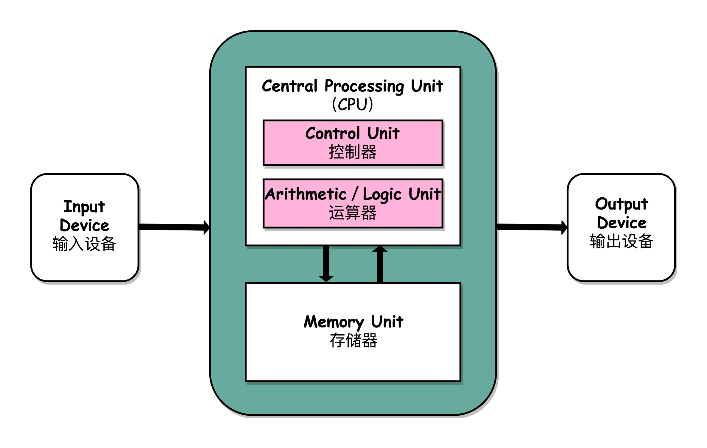
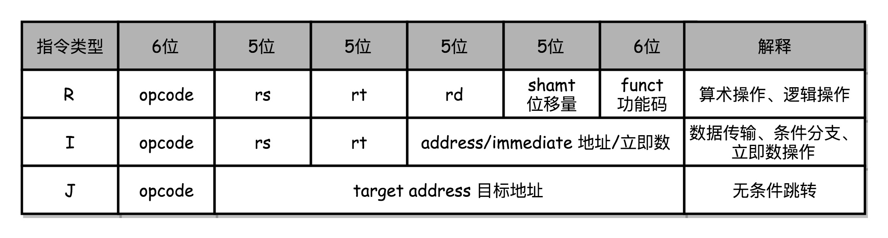

[toc]

# 深入浅出计算机组成原理

## 计算机体系架构


## 冯.诺依曼体系结构



**任何一台计算机的任何一个部件都可以归到运算器、控制器、存储器、输入设备和输出设备中，而所有的现代计算机也都是基于这个基础架构来设计开发的**

## 计算机组成原理知识地图


## 计算机性能指标

- [x] 响应时间(执行时间)

执行一个程序，到底需要花多少时间

- [x] 吞吐率(带宽)

在一定的时间范围内，到底能处理多少事情

```markdown
性能 = 1 / 响应时间
```

### 性能测试方法(`time`指令)

```markdown
time命令返回三个值
第一个是real time，是wall clock time，运行程序整个过程中流逝的时间
第二个是user time，是CPU在运行你的程序，在用户态运行指令的时间
第三个是sys time，是CPU在运行你的程序，在操作系统内核里运行指令的时间
程序实际花费的CPU执行时间(CPU Time)，就是user time加上sys time
```

### CPU执行时间公式

```
程序的CPU执行时间 = CPU时钟周期数 x 时钟周期时间
```

```
CPU时钟周期数 = 指令数 x 每条指令平均时钟周期数(Cycles Per Instruction，简称CPI)
```

性能优化方法：

- [x] 时钟周期时间，也就是计算机主频，取决于计算机硬件
- [x] 每条指令平均时钟周期数CPI，就是一条指令需要多少CPU Cycle，现在CPU通过流水线技术，让一条指令需要的CPU Cycle尽可能地少
- [x] 指令数，代表执行程序需要多少条指令、用哪些指令。取决于编译器

### 功耗

```
功耗 ~= 1/2 x 负载电容 x 电压的平方 x 开关频率 x 晶体管数量
```

### 并行优化


并行优化满足条件

- [x] 需要进行的计算，本身可以分解成几个可以并行的任务
- [x] 需要能够分解好问题，并确保几个人的结构能够汇总到一起
- [x] 在"汇总"这个阶段，是没有办法并行进行的，还是得顺序执行，一步一步来

### 阿姆达尔定律

```markdown
优化后的执行时间 = 受优化影响的执行时间/加速倍数 + 不受影响的执行时间
```

 ### 原则性性能提升方法

- [x] 加速大概率事件
- [x] 流水线提高性能
- [x] 通过预测提高性能

## 计算机指令

### C语言

```c
// test.c
int main()
{
  int a = 1; 
  int b = 2;
  a = a + b;
}
```

### 汇编语言

```
$ gcc -g -c test.c
$ objdump -d -M intel -S test.o
```

```
test.o:     file format elf64-x86-64
Disassembly of section .text:
0000000000000000 <main>:
int main()
{
   0:   55                      push   rbp
   1:   48 89 e5                mov    rbp,rsp
  int a = 1; 
   4:   c7 45 fc 01 00 00 00    mov    DWORD PTR [rbp-0x4],0x1
  int b = 2;
   b:   c7 45 f8 02 00 00 00    mov    DWORD PTR [rbp-0x8],0x2
  a = a + b;
  12:   8b 45 f8                mov    eax,DWORD PTR [rbp-0x8]
  15:   01 45 fc                add    DWORD PTR [rbp-0x4],eax
}
  18:   5d                      pop    rbp
  19:   c3                      ret    
```


### 指令分类

- [x] 算术类指令
- [x] 数据传输类指令
- [x] 逻辑类指令
- [x] 条件分支类指令
- [x] 无条件跳转指令


#### MIPS-CPU指令集



- [x] **R指令**一般用来做算术和逻辑操作，里面有读取和写入数据的寄存器的地址；如果是逻辑位移操作，后面还有位移操作的位移量，而最后的功能码，则是在前面的操作码不够的时候，扩展操作码表示对应的具体指令的
- [x] **I指令**通常用在数据传输、条件分支，以及在运算的时候使用的并非变量还是常数的时候。这个时候，没有了位移量和操作码，也没有了第三个寄存器，而是把这三部分直接合并成了一个地址值或者一个常数
- [x] **J指令**就是一个跳转指令，高6位之外的26位都是一个跳转后的地址

#### 示例

```
add $t0,$s2,$s1
```


`add`对应**MIPS**指令里**opcode**是0，`rs`代表第一个寄存器`s1`的地址是17，`rt`代表第二个寄存器`s2`的地址是18，`rd`代表目标的临时寄存器`t0`的地址是8，因为不是位移操作，所以位移量都是0