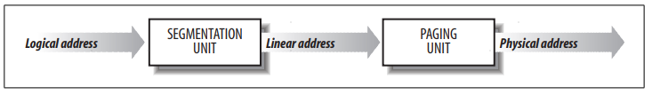
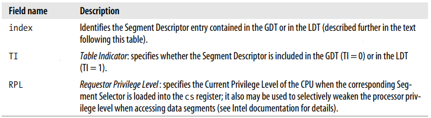

# 第二章 内存寻址

## 地址分类

* **逻辑地址**(logical address)
* **线性地址**(linear address or virtual address)
* **物理地址**(physical address)

逻辑地址转换为线性地址，通过**MMU**(Memory Management Unit)实现;
线性地址转换为物理地址，通过**分页单元**(Paging Unit)实现;

## 硬件分段

### 段选择器(Segment Selector)

|段寄存器|描述|
|-|-|
|cs|代码段寄存器，指向程序指令|
|ss|栈段寄存器，指向当前程序使用栈|
|ds|数据段寄存器，指向全局或者静态数据|
|es fs gs|通常用作数据段寄存器|

**cs代码段寄存器低两位表示当前特权等级CPL**(Current Privilege Level)，Linux 使用0表示内核态，3表示用户态

### 段描述符(Segment Descriptors)

段描述符由**8字节**构成，由**GDT**(Global Descriptor Table)或者**LDT**(Local Descriptor Table)存储

系统只有一个**GDT**，每个进程会有自己的**LDT**

**gdtr**控制寄存器存储

